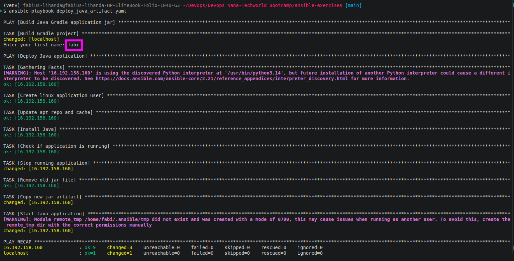
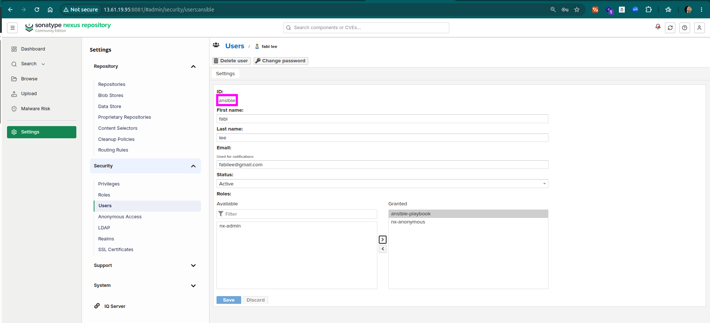
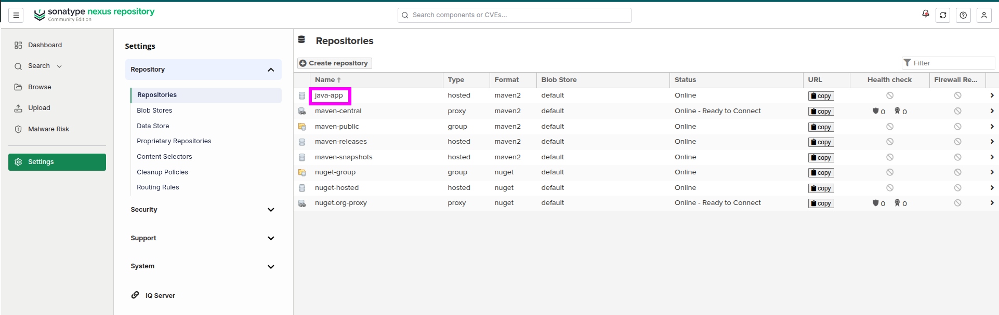
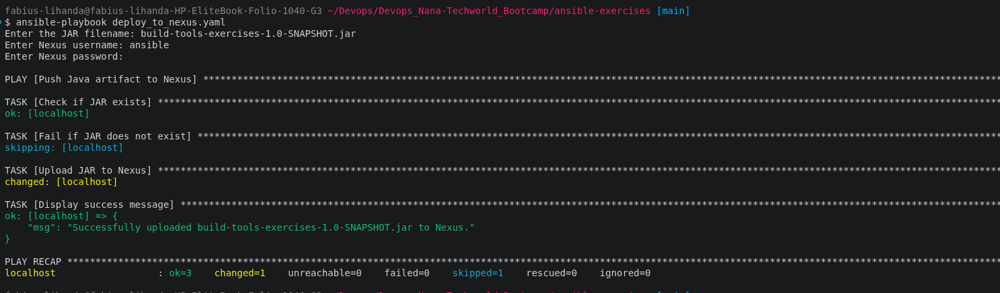
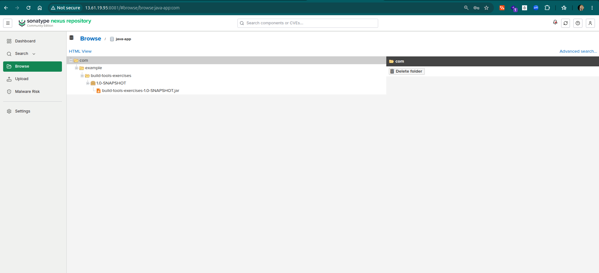

# 🤖 Automation with Ansible – Provisioning, Configuration and Kubernetes Deployment Pipelines

Manual infrastructure work doesn't scale well, the same steps repeated across servers eventually drift apart, break under time pressure, or end up understood by only one person. Ansible solves this by letting infrastructure be defined once, as code: it's agentless (driving everything over plain SSH, no software required on target machines) and idempotent (running the same playbook twice produces the same safe result, not double the side effects), which means a deployment process can be version-controlled, reviewed, and handed to anyone to run with confidence.

This directory walks through eight projects that build on each other starting with a single-command Java artifact deployment, moving through multi-server AWS provisioning with private networking, and finishing with a Kubernetes-based deployment pipeline each one turning a manual process into something repeatable and automated end to end.


## Project Objectives

Across the projects, these were my main objectives to take after building the projects:

- Build repeatable, version-controlled infrastructure workflows that reduce manual configuration and make deployments easier to reproduce and maintain.
- Reduce deployment risk and configuration drift by replacing manual, error-prone infrastructure processes with consistent automated workflows.
- Understand and apply **Ansible configuration management and automation best practices**, including reusable and idempotent playbooks.
- Automate **application deployment, server configuration, and artifact management** across different environments.
- Configure and manage **Ansible control nodes** while handling **OS and distribution differences** using conditionals, variables, and task inclusion.
- Integrate Ansible with **AWS infrastructure**, including EC2 provisioning, networking, private subnets, and multi-server architectures.
- Automate **Docker and Kubernetes deployments**, including containerized applications, persistent storage, Services, ConfigMaps, Secrets, Ingress, and Helm.
- Develop practical **troubleshooting and infrastructure automation skills** across Linux, AWS, Ansible, Docker, and Kubernetes.

---

<details>
<summary> Project 1: Build & Deploy Java Artifact</summary>

<br />

The starting point was a Gradle/Spring Boot application that needed to be built locally and deployed to a remote Ubuntu server. The goal was to make the entire process repeatable through a single Ansible playbook, including creating the application user, installing Java, replacing an existing artifact, and starting the application.

### Implementation

The playbook uses two plays:

- **Build:** First play. Runs entirely locally then simply builds the Java application locally using Gradle.
- **Deploy:** Second play. Connects to the remote Ubuntu server, prepares the environment, replaces the existing JAR artifact, and starts the application under a specified Linux user.

```yaml

---
- name: Build Java Gradle application jar
  hosts: localhost
  connection: local
  gather_facts: false

  vars_files:
    - project-vars


  tasks:
    - name: Build Gradle project
      command: ./gradlew clean build
      args:
        chdir: "{{ local_project_dir }}"


- name: Deploy Java application
  hosts: app_server
  become: true

  vars_files:
    - project-vars

  vars_prompt:
    - name: firstname
      prompt: "Enter your first name"
      private: false

  tasks:

    - name: Create linux application user
      user:
        name: "{{ firstname }}"
        state: present
        create_home: true
        groups: adm

    - name: Update apt repo and cache
      apt:
        update_cache: yes
        cache_valid_time: 3600

    - name: Install Java
      apt:
        name:
          - openjdk-17-jre-headless
          - acl
        state: present

    - name: Check if application is running
      shell: pgrep -f "java -jar /home/ubuntu/app.jar"
      register: app_process
      failed_when: false
      changed_when: false

    - name: Stop running application
      shell: "kill {{ app_process.stdout }} || true"
      when: app_process.rc == 0
      changed_when: app_process.rc == 0

    - name: Remove old jar file
      file:
        path: /home/ubuntu/app.jar
        state: absent

    - name: Copy new jar artifact
      copy:
        src: "{{ local_project_dir }}/build/libs/build-tools-exercises-1.0-SNAPSHOT.jar"
        dest: /home/ubuntu/app.jar
        mode: "0644"

    - name: Start Java application
      shell: nohup java -jar /home/ubuntu/app.jar > /home/{{ firstname }}/app.log 2>&1 &
      become_user: "{{ firstname }}"

```
Before deployment, Ansible ensures that the required Linux user and Java runtime exist. If an older instance of the application is running, the process is stopped and the previous JAR is removed before the new artifact is copied.

> **Note:** `nohup` keeps the Java process running after Ansible's SSH session ends. Without it, the process would terminate when the remote session closes. The `&` runs the application in the background, while the output is redirected to `app.log` located in the specified user's home directory.
>
> **Note on `acl` package:** The `acl` (Access Control List) package is required so Ansible can safely switch to run commands as the newly created application user (`become_user: "{{ firstname }}"`). Without it, Linux blocks the non-admin user from reading Ansible's temporary setup files, causing permission errors.



</details>

---

<details>
<summary> Project 2: Push Java Artifact to Nexus</summary>

<br />

Once developers had tested the application by running it directly from their local environment, the next step was to publish a verified artifact somewhere the rest of the team could pull it from, rather than passing JAR files around manually. This called for a Nexus repository as the artifact store, and a playbook that lets a developer specify a JAR and push it there on demand.

### Nexus Server Setup

The Nexus server itself was provisioned and configured with a separate playbook, [`deploy_nexus.yaml`](https://github.com/lihandafabius/Ansible/blob/main/deploy_nexus.yaml). It installs Java and `net-tools`, downloads and unpacks the Nexus installer, creates a dedicated `nexus` system user/group to own and run the service (rather than running it as root), and starts and verifies the service.

Inside Nexus, rather than using the built-in `admin` account for the upload, I created a separate user scoped to a role with just the permissions needed for the target repository.



> **Note on repository policy:** Nexus repositories enforce a version policy — Release, Snapshot, or Mixed. A repository created as Release-only will reject any artifact whose version string ends in `-SNAPSHOT` with an HTTP 400. This was resolved by switching the target repository's policy to Mixed, allowing both release and snapshot artifacts to live in the same repository — a reasonable simplification for a smaller project, where a larger team would more likely split these into two separate repositories.



### Implementation

With the server and repository in place, the upload itself is handled by a single local play. It prompts for the JAR filename and Nexus credentials, confirms the JAR actually exists before doing anything else, then uploads it via `curl`.

```yaml
---
- name: Push Java artifact to Nexus
  hosts: localhost
  connection: local
  gather_facts: false

  vars_prompt:
    - name: jar_file
      prompt: "Enter the JAR filename"
      private: false

    - name: nexus_username
      prompt: "Enter Nexus username"
      private: false

    - name: nexus_password
      prompt: "Enter Nexus password"
      private: true

  vars:
    nexus_url: "http://13.61.19.95:8081/repository/java-app/"
    group_id: "com.example"
    artifact_id: "build-tools-exercises"
    version: "1.0-SNAPSHOT"
    jar_path: "/home/fabius-lihanda/Devops/Devops_Nana-Techworld_Bootcamp/ansible-exercises/build/libs/{{ jar_file }}"

  tasks:

    - name: Check if JAR exists
      stat:
        path: "{{ jar_path }}"
      register: jar_file_status

    - name: Fail if JAR does not exist
      fail:
        msg: "JAR file {{ jar_file }} does not exist."
      when: not jar_file_status.stat.exists

    - name: Upload JAR to Nexus
      shell: curl -u "{{ nexus_username }}:{{ nexus_password }}" --upload-file "{{ jar_path }}" "{{ nexus_url }}com/example/{{ artifact_id }}/{{ version }}/{{ jar_file }}"
      no_log: true

    - name: Display success message
      debug:
        msg: "Successfully uploaded {{ jar_file }} to Nexus."
```

Credentials are collected interactively via `vars_prompt` rather than hardcoded, with the password field marked `private: true` so it isn't echoed to the terminal. The `stat` + `fail` combination acts as a guard clause, stopping the play early with a clear message instead of letting `curl` fail obscurely on a missing file.

> **Note on `no_log: true`:** Because the upload task's command line embeds the Nexus password, `no_log: true` suppresses that task's output in Ansible's logs and console — without it, the credentials would appear in plain text in the run output.





</details>

---

<details>
<summary>Exercise 3 & 4: Install Jenkins on EC2 (Ubuntu and Amazon Linux)</summary>

<br />

The next requirement was to spin up a fully-configured Jenkins server — Java, the Jenkins package itself, Node.js/npm, and Docker (so Jenkins jobs can build containers) — with a single Ansible command. The playbook was later extended to support **both** Ubuntu and Amazon Linux, since the company runs infrastructure on multiple OS flavors.

### Dynamic AMI Lookup

Rather than hardcoding AMI IDs (which go stale and are region-specific), the playbook resolves the current AMI at runtime via AWS SSM public parameters, selected per OS:

```yaml
os_config:
  ubuntu:
    ssh_user: "ubuntu"
    ami_ssm_path: "/aws/service/canonical/ubuntu/server/24.04/stable/current/amd64/hvm/ebs-gp3/ami-id"
  amazon_linux:
    ssh_user: "ec2-user"
    ami_ssm_path: "/aws/service/ami-amazon-linux-latest/al2023-ami-kernel-default-x86_64"
```

```yaml
- name: Look up the current AMI ID for the chosen OS
  set_fact:
    ami_id: "{{ lookup('amazon.aws.aws_ssm', os_config[os_type].ami_ssm_path, region=aws_region) }}"
```

### Security Group Scoped to the Caller's IP

Rather than opening SSH/Jenkins to the world, the playbook detects the operator's current public IP and scopes both rules to it:

```yaml
- name: Get my current public IP
  uri:
    url: https://api.ipify.org
    return_content: true
  register: my_ip

- name: Create security group with SSH and Jenkins port open to my IP only
  amazon.aws.ec2_security_group:
    rules:
      - proto: tcp
        ports: [22]
        cidr_ip: "{{ my_ip.content }}/32"
      - proto: tcp
        ports: [8080]
        cidr_ip: "{{ my_ip.content }}/32"
```

### From EC2 Instance to Reachable Host

`add_host` registers the freshly-launched instance's public IP into an in-memory inventory group, so a second play in the same playbook run can immediately target and configure it — no manual inventory file needed:

```yaml
- name: Add new instance to in-memory inventory
  add_host:
    name: "{{ ec2_result.instances[0].public_ip_address }}"
    groups: jenkins
    ansible_user: "{{ os_config[os_type].ssh_user }}"
    ansible_ssh_private_key_file: "{{ key_file }}"
    ansible_ssh_common_args: "-o StrictHostKeyChecking=no"

- name: Wait for SSH to come up on the new instance
  wait_for:
    host: "{{ ec2_result.instances[0].public_ip_address }}"
    port: 22
    delay: 5
    timeout: 180
```

### Cross-OS Support via Conditionals

Every OS-sensitive task (package manager, Jenkins signing-key mechanism, package names) is duplicated with `(Debian)`/`(RedHat)` labels and a matching `when:` guard on `ansible_os_family`:

```yaml
- name: (Debian) Install Docker
  apt:
    name: docker.io
    state: present
  when: ansible_os_family == "Debian"

- name: (RedHat) Install Docker
  dnf:
    name: docker
    state: present
  when: ansible_os_family == "RedHat"
```

Everything downstream of that split — starting Docker, adding the `jenkins` user to the `docker` group, starting Jenkins, retrieving the initial admin password — runs unconditionally, shared by both branches.

</details>

---

<details>
<summary>Exercise 5: Install Jenkins as a Docker Container</summary>

<br />

Rather than installing Jenkins as a system package, this variant runs it as a Docker container — with volumes for both the Jenkins home directory and the host's own Docker socket/binary, so pipelines running *inside* Jenkins can still invoke `docker` commands on the host.

The reference `docker run` command was mapped into an idempotent Ansible task set that checks the container's actual state before acting:

```yaml
- name: Check if a Jenkins container already exists
  command: docker inspect -f "{{ '{{.State.Running}}' }}" jenkins
  register: jenkins_running
  failed_when: false
  changed_when: false

- name: Start the existing Jenkins container if it's stopped
  command: docker start jenkins
  when: jenkins_running.rc == 0 and jenkins_running.stdout == "false"

- name: Run a new Jenkins container (none exists yet)
  command: >
    docker run
    --name jenkins
    -p 8080:8080
    -p 50000:50000
    -d
    -u root
    -v /var/run/docker.sock:/var/run/docker.sock
    -v /usr/bin/docker:/usr/bin/docker
    -v jenkins_home:/var/jenkins_home
    jenkins/jenkins:lts
  when: jenkins_running.rc != 0
```

This three-way branch covers every possible state the container could be in — not-exists, exists-but-stopped, exists-and-running — making the playbook safe to rerun any number of times without erroring on "container name already in use."

</details>

---

<details>
<summary>Exercise 6: Web Server and Database Server Configuration</summary>

<br />

A second team needed a traditional (non-Docker) two-tier setup: a Java web server and a MySQL database server, both provisioned inside the same VPC. Critically, the database server was required to have **no public IP at all** — reachable only from inside the VPC — which meant it also needed a dedicated Ansible control server to actually configure it, since a laptop outside the VPC has no route to a private IP.

### Private Networking

A public and a private subnet were provisioned, along with an Internet Gateway (for the public subnet) and a NAT Gateway (so the private subnet gets outbound internet — needed to `apt install mysql` — without any inbound exposure):

```yaml
- name: Create NAT Gateway (lives in the public subnet, gives the private subnet outbound internet)
  amazon.aws.ec2_vpc_nat_gateway:
    subnet_id: "{{ public_subnet_id }}"
    allocation_id: "{{ nat_eip_id }}"
    wait: true

- name: Create private route table (routes to the internet via NAT gateway)
  amazon.aws.ec2_vpc_route_table:
    subnets: ["{{ private_subnet_id }}"]
    routes:
      - dest: "0.0.0.0/0"
        nat_gateway_id: "{{ nat_gw_result.nat_gateway_id }}"
```

### Security Group Layering

Three security groups formed a chain of trust rather than three independent rule sets: the control server accepted SSH only from the operator's IP; the web server accepted SSH only *from the control server's security group* (not the operator directly); the database server accepted MySQL traffic only from the web server's security group, and SSH only from the control server's — with no rule referencing the operator's IP or `0.0.0.0/0` at all.

### Configuring the Control Server, Then Running From It

A dedicated playbook installs Ansible and its dependencies on the control server, copies the SSH private key onto it (so it can, in turn, reach the web/db servers over the private subnet), stages a generated `inventory.ini` (pointing at the web/db servers' **private** IPs), and copies over the actual deployment playbook:

```yaml
- name: Copy SSH private key to control server
  copy:
    src: "{{ ssh_key }}"
    dest: "/home/{{ ssh_user }}/.ssh/{{ ssh_key | basename }}"
    mode: "0600"

- name: Run deploy_app_server_and_db.yaml on the control server
  command:
    cmd: >
      ansible-playbook -i inventory.ini deploy_app_server_and_db.yaml
      --extra-vars "web_public_ip={{ hostvars['localhost'].web_server_public_ip }}"
    chdir: "{{ project_dir }}"
```

### Installing MySQL via an Existing Role

Rather than writing MySQL install/configuration logic from scratch, the widely-used `geerlingguy.mysql` community role was used, configured entirely via variables:

```yaml
vars:
  mysql_root_password: "{{ db_root_password }}"
  mysql_bind_address: "0.0.0.0"   # role defaults to 127.0.0.1 - must open this for the web server to connect remotely
  mysql_databases:
    - name: appdb
  mysql_users:
    - name: appuser
      password: "{{ db_password }}"
      priv: "appdb.*:ALL"
      host: "%"   # access control enforced at the security-group level instead

roles:
  - geerlingguy.mysql
```

Once MySQL was reachable, the web play deployed the Java jar and started it with database credentials injected as OS environment variables — matching exactly what the application's `DatabaseConfig.java` reads via `System.getenv()`:

```yaml
- name: Start the application with DB connection details
  become_user: "{{ app_user }}"
  environment:
    DB_USER: "{{ db_user }}"
    DB_PWD: "{{ db_password }}"
    DB_SERVER: "{{ db_host }}"
    DB_NAME: "{{ db_name }}"
  shell: >
    nohup java -jar {{ remote_app_dir }}/{{ jar_name }}
    > {{ remote_app_dir }}/app.log 2>&1 &
  async: 1000
  poll: 0
```

Once both playbooks completed, the Java application was confirmed running and reachable from a browser at `http://<web-server-public-ip>:8080`, with all database traffic staying entirely inside the VPC.

</details>

---

<details>
<summary>Exercise 7: Deploy Java + MySQL Application in Kubernetes</summary>

<br />

The team decided to modernize onto Kubernetes, but explicitly did not want to learn `kubectl` or raw manifest syntax — the whole point of this exercise was that deployment stays a single Ansible command, with all the Kubernetes-specific detail hidden inside version-controlled manifest files.

### Cluster and Storage

The EKS cluster was provisioned with Terraform (`terraform-aws-modules/eks`), and a `StorageClass` backed by the EBS CSI driver was created so PersistentVolumeClaims could be dynamically provisioned:

```yaml
apiVersion: storage.k8s.io/v1
kind: StorageClass
metadata:
  name: auto-ebs
provisioner: ebs.csi.eks.amazonaws.com
volumeBindingMode: WaitForFirstConsumer
parameters:
  type: gp3
allowVolumeExpansion: true
```

### MySQL: Secret, PVC, Deployment, Service

A single-replica MySQL Deployment was defined with a mounted PVC for persistence, and a `Recreate` deployment strategy — required because a `ReadWriteOnce` EBS volume can only be mounted by one pod at a time, and the default `RollingUpdate` strategy would try to start a second pod before killing the first:

```yaml
apiVersion: apps/v1
kind: Deployment
metadata:
  name: mysql
  namespace: java-app
spec:
  replicas: 1
  strategy:
    type: Recreate
  template:
    spec:
      containers:
        - name: mysql
          image: mysql:8.4
          env:
            - name: MYSQL_ROOT_PASSWORD
              valueFrom:
                secretKeyRef: { name: mysql-secret, key: MYSQL_ROOT_PASSWORD }
            - name: MYSQL_USER
              valueFrom:
                secretKeyRef: { name: mysql-secret, key: DB_USER }
            - name: MYSQL_PASSWORD
              valueFrom:
                secretKeyRef: { name: mysql-secret, key: DB_PWD }
          volumeMounts:
            - name: mysql-storage
              mountPath: /var/lib/mysql
      volumes:
        - name: mysql-storage
          persistentVolumeClaim:
            claimName: mysql-pvc
```

Note the `MYSQL_USER`/`MYSQL_PASSWORD` env vars are mapped from `DB_USER`/`DB_PWD` secret keys rather than using `envFrom` — the secret's key names match what the *Java application* expects via `System.getenv()`, while MySQL's official image expects its own specific env var names. `valueFrom.secretKeyRef` lets the container's env var name differ from the secret's key name, so one secret serves both consumers without duplicating credentials.

### Namespace Consistency

Kubernetes Secrets and PersistentVolumeClaims are namespace-scoped — a Deployment can only reference a Secret or PVC that lives in its **own** namespace. Every manifest (Secret, PVC, Deployment, Service) was given a matching `namespace: java-app`, with the namespace itself created as the first task in the deploying playbook, before anything namespaced was applied.

### Driving It All From Ansible

Every manifest is applied through `kubernetes.core.k8s`, keeping `kubectl` entirely out of the developer-facing workflow:

```yaml
- name: Create java app namespace
  kubernetes.core.k8s:
    name: java-app
    api_version: v1
    kind: Namespace
    state: present
    kubeconfig: "{{ kubeconfig }}"

- name: deploy mysql
  kubernetes.core.k8s:
    src: "{{ manifest_dir }}/mysql.yaml"
    state: present
    kubeconfig: "{{ kubeconfig }}"
```

</details>

---

<details>
<summary>Exercise 8: Deploy MySQL Chart in Kubernetes (Highly Available)</summary>

<br />

With the single-replica MySQL Deployment working, the team's next concern was availability: a single MySQL pod is a single point of failure. The task was to replace it with a 3-replica MySQL deployment sourced from a Helm chart, driven by Ansible rather than a manual `helm install`.

Ansible's `kubernetes.core.helm` module allows a chart to be installed, upgraded, or values-overridden the same way `kubernetes.core.k8s` handles raw manifests — keeping the "no kubectl/helm knowledge required" promise of the exercise intact even as the underlying implementation moved from hand-written YAML to a chart-managed StatefulSet.

</details>

---

<details>
<summary>Challenges</summary>

<br />

Automating this project end-to-end surfaced a long list of real, non-obvious problems — the kind that only show up once you actually run the thing against live infrastructure. Working through them is where most of the actual learning happened.

---

### 1. Gradle Wrapper / Version Mismatch

A fresh clone had no `gradlew` wrapper and the system-installed Gradle was version **4.4.1** — eight years old, and incompatible with the Spring Boot 3.5.5 project's plugins, producing a cryptic `NoSuchMethodError` on `TaskContainer.named()`. The fix was installing a modern Gradle via SDKMAN and generating a proper wrapper pinned to a compatible version (`gradle wrapper --gradle-version 8.14`), rather than relying on whatever Gradle happened to already be on the machine.

> **Lesson learned:** Never assume the system's installed build tool version is close to current — pin and commit a wrapper.

---

### 2. Maven Coordinate Changes

`mysql-connector-j` version 9.x moved from the `mysql:` groupId to `com.mysql:` — a dependency written as `group: 'mysql', name: 'mysql-connector-j', version: '9.2.0'` silently resolved to nothing and failed the build with `Could not find mysql:mysql-connector-j:9.2.0`. The fix was updating to the current `com.mysql:mysql-connector-j:9.2.0` coordinate.

---

### 3. Jenkins APT Signing Key Format

Early attempts to add Jenkins' apt repository key failed with `NO_PUBKEY` errors, because the key was downloaded as ASCII-armored text and saved directly — but apt's `signed-by` option expects a binary keyring, not armored text. This was resolved with `curl | gpg --dearmor -o ...`. Later, following Jenkins' current official install instructions (year-versioned key URL, `/etc/apt/keyrings` path) turned out to work with a plain download and no dearmor step at all — a reminder that "correct" install instructions for third-party repositories change over time and are worth re-checking against the vendor's current docs rather than trusting a remembered process.

---

### 4. SSH Key Pair Mismatch

A server was launched with AWS key pair name `"jenkins"`, while the configuration playbook authenticated using a completely different local key file (`myapp-key-pair.pem`) — producing `Permission denied (publickey)`. Since a key pair is baked into an EC2 instance at launch time and can't be swapped on a running instance, the fix required correcting the `key_name` var and **relaunching** the affected servers, not just editing the connecting playbook.

> **Lesson learned:** Keep `key_name` (the AWS-registered pair name) and the local `.pem` file path as a single source of truth across every playbook that touches the same servers — a mismatch here fails silently until the first SSH attempt.

---

### 5. `ansible_python_interpreter` Leaking Across `delegate_to`

A playbook running locally (via a Python virtualenv) used `delegate_to` to run tasks against a remote server. The play-level `ansible_python_interpreter` (pointing at the local venv) leaked through to the delegated host, causing Ansible to try running modules using a Python path that only existed on the operator's laptop. The first fix was explicitly overriding the interpreter in every delegated task's `vars:` block; the more durable fix was restructuring the playbook to use `add_host` + a proper second play, where connection details (including the interpreter) are set once and inherited automatically by every task — eliminating an entire class of "forgot to repeat this everywhere" bugs.

---

### 6. `pkill -f` Self-Termination

`pkill -f <jar_name>` intermittently returned non-zero (`rc: -15`, later `rc: -9` with `-9`) even though it successfully stopped the target process. The cause: `pkill -f` matches against the **full command line**, including the shell invocation running the `pkill` command itself (which literally contains the jar name as text) — so it could match and signal its own parent shell. The fix was `failed_when: false` on every `pkill` task, with a separate `pgrep`-based confirmation step as the actual pass/fail gate, rather than trusting `pkill`'s own exit code.

---

### 7. MySQL 8.4 Disabled `mysql_native_password` by Default

The `geerlingguy.mysql` role's user-creation step failed with `(1524, "Plugin 'mysql_native_password' is not loaded")`. MySQL 8.4 disabled that legacy authentication plugin by default (removed entirely in 9.0), but the role's underlying `mysql_user` module still defaulted new accounts to it. Two fixes were explored: manually re-enabling the plugin via `lineinfile` on the role's generated config file *after* install (requiring a restart and manual user creation, bypassing the role's own step); and the more correct fix, using the role's own `mysql_config_include_files` mechanism to inject `mysql_native_password=ON` **before** MySQL's first startup — letting the role's normal user-creation flow succeed on the first pass, with no restart needed.

> **Lesson learned:** A role's own error messages (down to which exact module argument failed) are often more reliable than a role's documented README, which can lag behind the actual code — `mysql_config_include_files` turned out to expect a list of dicts with a `src` key, not a list of plain path strings, discoverable only from the role's stack trace.

---

### 8. Missing EBS CSI Driver Addon

A MySQL PersistentVolumeClaim sat in `Pending` indefinitely with `Waiting for a volume to be created either by the external provisioner 'ebs.csi.eks.amazonaws.com'...`. The Terraform EKS module's `addons` block simply never included `aws-ebs-csi-driver` — nothing was provisioning volumes at all. The fix required both adding the addon *and* wiring it to an IAM role via EKS Pod Identity (the modern replacement for the older OIDC/IRSA pattern), since the driver needs AWS permissions to actually create/attach EBS volumes on the cluster's behalf.

---

### 9. Node Instance Type Too Small for Addon Pods

After adding the EBS CSI driver, its status showed `DEGRADED` with `InsufficientNumberOfReplicas ... Too many pods`. `t3.micro` instances support a very low number of pods per node (an AWS-imposed limit based on available ENI secondary IPs) — with `kube-proxy`, `aws-node`, and other DaemonSets already claiming a slot on every node, there was no room left for the CSI driver's own per-node DaemonSet pods. Bumping the node group to `t3.small` resolved it. This is a distinct failure mode from *cluster*-level resource exhaustion — it's a hard per-node ceiling that more CPU/memory headroom elsewhere in the cluster can't work around.

---

### 10. Confusing Two Incompatible Provisioning Tools

An `eksctl` `ClusterConfig` YAML file was mistakenly assumed to be pasteable into a Terraform `.tf` file. They are two entirely separate tools with incompatible syntax and no shared state — `eksctl` is a standalone CLI that manages a cluster's lifecycle directly, while `terraform-aws-modules/eks` is an HCL module managed through Terraform's own plan/apply/state cycle. Where `eksctl`'s `attachPolicyARNs` shorthand auto-generates IRSA wiring behind the scenes, the Terraform equivalent needed to be written explicitly as an `aws_iam_role` + `pod_identity_association` — not "worse," just less automatically hidden.

---

### 11. `terraform destroy` Blocked by Un-Tracked Kubernetes Resources

A VPC deletion failed with `DependencyViolation: The vpc ... has dependencies and cannot be deleted`, despite Terraform believing it owned everything in the VPC. Kubernetes Services/Ingresses of type `LoadBalancer` create real AWS resources (ENIs, load balancers) directly via the cloud controller manager — entirely outside Terraform's state. Those resources have to be cleaned up (or the corresponding Kubernetes objects deleted first, letting Kubernetes tear down its own AWS-side resources) before Terraform can successfully remove the underlying VPC.

> **Lesson learned:** Anything Kubernetes provisions dynamically in AWS (load balancers, in particular) is invisible to Terraform's state and needs to be torn down through Kubernetes first, in the correct order, during a full environment teardown.

</details>

---

## Conclusion

This project traced a full path from a single-server jar deployment to a highly-available, Helm-managed MySQL deployment running on Amazon EKS — with Ansible as the consistent automation layer throughout, regardless of how much the underlying infrastructure changed underneath it. Along the way, the project touched idempotent process management, private VPC networking with a jump-host pattern, reusing community Ansible roles instead of reinventing them, and the practical realities of Kubernetes storage provisioning on AWS (CSI drivers, Pod Identity, per-node pod limits).

Nearly every real lesson here came from something breaking in a non-obvious way — a self-signaling `pkill`, a silently-changed MySQL default, a missing Terraform addon — and tracing each one back to its actual root cause rather than working around the symptom. That process, more than any individual playbook, is the transferable skill this project was really building.
