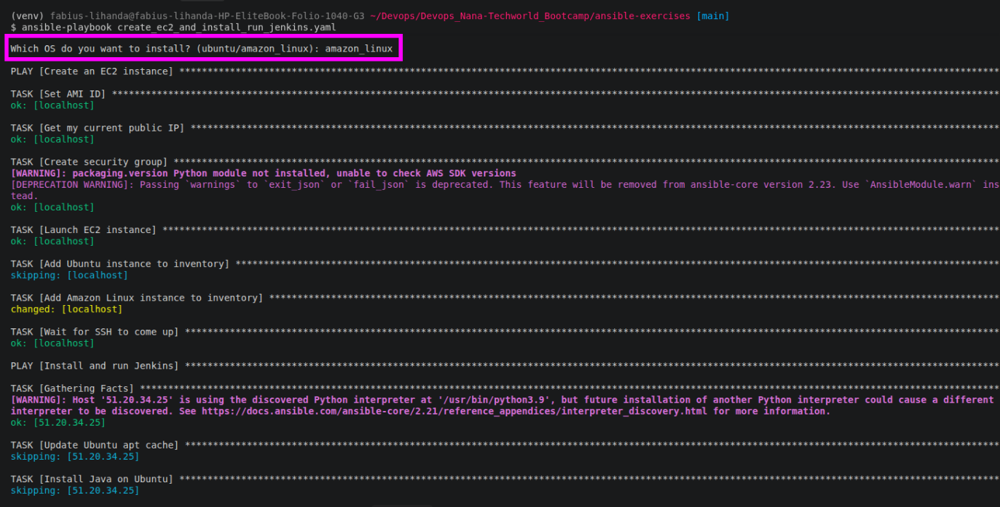
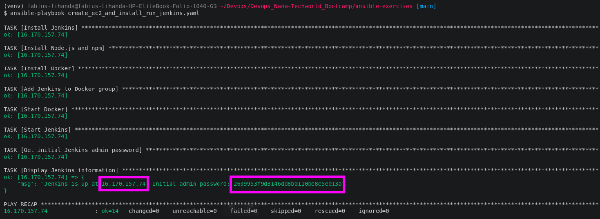
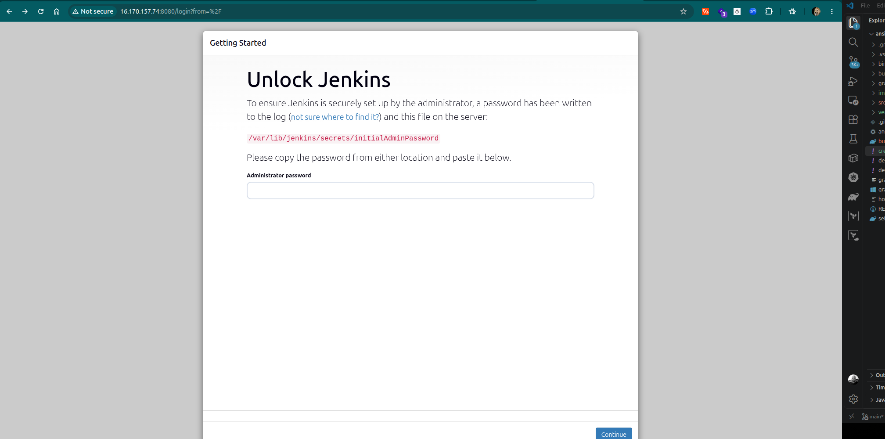
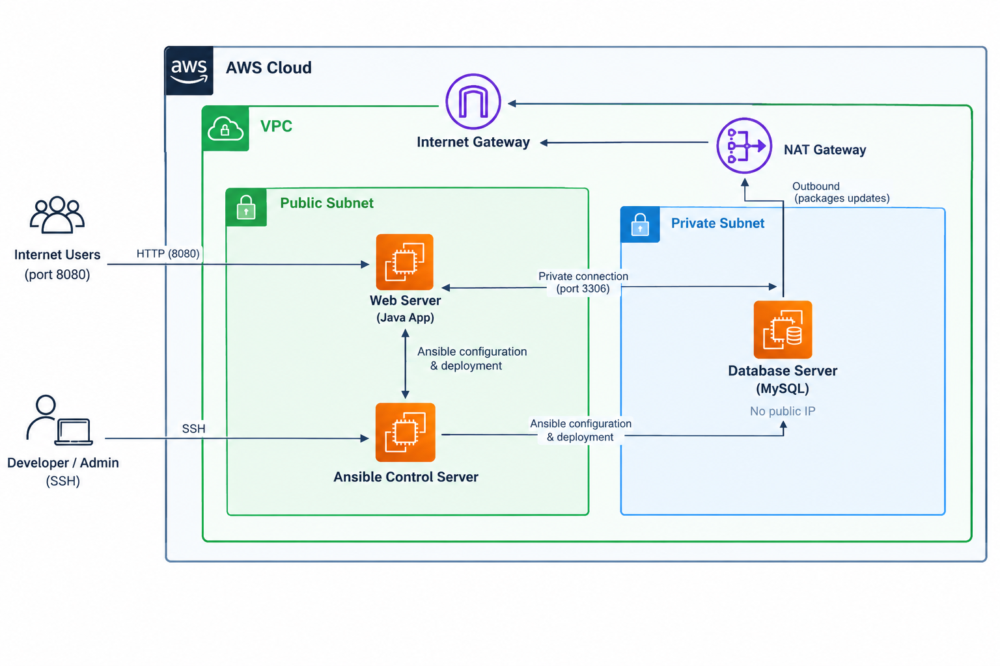
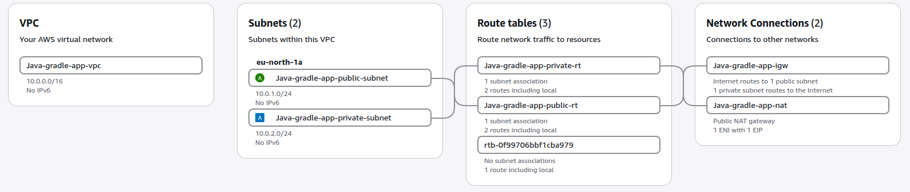

# 🤖 Automation with Ansible – Provisioning, Configuration and Kubernetes Deployment Pipelines

Manual infrastructure work doesn't scale well, the same steps repeated across servers eventually drift apart, break under time pressure, or end up understood by only one person. Ansible solves this by letting infrastructure be defined once, as code: it's agentless (driving everything over plain SSH, no software required on target machines) and idempotent (running the same playbook twice produces the same safe result, not double the side effects), which means a deployment process can be version-controlled, reviewed, and handed to anyone to run with confidence.

This directory walks through eight projects that build on each other — starting with a single-command Java artifact deployment, moving through multi-server AWS provisioning with private networking, and finishing with a Kubernetes-based deployment pipeline — each one turning a manual process into something repeatable and automated end to end. Each project is framed around a real team's requirements, presented the way they'd actually reach a DevOps engineer: a specific pain point or ask from developers, translated here into an Ansible playbook that solves it.


## Project Objectives

Across the projects, these were my main objectives to take after building the projects:

- Build repeatable, version-controlled infrastructure workflows that reduce manual configuration and make deployments easier to reproduce and maintain.
- Reduce deployment risk and configuration drift by replacing manual, error-prone infrastructure processes with consistent automated workflows.
- Understand and apply **Ansible configuration management and automation best practices**, including reusable and idempotent playbooks.
- Automate **application deployment, server configuration, and artifact management** across different environments.
- Configure and manage **Ansible control nodes** while handling **OS and distribution differences** using conditionals, variables, and task inclusion.
- Integrate Ansible with **AWS infrastructure**, including EC2 provisioning, networking, private subnets, and multi-server architectures.
- Automate **Docker and Kubernetes deployments**, including containerized applications, persistent storage, Services, ConfigMaps, Secrets, Ingress, and Helm.
- Develop practical **troubleshooting and infrastructure automation skills** across Linux, AWS, Ansible, Docker, and Kubernetes.

---

<details>
<summary> Project 1: Build & Deploy Java Artifact</summary>

<br />

The starting point was a Gradle/Spring Boot application that needed to be built locally and deployed to a remote Ubuntu server. The goal was to make the entire process repeatable through a single Ansible playbook, including creating the application user, installing Java, replacing an existing artifact, and starting the application.

### Implementation

The playbook uses two plays:

- **Build:** First play. Runs entirely locally then simply builds the Java application locally using Gradle.
- **Deploy:** Second play. Connects to the remote Ubuntu server, prepares the environment, replaces the existing JAR artifact, and starts the application under a specified Linux user.

```yaml

---
- name: Build Java Gradle application jar
  hosts: localhost
  connection: local
  gather_facts: false

  vars_files:
    - project-vars


  tasks:
    - name: Build Gradle project
      command: ./gradlew clean build
      args:
        chdir: "{{ local_project_dir }}"


- name: Deploy Java application
  hosts: app_server
  become: true

  vars_files:
    - project-vars

  vars_prompt:
    - name: firstname
      prompt: "Enter your first name"
      private: false

  tasks:

    - name: Create linux application user
      user:
        name: "{{ firstname }}"
        state: present
        create_home: true
        groups: adm

    - name: Update apt repo and cache
      apt:
        update_cache: yes
        cache_valid_time: 3600

    - name: Install Java
      apt:
        name:
          - openjdk-17-jre-headless
          - acl
        state: present

    - name: Check if application is running
      shell: pgrep -f "java -jar /home/ubuntu/app.jar"
      register: app_process
      failed_when: false
      changed_when: false

    - name: Stop running application
      shell: "kill {{ app_process.stdout }} || true"
      when: app_process.rc == 0
      changed_when: app_process.rc == 0

    - name: Remove old jar file
      file:
        path: /home/ubuntu/app.jar
        state: absent

    - name: Copy new jar artifact
      copy:
        src: "{{ local_project_dir }}/build/libs/build-tools-exercises-1.0-SNAPSHOT.jar"
        dest: /home/ubuntu/app.jar
        mode: "0644"

    - name: Start Java application
      shell: nohup java -jar /home/ubuntu/app.jar > /home/{{ firstname }}/app.log 2>&1 &
      become_user: "{{ firstname }}"

```
Before deployment, Ansible ensures that the required Linux user and Java runtime exist. If an older instance of the application is running, the process is stopped and the previous JAR is removed before the new artifact is copied.

> **Note:** `nohup` keeps the Java process running after Ansible's SSH session ends. Without it, the process would terminate when the remote session closes. The `&` runs the application in the background, while the output is redirected to `app.log` located in the specified user's home directory.
>
> **Note on `acl` package:** The `acl` (Access Control List) package is required so Ansible can safely switch to run commands as the newly created application user (`become_user: "{{ firstname }}"`). Without it, Linux blocks the non-admin user from reading Ansible's temporary setup files, causing permission errors.


</details>

---

<details>
<summary> Project 2: Push Java Artifact to Nexus</summary>

<br />

Once developers had tested the application by running it directly from their local environment, the next step was to publish a verified artifact somewhere the rest of the team could pull it from, rather than passing JAR files around manually. This called for a Nexus repository as the artifact store, and a playbook that lets a developer specify a JAR and push it there on demand.

### Nexus Server Setup

The Nexus server itself was provisioned and configured with a separate playbook, [`deploy_nexus.yaml`](https://github.com/lihandafabius/Ansible/blob/main/deploy_nexus.yaml). It installs Java and `net-tools`, downloads and unpacks the Nexus installer, creates a dedicated `nexus` system user/group to own and run the service (rather than running it as root), and starts and verifies the service.

Inside Nexus, rather than using the built-in `admin` account for the upload, I created a separate user scoped to a role with just the permissions needed for the target repository.


> **Note on repository policy:** Nexus repositories enforce a version policy — Release, Snapshot, or Mixed. A repository created as Release-only will reject any artifact whose version string ends in `-SNAPSHOT` with an HTTP 400. This was resolved by switching the target repository's policy to Mixed, allowing both release and snapshot artifacts to live in the same repository — a reasonable simplification for a smaller project, where a larger team would more likely split these into two separate repositories.


### Implementation

With the server and repository in place, the upload itself is handled by a single local play. It prompts for the JAR filename and Nexus credentials, confirms the JAR actually exists before doing anything else, then uploads it via `curl`.

```yaml
---
- name: Push Java artifact to Nexus
  hosts: localhost
  connection: local
  gather_facts: false

  vars_prompt:
    - name: jar_file
      prompt: "Enter the JAR filename"
      private: false

    - name: nexus_username
      prompt: "Enter Nexus username"
      private: false

    - name: nexus_password
      prompt: "Enter Nexus password"
      private: true

  vars:
    nexus_url: "http://13.61.19.95:8081/repository/java-app/"
    group_id: "com.example"
    artifact_id: "build-tools-exercises"
    version: "1.0-SNAPSHOT"
    jar_path: "/home/fabius-lihanda/Devops/Devops_Nana-Techworld_Bootcamp/ansible-exercises/build/libs/{{ jar_file }}"

  tasks:

    - name: Check if JAR exists
      stat:
        path: "{{ jar_path }}"
      register: jar_file_status

    - name: Fail if JAR does not exist
      fail:
        msg: "JAR file {{ jar_file }} does not exist."
      when: not jar_file_status.stat.exists

    - name: Upload JAR to Nexus
      shell: curl -u "{{ nexus_username }}:{{ nexus_password }}" --upload-file "{{ jar_path }}" "{{ nexus_url }}com/example/{{ artifact_id }}/{{ version }}/{{ jar_file }}"
      no_log: true

    - name: Display success message
      debug:
        msg: "Successfully uploaded {{ jar_file }} to Nexus."
```

Credentials are collected interactively via `vars_prompt` rather than hardcoded, with the password field marked `private: true` so it isn't echoed to the terminal. The `stat` + `fail` combination acts as a guard clause, stopping the play early with a clear message instead of letting `curl` fail obscurely on a missing file.

> **Note on `no_log: true`:** Because the upload task's command line embeds the Nexus password, `no_log: true` suppresses that task's output in Ansible's logs and console — without it, the credentials would appear in plain text in the run output.


</details>

---

<details>
<summary> Project 3: Dynamically Provision Jenkins on EC2 or Ubuntu </summary>

<br />

Up to this point Jenkins servers had to be created and configured by hand whenever the team needed one. The goal here was to remove that bottleneck entirely: a single Ansible command should be able to spin up a brand-new server and come back with a fully working Jenkins instance, ready for builds. Since the company also runs infrastructure outside AWS, the same playbook needed to support installing onto an existing Ubuntu server as well as provisioning a fresh EC2 instance — one codebase, two OS flavors, selected at runtime. Jenkins itself is run as a Docker container here rather than installed as a native package.

### Implementation

The playbook is split into two plays:

- **Provision:** First play. Runs locally, asks which OS to target, provisions the EC2 instance and its security group, and dynamically adds the new host to the in-memory inventory.
- **Configure:** Second play. Connects to whichever host resulted from the first play, installs Docker (branching between `apt` and `dnf` depending on `os_type`), then starts Jenkins as a Docker container. 

```yaml
---
- name: Create an EC2 instance
  hosts: localhost
  connection: local
  gather_facts: false

  # If you have the AWS CLI configured (aws configure), boto3 automatically
  # picks up your credentials - you don't need to pass them explicitly.

  vars_prompt:
    - name: os_type
      prompt: "Which OS do you want to install? (ubuntu/amazon_linux)"
      private: false

  vars:
    aws_region: "eu-north-1"
    instance_type: "t3.small"

    ami_ids:
      ubuntu: "ami-0aba19e56f3eaec05"
      amazon_linux: "ami-06cfeaaa22092f09d"

    key_name: "jenkins"
    key_file: "~/.ssh/jenkins.pem"
    instance_name: "jenkins-server"
    sg_name: "jenkins-server-sg"

  tasks:

    - name: Set AMI ID
      set_fact:
        ami_id: "{{ ami_ids[os_type] }}"

    - name: Get my current public IP
      uri:
        url: https://api.ipify.org
        return_content: true
      register: my_ip

    - name: Create security group
      amazon.aws.ec2_security_group:
        name: "{{ sg_name }}"
        description: "Allow SSH and Jenkins traffic from my IP only"
        region: "{{ aws_region }}"
        rules:
          - proto: tcp
            ports:
              - 22
            cidr_ip: "{{ my_ip.content }}/32"
            rule_desc: "SSH from my IP"

          - proto: tcp
            ports:
              - 8080
            cidr_ip: "{{ my_ip.content }}/32"
            rule_desc: "Access Jenkins from my IP"

    - name: Launch EC2 instance
      amazon.aws.ec2_instance:
        name: "{{ instance_name }}"
        key_name: "{{ key_name }}"
        instance_type: "{{ instance_type }}"
        image_id: "{{ ami_id }}"
        region: "{{ aws_region }}"
        security_group: "{{ sg_name }}"
        wait: true
        state: running
        tags:
          Environment: "dev"
      register: ec2_result

    - name: Add Ubuntu instance to inventory
      add_host:
        name: "{{ ec2_result.instances[0].public_ip_address }}"
        groups: jenkins
        ansible_user: ubuntu
        ansible_ssh_private_key_file: "{{ key_file }}"
        ansible_ssh_common_args: "-o StrictHostKeyChecking=no"
        os_type: "{{ os_type }}"
      when: os_type == "ubuntu"

    - name: Add Amazon Linux instance to inventory
      add_host:
        name: "{{ ec2_result.instances[0].public_ip_address }}"
        groups: jenkins
        ansible_user: ec2-user
        ansible_ssh_private_key_file: "{{ key_file }}"
        ansible_ssh_common_args: "-o StrictHostKeyChecking=no"
        os_type: "{{ os_type }}"
      when: os_type == "amazon_linux"

    - name: Wait for SSH to come up
      wait_for:
        host: "{{ ec2_result.instances[0].public_ip_address }}"
        port: 22
        delay: 5
        timeout: 180
        state: started


- name: Install and run Jenkins as a Docker container
  hosts: jenkins
  become: true

  tasks:

    # ---- Ubuntu ----
    - name: Update Ubuntu apt cache
      apt:
        update_cache: true
        cache_valid_time: 3600
      when: os_type == "ubuntu"

    # Using the Ubuntu-maintained docker.io package for simplicity.
    # Production setups should instead add Docker's official apt repo
    # (docs.docker.com/engine/install/ubuntu) for the latest version and security patches.

    - name: Install Docker on Ubuntu
      apt:
        name:
          - docker.io 
        state: present
      when: os_type == "ubuntu"

    # ---- Amazon Linux ----
    - name: Update Amazon Linux packages
      dnf:
        name: "*"
        state: latest
        update_only: true
      when: os_type == "amazon_linux"

    - name: Install Docker on Amazon Linux
      dnf:
        name:
          - docker
        state: present
      when: os_type == "amazon_linux"

    # ---- Common ----
    - name: Start Docker
      service:
        name: docker
        state: started
        enabled: true

    - name: Find docker binary path
      command: which docker
      register: docker_result
      changed_when: false

    - name: Start jenkins container
      community.docker.docker_container:
        name: jenkins
        image: jenkins/jenkins:lts
        volumes:
          - /var/run/docker.sock:/var/run/docker.sock
          - "{{ docker_result.stdout }}:/usr/bin/docker"
          - jenkins_home:/var/jenkins_home
        ports:
          - "8080:8080"
          - "50000:50000"

    - name: Set Docker socket permission
      ansible.builtin.file:
        path: /var/run/docker.sock
        mode: "0666"

    - name: Wait for Jenkins to initialize
      wait_for:
        path: /var/lib/docker/volumes/jenkins_home/_data/secrets/initialAdminPassword
        timeout: 120

    - name: Get initial Jenkins admin password
      command: docker exec jenkins cat /var/jenkins_home/secrets/initialAdminPassword
      register: jenkins_password
      changed_when: false

    - name: Display Jenkins information
      debug:
        msg: "Jenkins is up at {{ inventory_hostname }}. Initial admin password: {{ jenkins_password.stdout }}"
```

> **Notes:**
> - **Security group scoping:** Rather than opening SSH and the Jenkins web UI to `0.0.0.0/0`, the play calls the `api.ipify.org` service to get the operator's current public IP and locks both the SSH (22) and Jenkins (8080) rules to that single `/32` address. This avoids exposing a fresh, not-yet-hardened Jenkins instance to the whole internet during setup.
> - **`add_host` and dynamic inventory:** Since the target host doesn't exist until the first play creates it, `add_host` registers the new instance's public IP into an in-memory `jenkins` group on the fly — along with the correct SSH user and `os_type` fact — so the second play can immediately target it without a separate inventory file.
> - `community.docker.docker_container` is idempotent by design — it checks the container's actual state and config before acting, so rerunning the playbook doesn't fail on a name conflict or blindly recreate a container that's already correct, the way a raw `docker run` via `command` would.

- Mounting `/var/run/docker.sock` and the host's `docker` binary (path resolved dynamically via `which docker`) lets Jenkins run Docker builds against the host's engine instead of nesting its own daemon.
- The container's Jenkins user has no relation to any host user/group, so host-side group membership doesn't apply. `0666` on the socket is the simple fix.







</details>

---

<details>
<summary> Project 4: Web Server and Database Server Configuration</summary>

<br />

Another team wanted a traditional, non-containerized setup: a Java web application talking to a MySQL database, both on AWS, provisioned and configured entirely through Ansible. The agreed architecture was a dedicated Ansible control-plane server, alongside a web server and a database server sharing the same VPC — with the database left deliberately unreachable from outside the VPC by giving it no public IP address at all.

Since the database server has no direct internet access, package installation for it still needs an outbound path, so its subnet routes through a NAT gateway rather than an Internet Gateway. And since the database's private IP can't be reached from outside the VPC in the first place, the two servers can't be configured directly from a local machine — that work has to run *from* the Ansible control server, once it's inside the VPC.

### Architecture



### Implementation

The project is split across four playbooks, run in order:

#### 1. Provision networking

Creates the VPC, both subnets, the Internet Gateway, the NAT Gateway (with its own Elastic IP), and the public/private route tables.

```yaml
---
- name: Provision networking infrastructure
  hosts: localhost
  connection: local
  gather_facts: false

  vars:
    aws_region: "eu-north-1"
    availability_zone: "eu-north-1a"

    vpc_cidr: "10.0.0.0/16"
    public_subnet_cidr: "10.0.1.0/24"
    private_subnet_cidr: "10.0.2.0/24"

    vpc_name: "Java-gradle-app-vpc"
    public_subnet_name: "Java-gradle-app-public-subnet"
    private_subnet_name: "Java-gradle-app-private-subnet"
    igw_name: "Java-gradle-app-igw"
    public_route_table_name: "Java-gradle-app-public-rt"
    private_route_table_name: "Java-gradle-app-private-rt"
    nat_gateway_name: "Java-gradle-app-nat"

  tasks:

    - name: Create VPC
      amazon.aws.ec2_vpc_net:
        name: "{{ vpc_name }}"
        cidr_block: "{{ vpc_cidr }}"
        region: "{{ aws_region }}"
        state: present
        tags:
          Name: "{{ vpc_name }}"
      register: vpc

    - name: Create public subnet
      amazon.aws.ec2_vpc_subnet:
        vpc_id: "{{ vpc.vpc.id }}"
        cidr: "{{ public_subnet_cidr }}"
        az: "{{ availability_zone }}"
        region: "{{ aws_region }}"
        map_public: true
        state: present
        tags:
          Name: "{{ public_subnet_name }}"
      register: public_subnet

    - name: Create private subnet
      amazon.aws.ec2_vpc_subnet:
        vpc_id: "{{ vpc.vpc.id }}"
        cidr: "{{ private_subnet_cidr }}"
        az: "{{ availability_zone }}"
        region: "{{ aws_region }}"
        map_public: false
        state: present
        tags:
          Name: "{{ private_subnet_name }}"
      register: private_subnet

    - name: Create Internet Gateway
      amazon.aws.ec2_vpc_igw:
        vpc_id: "{{ vpc.vpc.id }}"
        region: "{{ aws_region }}"
        state: present
        tags:
          Name: "{{ igw_name }}"
      register: igw

    - name: Create public route table
      amazon.aws.ec2_vpc_route_table:
        vpc_id: "{{ vpc.vpc.id }}"
        region: "{{ aws_region }}"
        tags:
          Name: "{{ public_route_table_name }}"
        subnets:
          - "{{ public_subnet.subnet.id }}"
        routes:
          - dest: "0.0.0.0/0"
            gateway_id: "{{ igw.gateway_id }}"
        state: present

    - name: Allocate Elastic IP for NAT Gateway
      amazon.aws.ec2_eip:
        region: "{{ aws_region }}"
        in_vpc: true
        state: present
      register: nat_eip

    - name: Create NAT Gateway
      amazon.aws.ec2_vpc_nat_gateway:
        subnet_id: "{{ public_subnet.subnet.id }}"
        allocation_id: "{{ nat_eip.allocation_id }}"
        region: "{{ aws_region }}"
        state: present
        wait: true
        tags:
          Name: "{{ nat_gateway_name }}"
      register: nat_gateway

    - name: Create private route table
      amazon.aws.ec2_vpc_route_table:
        vpc_id: "{{ vpc.vpc.id }}"
        region: "{{ aws_region }}"
        tags:
          Name: "{{ private_route_table_name }}"
        subnets:
          - "{{ private_subnet.subnet.id }}"
        routes:
          - dest: "0.0.0.0/0"
            nat_gateway_id: "{{ nat_gateway.nat_gateway_id }}"
        state: present

    - name: Display networking information
      debug:
        msg:
          - "VPC ID: {{ vpc.vpc.id }}"
          - "Public subnet ID: {{ public_subnet.subnet.id }}"
          - "Private subnet ID: {{ private_subnet.subnet.id }}"
```

- In a real environment this networking layer would typically already exist, managed separately (e.g. by a networking/platform team or via Terraform) — it's included here to make the exercise fully self-contained.
- The private route table points `0.0.0.0/0` at the NAT Gateway rather than the Internet Gateway, giving the database server outbound-only access — enough to install packages, but nothing can initiate a connection *into* it from the internet.



#### 2. Provision the three servers

Looks up the VPC/subnets created above, creates three chained security groups, then launches the control-plane, web, and database instances — the database instance alone gets `assign_public_ip: false`.

```yaml
---
- name: Provision Ansible, Web and Database servers
  hosts: localhost
  connection: local
  gather_facts: false

  vars:
    aws_region: "eu-north-1"
    availability_zone: "eu-north-1a"
    vpc_name: "Java-gradle-app-vpc"
    public_subnet_name: "Java-gradle-app-public-subnet"
    private_subnet_name: "Java-gradle-app-private-subnet"

    instance_type: "t3.small"
    key_name: "myapp-key-pair"
    ami_id: "ami-0aba19e56f3eaec05"
    key_file: "~/.ssh/myapp-key-pair.pem"

  tasks:

    - name: Get VPC information
      amazon.aws.ec2_vpc_net_info:
        region: "{{ aws_region }}"
        filters:
          "tag:Name": "{{ vpc_name }}"
      register: vpc_info

    - name: Get public subnet information
      amazon.aws.ec2_vpc_subnet_info:
        region: "{{ aws_region }}"
        filters:
          "tag:Name": "{{ public_subnet_name }}"
      register: public_subnet_info

    - name: Get private subnet information
      amazon.aws.ec2_vpc_subnet_info:
        region: "{{ aws_region }}"
        filters:
          "tag:Name": "{{ private_subnet_name }}"
      register: private_subnet_info

    - name: Set network IDs
      set_fact:
        vpc_id: "{{ vpc_info.vpcs[0].vpc_id }}"
        public_subnet_id: "{{ public_subnet_info.subnets[0].id }}"
        private_subnet_id: "{{ private_subnet_info.subnets[0].id }}"

    - name: Get my current public IP
      uri:
        url: https://api.ipify.org
        return_content: true
      register: my_ip

    - name: Create Ansible security group
      amazon.aws.ec2_security_group:
        name: "control-node-sg"
        description: "Security group for Ansible control plane"
        vpc_id: "{{ vpc_id }}"
        region: "{{ aws_region }}"
        rules:
          - proto: tcp
            ports: [22]
            cidr_ip: "{{ my_ip.content }}/32"
            rule_desc: "SSH from my IP"
      register: control_node_sg

    - name: Create Web security group
      amazon.aws.ec2_security_group:
        name: "app-server-sg"
        description: "Security group for Java web server"
        vpc_id: "{{ vpc_id }}"
        region: "{{ aws_region }}"
        rules:
          - proto: tcp
            ports: [22]
            group_id: "{{ control_node_sg.group_id }}"
            rule_desc: "SSH from Ansible server"
          - proto: tcp
            ports: [8080]
            cidr_ip: "{{ my_ip.content }}/32"
            rule_desc: "Java application from my IP"
      register: web_server_sg

    - name: Create Database security group
      amazon.aws.ec2_security_group:
        name: "db-server-sg"
        description: "Security group for MySQL database"
        vpc_id: "{{ vpc_id }}"
        region: "{{ aws_region }}"
        rules:
          - proto: tcp
            ports: [22]
            group_id: "{{ control_node_sg.group_id }}"
            rule_desc: "SSH from Ansible server"
          - proto: tcp
            ports: [3306]
            group_id: "{{ web_server_sg.group_id }}"
            rule_desc: "MySQL from Web server"
      register: db_server_sg

    - name: Provision Ansible control plane
      amazon.aws.ec2_instance:
        name: "Java-gradle-app-ansible-server"
        key_name: "{{ key_name }}"
        instance_type: "{{ instance_type }}"
        image_id: "{{ ami_id }}"
        region: "{{ aws_region }}"
        vpc_subnet_id: "{{ public_subnet_id }}"
        security_groups: ["{{ control_node_sg.group_id }}"]
        network_interfaces:
          - assign_public_ip: true
        wait: true
        state: running
        tags:
          Name: "Java-gradle-app-ansible-server"
          Role: "ansible-control-plane"
      register: ansible_server

    - name: Provision Web server
      amazon.aws.ec2_instance:
        name: "Java-gradle-app-web-server"
        key_name: "{{ key_name }}"
        instance_type: "{{ instance_type }}"
        image_id: "{{ ami_id }}"
        region: "{{ aws_region }}"
        vpc_subnet_id: "{{ public_subnet_id }}"
        security_groups: ["{{ web_server_sg.group_id }}"]
        network_interfaces:
          - assign_public_ip: true
        wait: true
        state: running
        tags:
          Name: "Java-gradle-app-web-server"
          Role: "web-server"
      register: web_server

    - name: Provision Database server
      amazon.aws.ec2_instance:
        name: "Java-gradle-app-db-server"
        key_name: "{{ key_name }}"
        instance_type: "{{ instance_type }}"
        image_id: "{{ ami_id }}"
        region: "{{ aws_region }}"
        vpc_subnet_id: "{{ private_subnet_id }}"
        security_groups: ["{{ db_server_sg.group_id }}"]
        network_interfaces:
          - assign_public_ip: false
        wait: true
        state: running
        tags:
          Name: "Java-gradle-app-db-server"
          Role: "database-server"
      register: db_server

    - name: Display server information
      debug:
        msg:
          - "Control node public IP: {{ ansible_server.instances[0].public_ip_address }}"
          - "Web server public IP: {{ web_server.instances[0].public_ip_address }}"
          - "Database server private IP: {{ db_server.instances[0].private_ip_address }}"
```

- Som security groups reference each other by `group_id` rather than by CIDR — so access is based on group membership, not IP address. The DB only accepts 3306 from servers in the web server's SG; even if the web server's IP changes, it still gets in, and no other server on the same network can.
- `assign_public_ip: false` on the database instance is what actually keeps it unreachable from outside the VPC — the private subnet's routing alone wouldn't be enough if the instance also had a public IP.

#### 3. Configure the Ansible control server

Looks up all three running instances, then connects to the control server to install Python/Ansible, install the `geerlingguy.mysql` role from Galaxy, and stage everything the next playbook needs — the SSH private key, a generated `inventory.ini` targeting the web and DB servers by *private* IP, the built jar, and the deploy playbook itself. It finishes by running that deploy playbook from the control server.

```yaml
---
- name: Look up servers and prep the control server connection
  hosts: localhost
  connection: local
  gather_facts: false

  vars_files:
    - project-vars

  tasks:

    - name: Get Ansible control server information
      amazon.aws.ec2_instance_info:
        region: "{{ aws_region }}"
        filters:
          "tag:Name": "{{ control_server_name }}"
          instance-state-name: "running"
      register: control_server

    - name: Get web server information
      amazon.aws.ec2_instance_info:
        region: "{{ aws_region }}"
        filters:
          "tag:Name": "{{ web_server_name }}"
          instance-state-name: "running"
      register: web_server

    - name: Get db server information
      amazon.aws.ec2_instance_info:
        region: "{{ aws_region }}"
        filters:
          "tag:Name": "{{ db_server_name }}"
          instance-state-name: "running"
      register: db_server

    - name: Stop if any server was not found
      fail:
        msg: "One or more servers not found - run provision_servers.yaml first."
      when: >
        control_server.instances | length == 0 or
        web_server.instances | length == 0 or
        db_server.instances | length == 0

    - name: Set server IPs
      set_fact:
        control_server_ip: "{{ control_server.instances[0].public_ip_address }}"
        web_server_private_ip: "{{ web_server.instances[0].private_ip_address }}"
        web_server_public_ip: "{{ web_server.instances[0].public_ip_address }}"
        db_server_private_ip: "{{ db_server.instances[0].private_ip_address }}"

    - name: Add control server to in-memory inventory
      add_host:
        name: "{{ control_server_ip }}"
        groups: ansible_control
        ansible_user: "{{ ssh_user }}"
        ansible_ssh_private_key_file: "{{ ssh_key }}"
        ansible_ssh_common_args: "-o StrictHostKeyChecking=no"

    - name: Wait for SSH on the control server
      wait_for:
        host: "{{ control_server_ip }}"
        port: 22
        timeout: 300


- name: Configure the control server and stage deployment files on it
  hosts: ansible_control

  vars_files:
    - project-vars

  tasks:

    - name: Install Python and pip on control server
      apt:
        name: [python3, python3-pip, python3-venv, ansible]
        state: present
        update_cache: true
      become: true

    - name: Create project directory
      ansible.builtin.file:
        path: "{{ project_dir }}"
        state: directory
        owner: "{{ ssh_user }}"
        group: "{{ ssh_user }}"
        mode: "0755"
      become: true

    - name: Install MySQL role
      ansible.builtin.command:
        cmd: ansible-galaxy role install geerlingguy.mysql
      changed_when: false

    - name: Create SSH directory
      ansible.builtin.file:
        path: "/home/{{ ssh_user }}/.ssh"
        state: directory
        owner: "{{ ssh_user }}"
        group: "{{ ssh_user }}"
        mode: "0700"
      become: true

    - name: Copy SSH private key to control server
      ansible.builtin.copy:
        src: "{{ ssh_key }}"
        dest: "/home/{{ ssh_user }}/.ssh/myapp-key-pair.pem"
        owner: "{{ ssh_user }}"
        group: "{{ ssh_user }}"
        mode: "0600"
      become: true

    - name: Copy inventory.ini
      ansible.builtin.copy:
        dest: "{{ project_dir }}/inventory.ini"
        content: |
          [web]
          {{ hostvars['localhost'].web_server_private_ip }} ansible_host={{ hostvars['localhost'].web_server_private_ip }} ansible_user={{ ssh_user }} ansible_ssh_private_key_file=~/.ssh/myapp-key-pair.pem ansible_ssh_common_args='-o StrictHostKeyChecking=no'

          [db]
          {{ hostvars['localhost'].db_server_private_ip }} ansible_host={{ hostvars['localhost'].db_server_private_ip }} ansible_user={{ ssh_user }} ansible_ssh_private_key_file=~/.ssh/myapp-key-pair.pem ansible_ssh_common_args='-o StrictHostKeyChecking=no'
        owner: "{{ ssh_user }}"
        group: "{{ ssh_user }}"
        mode: "0644"

    - name: Copy jar file
      ansible.builtin.copy:
        src: "{{ local_jar_path }}"
        dest: "{{ project_dir }}/build-tools-exercises-1.0-SNAPSHOT.jar"
        owner: "{{ ssh_user }}"
        group: "{{ ssh_user }}"
        mode: "0644"

    - name: Copy web and database deploy playbook
      ansible.builtin.copy:
        src: "{{ local_project_dir }}/deploy_app_server_and_db.yaml"
        dest: "{{ project_dir }}/deploy_app_server_and_db.yaml"
        owner: "{{ ssh_user }}"
        group: "{{ ssh_user }}"
        mode: "0644"

    - name: Run deploy_app_server_and_db.yaml on the control server
      ansible.builtin.command:
        cmd: >
          ansible-playbook -i inventory.ini deploy_app_server_and_db.yaml
          --extra-vars "web_public_ip={{ hostvars['localhost'].web_server_public_ip }}"
        chdir: "{{ project_dir }}"
      register: deploy_result
      changed_when: true

    - debug:
        var: deploy_result.stdout_lines

    - debug:
        msg: "App running at http://{{ hostvars['localhost'].web_server_public_ip }}:8080"
```

- This playbook is the one that actually reaches inside the VPC: it runs the deploy playbook *from* the control server, via a nested `ansible-playbook` invocation over `command`, because the local machine has no route to the database's private IP at all.
- `inventory.ini` is generated dynamically with the servers' private IPs rather than committed as a static file — it's built from facts this playbook just looked up, so it stays correct across re-provisioning without manual editing.

#### 4. Deploy MySQL and the Java application

Runs from the control server. Installs MySQL on `db` using the existing `geerlingguy.mysql` role rather than hand-writing that logic, and deploys the Java app on `web`, pointed at the database's private IP via environment variables.

```yaml
---
- name: Install and start MySQL on the database server
  hosts: db
  become: true

  pre_tasks:
    - name: Create MySQL native_password override file on the control server
      copy:
        dest: "/home/ubuntu/mysql-native-password-override.cnf"
        content: |
          [mysqld]
          mysql_native_password=ON
      delegate_to: localhost
      become: false

  vars:
    mysql_root_password: "rootpass"
    mysql_bind_address: "0.0.0.0"
    mysql_config_include_files:
      - src: "/home/ubuntu/mysql-native-password-override.cnf"
    mysql_databases:
      - name: appdb
    mysql_users:
      - name: appuser
        password: "userpass"
        priv: "appdb.*:ALL"
        host: "%"

  roles:
    - geerlingguy.mysql

- name: Deploy and run the Java web application
  hosts: web
  become: true

  vars:
    app_user: "appadmin"
    remote_app_dir: "/opt/java-app"
    jar_name: "build-tools-exercises-1.0-SNAPSHOT.jar"
    local_jar_path: "/home/ubuntu/ansible-project/build-tools-exercises-1.0-SNAPSHOT.jar"
    db_host: "{{ hostvars[groups['db'][0]]['ansible_host'] }}"
    db_name: "appdb"
    db_user: "appuser"
    db_password: "userpass"
    web_public_ip: "{{ ansible_host }}"

  tasks:

    - name: Create linux application user
      user:
        name: "{{ app_user }}"
        state: present
        create_home: true
        groups: adm

    - name: Update apt repo and cache
      apt:
        update_cache: true
        cache_valid_time: 3600

    - name: Install Java
      apt:
        name: [openjdk-17-jre-headless, acl]
        state: present

    - name: Create application directory
      file:
        path: "{{ remote_app_dir }}"
        state: directory
        owner: "{{ app_user }}"
        group: "{{ app_user }}"
        mode: "0755"

    - name: Check if application is running
      shell: "pgrep -f 'java -jar {{ remote_app_dir }}/{{ jar_name }}'"
      register: app_process
      failed_when: false
      changed_when: false

    - name: Stop running application
      shell: "kill {{ app_process.stdout }} || true"
      when: app_process.rc == 0
      changed_when: true

    - name: Remove old jar file
      file:
        path: "{{ remote_app_dir }}/{{ jar_name }}"
        state: absent

    - name: Copy new jar artifact
      copy:
        src: "{{ local_jar_path }}"
        dest: "{{ remote_app_dir }}/{{ jar_name }}"
        owner: "{{ app_user }}"
        group: "{{ app_user }}"
        mode: "0644"

    - name: Start Java application
      become_user: "{{ app_user }}"
      environment:
        DB_USER: "{{ db_user }}"
        DB_PWD: "{{ db_password }}"
        DB_SERVER: "{{ db_host }}"
        DB_NAME: "{{ db_name }}"
      shell: |
        cd "{{ remote_app_dir }}"
        nohup java -jar "{{ jar_name }}" > app.log 2>&1 &

    - name: Check that application is running
      shell: "pgrep -f 'java -jar {{ remote_app_dir }}/{{ jar_name }}'"
      register: app_process
      until: app_process.rc == 0
      retries: 5
      delay: 2
      changed_when: false

    - name: Check that port 8080 is listening
      shell: "ss -lnt | grep ':8080 '"
      register: port_check
      until: port_check.rc == 0
      retries: 10
      delay: 2
      changed_when: false
```

- Using an existing, maintained role (`geerlingguy.mysql`) instead of writing raw install/config tasks avoids re-solving problems the community has already handled — version quirks, config templating, and platform differences.
- The `mysql_native_password=ON` override exists because newer MySQL defaults to `caching_sha2_password`, which the app's DB driver may not support — this keeps authentication compatible without changing the application.
- `mysql_bind_address: "0.0.0.0"` is a deliberate deviation from the role's default (`127.0.0.1`, localhost-only) — required so the web server can reach MySQL at all, since it connects over the private network rather than from the same host.
- Startup polling (`until`/`retries` on both the process check and the port check) replaces a fixed sleep, so the playbook only reports success once the app has actually finished starting and is genuinely listening — not just "the start command was issued."

</details>

---

<details>
<summary>Exercise 7: Deploy Java + MySQL Application in Kubernetes</summary>

<br />

The team decided to modernize onto Kubernetes, but explicitly did not want to learn `kubectl` or raw manifest syntax — the whole point of this exercise was that deployment stays a single Ansible command, with all the Kubernetes-specific detail hidden inside version-controlled manifest files.

### Cluster and Storage

The EKS cluster was provisioned with Terraform (`terraform-aws-modules/eks`), and a `StorageClass` backed by the EBS CSI driver was created so PersistentVolumeClaims could be dynamically provisioned:

```yaml
apiVersion: storage.k8s.io/v1
kind: StorageClass
metadata:
  name: auto-ebs
provisioner: ebs.csi.eks.amazonaws.com
volumeBindingMode: WaitForFirstConsumer
parameters:
  type: gp3
allowVolumeExpansion: true
```

### MySQL: Secret, PVC, Deployment, Service

A single-replica MySQL Deployment was defined with a mounted PVC for persistence, and a `Recreate` deployment strategy — required because a `ReadWriteOnce` EBS volume can only be mounted by one pod at a time, and the default `RollingUpdate` strategy would try to start a second pod before killing the first:

```yaml
apiVersion: apps/v1
kind: Deployment
metadata:
  name: mysql
  namespace: java-app
spec:
  replicas: 1
  strategy:
    type: Recreate
  template:
    spec:
      containers:
        - name: mysql
          image: mysql:8.4
          env:
            - name: MYSQL_ROOT_PASSWORD
              valueFrom:
                secretKeyRef: { name: mysql-secret, key: MYSQL_ROOT_PASSWORD }
            - name: MYSQL_USER
              valueFrom:
                secretKeyRef: { name: mysql-secret, key: DB_USER }
            - name: MYSQL_PASSWORD
              valueFrom:
                secretKeyRef: { name: mysql-secret, key: DB_PWD }
          volumeMounts:
            - name: mysql-storage
              mountPath: /var/lib/mysql
      volumes:
        - name: mysql-storage
          persistentVolumeClaim:
            claimName: mysql-pvc
```

Note the `MYSQL_USER`/`MYSQL_PASSWORD` env vars are mapped from `DB_USER`/`DB_PWD` secret keys rather than using `envFrom` — the secret's key names match what the *Java application* expects via `System.getenv()`, while MySQL's official image expects its own specific env var names. `valueFrom.secretKeyRef` lets the container's env var name differ from the secret's key name, so one secret serves both consumers without duplicating credentials.

### Namespace Consistency

Kubernetes Secrets and PersistentVolumeClaims are namespace-scoped — a Deployment can only reference a Secret or PVC that lives in its **own** namespace. Every manifest (Secret, PVC, Deployment, Service) was given a matching `namespace: java-app`, with the namespace itself created as the first task in the deploying playbook, before anything namespaced was applied.

### Driving It All From Ansible

Every manifest is applied through `kubernetes.core.k8s`, keeping `kubectl` entirely out of the developer-facing workflow:

```yaml
- name: Create java app namespace
  kubernetes.core.k8s:
    name: java-app
    api_version: v1
    kind: Namespace
    state: present
    kubeconfig: "{{ kubeconfig }}"

- name: deploy mysql
  kubernetes.core.k8s:
    src: "{{ manifest_dir }}/mysql.yaml"
    state: present
    kubeconfig: "{{ kubeconfig }}"
```

</details>

---

<details>
<summary>Exercise 8: Deploy MySQL Chart in Kubernetes (Highly Available)</summary>

<br />

With the single-replica MySQL Deployment working, the team's next concern was availability: a single MySQL pod is a single point of failure. The task was to replace it with a 3-replica MySQL deployment sourced from a Helm chart, driven by Ansible rather than a manual `helm install`.

Ansible's `kubernetes.core.helm` module allows a chart to be installed, upgraded, or values-overridden the same way `kubernetes.core.k8s` handles raw manifests — keeping the "no kubectl/helm knowledge required" promise of the exercise intact even as the underlying implementation moved from hand-written YAML to a chart-managed StatefulSet.

</details>

---

<details>
<summary>Challenges</summary>

<br />

Automating this project end-to-end surfaced a long list of real, non-obvious problems — the kind that only show up once you actually run the thing against live infrastructure. Working through them is where most of the actual learning happened.

---

### 1. Gradle Wrapper / Version Mismatch

A fresh clone had no `gradlew` wrapper and the system-installed Gradle was version **4.4.1** — eight years old, and incompatible with the Spring Boot 3.5.5 project's plugins, producing a cryptic `NoSuchMethodError` on `TaskContainer.named()`. The fix was installing a modern Gradle via SDKMAN and generating a proper wrapper pinned to a compatible version (`gradle wrapper --gradle-version 8.14`), rather than relying on whatever Gradle happened to already be on the machine.

> **Lesson learned:** Never assume the system's installed build tool version is close to current — pin and commit a wrapper.

---

### 2. Maven Coordinate Changes

`mysql-connector-j` version 9.x moved from the `mysql:` groupId to `com.mysql:` — a dependency written as `group: 'mysql', name: 'mysql-connector-j', version: '9.2.0'` silently resolved to nothing and failed the build with `Could not find mysql:mysql-connector-j:9.2.0`. The fix was updating to the current `com.mysql:mysql-connector-j:9.2.0` coordinate.

---

### 3. Jenkins APT Signing Key Format

Early attempts to add Jenkins' apt repository key failed with `NO_PUBKEY` errors, because the key was downloaded as ASCII-armored text and saved directly — but apt's `signed-by` option expects a binary keyring, not armored text. This was resolved with `curl | gpg --dearmor -o ...`. Later, following Jenkins' current official install instructions (year-versioned key URL, `/etc/apt/keyrings` path) turned out to work with a plain download and no dearmor step at all — a reminder that "correct" install instructions for third-party repositories change over time and are worth re-checking against the vendor's current docs rather than trusting a remembered process.

---

### 4. SSH Key Pair Mismatch

A server was launched with AWS key pair name `"jenkins"`, while the configuration playbook authenticated using a completely different local key file (`myapp-key-pair.pem`) — producing `Permission denied (publickey)`. Since a key pair is baked into an EC2 instance at launch time and can't be swapped on a running instance, the fix required correcting the `key_name` var and **relaunching** the affected servers, not just editing the connecting playbook.

> **Lesson learned:** Keep `key_name` (the AWS-registered pair name) and the local `.pem` file path as a single source of truth across every playbook that touches the same servers — a mismatch here fails silently until the first SSH attempt.

---

### 5. `ansible_python_interpreter` Leaking Across `delegate_to`

A playbook running locally (via a Python virtualenv) used `delegate_to` to run tasks against a remote server. The play-level `ansible_python_interpreter` (pointing at the local venv) leaked through to the delegated host, causing Ansible to try running modules using a Python path that only existed on the operator's laptop. The first fix was explicitly overriding the interpreter in every delegated task's `vars:` block; the more durable fix was restructuring the playbook to use `add_host` + a proper second play, where connection details (including the interpreter) are set once and inherited automatically by every task — eliminating an entire class of "forgot to repeat this everywhere" bugs.

---

### 6. `pkill -f` Self-Termination

`pkill -f <jar_name>` intermittently returned non-zero (`rc: -15`, later `rc: -9` with `-9`) even though it successfully stopped the target process. The cause: `pkill -f` matches against the **full command line**, including the shell invocation running the `pkill` command itself (which literally contains the jar name as text) — so it could match and signal its own parent shell. The fix was `failed_when: false` on every `pkill` task, with a separate `pgrep`-based confirmation step as the actual pass/fail gate, rather than trusting `pkill`'s own exit code.

---

### 7. MySQL 8.4 Disabled `mysql_native_password` by Default

The `geerlingguy.mysql` role's user-creation step failed with `(1524, "Plugin 'mysql_native_password' is not loaded")`. MySQL 8.4 disabled that legacy authentication plugin by default (removed entirely in 9.0), but the role's underlying `mysql_user` module still defaulted new accounts to it. Two fixes were explored: manually re-enabling the plugin via `lineinfile` on the role's generated config file *after* install (requiring a restart and manual user creation, bypassing the role's own step); and the more correct fix, using the role's own `mysql_config_include_files` mechanism to inject `mysql_native_password=ON` **before** MySQL's first startup — letting the role's normal user-creation flow succeed on the first pass, with no restart needed.

> **Lesson learned:** A role's own error messages (down to which exact module argument failed) are often more reliable than a role's documented README, which can lag behind the actual code — `mysql_config_include_files` turned out to expect a list of dicts with a `src` key, not a list of plain path strings, discoverable only from the role's stack trace.

---

### 8. Missing EBS CSI Driver Addon

A MySQL PersistentVolumeClaim sat in `Pending` indefinitely with `Waiting for a volume to be created either by the external provisioner 'ebs.csi.eks.amazonaws.com'...`. The Terraform EKS module's `addons` block simply never included `aws-ebs-csi-driver` — nothing was provisioning volumes at all. The fix required both adding the addon *and* wiring it to an IAM role via EKS Pod Identity (the modern replacement for the older OIDC/IRSA pattern), since the driver needs AWS permissions to actually create/attach EBS volumes on the cluster's behalf.

---

### 9. Node Instance Type Too Small for Addon Pods

After adding the EBS CSI driver, its status showed `DEGRADED` with `InsufficientNumberOfReplicas ... Too many pods`. `t3.micro` instances support a very low number of pods per node (an AWS-imposed limit based on available ENI secondary IPs) — with `kube-proxy`, `aws-node`, and other DaemonSets already claiming a slot on every node, there was no room left for the CSI driver's own per-node DaemonSet pods. Bumping the node group to `t3.small` resolved it. This is a distinct failure mode from *cluster*-level resource exhaustion — it's a hard per-node ceiling that more CPU/memory headroom elsewhere in the cluster can't work around.

---

### 10. Confusing Two Incompatible Provisioning Tools

An `eksctl` `ClusterConfig` YAML file was mistakenly assumed to be pasteable into a Terraform `.tf` file. They are two entirely separate tools with incompatible syntax and no shared state — `eksctl` is a standalone CLI that manages a cluster's lifecycle directly, while `terraform-aws-modules/eks` is an HCL module managed through Terraform's own plan/apply/state cycle. Where `eksctl`'s `attachPolicyARNs` shorthand auto-generates IRSA wiring behind the scenes, the Terraform equivalent needed to be written explicitly as an `aws_iam_role` + `pod_identity_association` — not "worse," just less automatically hidden.

---

### 11. `terraform destroy` Blocked by Un-Tracked Kubernetes Resources

A VPC deletion failed with `DependencyViolation: The vpc ... has dependencies and cannot be deleted`, despite Terraform believing it owned everything in the VPC. Kubernetes Services/Ingresses of type `LoadBalancer` create real AWS resources (ENIs, load balancers) directly via the cloud controller manager — entirely outside Terraform's state. Those resources have to be cleaned up (or the corresponding Kubernetes objects deleted first, letting Kubernetes tear down its own AWS-side resources) before Terraform can successfully remove the underlying VPC.

> **Lesson learned:** Anything Kubernetes provisions dynamically in AWS (load balancers, in particular) is invisible to Terraform's state and needs to be torn down through Kubernetes first, in the correct order, during a full environment teardown.

</details>

---

## Conclusion

This project traced a full path from a single-server jar deployment to a highly-available, Helm-managed MySQL deployment running on Amazon EKS — with Ansible as the consistent automation layer throughout, regardless of how much the underlying infrastructure changed underneath it. Along the way, the project touched idempotent process management, private VPC networking with a jump-host pattern, reusing community Ansible roles instead of reinventing them, and the practical realities of Kubernetes storage provisioning on AWS (CSI drivers, Pod Identity, per-node pod limits).

Nearly every real lesson here came from something breaking in a non-obvious way — a self-signaling `pkill`, a silently-changed MySQL default, a missing Terraform addon — and tracing each one back to its actual root cause rather than working around the symptom. That process, more than any individual playbook, is the transferable skill this project was really building.
