## ☁️ AWS EC2 Deployment & CI/CD Automation with Jenkins

This project demonstrates how to provision AWS infrastructure using the AWS CLI, deploy a Dockerized Node.js application on an EC2 instance, and automate the deployment process using Jenkins CI/CD pipelines.

The setup includes:

- AWS IAM user and CLI configuration
- Infrastructure provisioning using AWS CLI
- Custom VPC, subnet, and security group configuration
- EC2 instance provisioning with AWS CLI
- Docker installation and container deployment
- Docker Compose configuration
- Jenkins CI/CD automation
- Secure SSH deployment automation
- Multi-branch pipeline automation with branch-specific logic
- Automatic webhook-triggered builds

The exercises simulate a real-world DevOps workflow where infrastructure, deployment, and automation are managed programmatically and integrated into CI/CD pipelines.

---

<details>
<summary>Exercise 1: Create IAM User & Permissions </summary>
<br />

To securely interact with AWS services, a dedicated IAM user was created and configured permissions required for infrastructure provisioning and deployment tasks.

### Steps:

* Created a new IAM user using the AWS Management Console
  
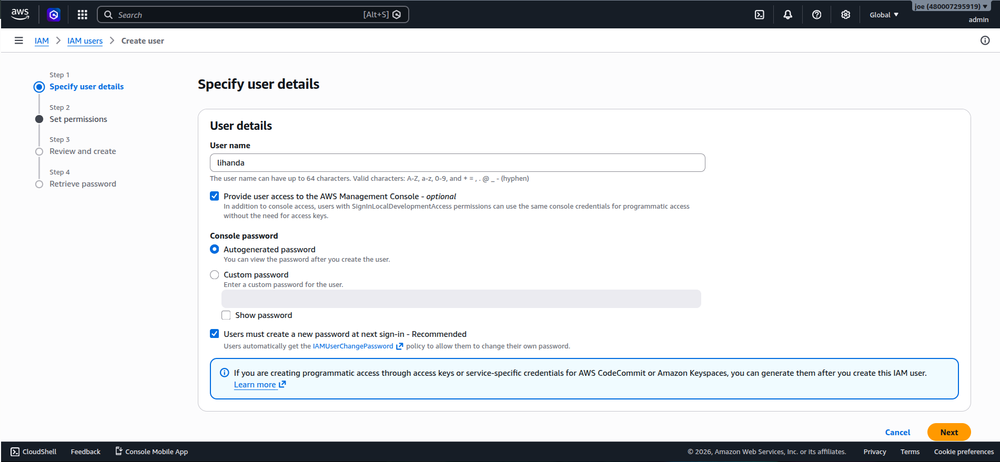

* Created a `devops` group


  
* Added the IAM user to the `devops` group

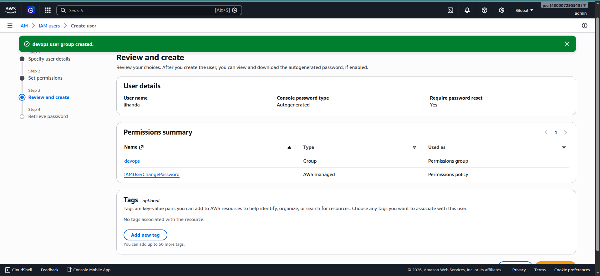

* Granted only the required permissions following the **least privilege principle**
* Attached the following AWS managed policies to the `devops` group:
  * `AmazonEC2FullAccess`
  * `AmazonVPCFullAccess`

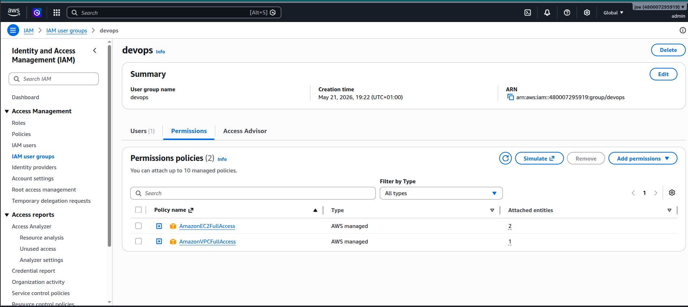

These permissions allowed management of:
  * EC2 instances
  * VPCs and subnets
  * Security groups
  * Networking configuration
* Enabled:
  * AWS Console access for the user 
  * Programmatic access (Access Key & Secret Key)

### Key Concepts:

* **IAM (Identity and Access Management):** Controls authentication and authorization in AWS
* **Least privilege principle:** Users should only receive permissions they require
* **Programmatic access:** Required for AWS CLI interaction

</details>

---

<details>
<summary>Exercise 2: Configure AWS CLI </summary>
<br />

To interact with AWS services from the terminal, AWS CLI was concigured using the IAM credentials fot the user created earlier.

### Steps:

* Created access keys to be used for configuring AWS CLI for our user:

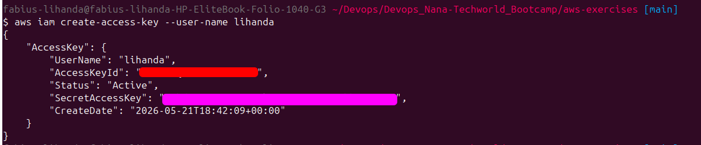

* Configured credentials using:

```bash
aws configure
```

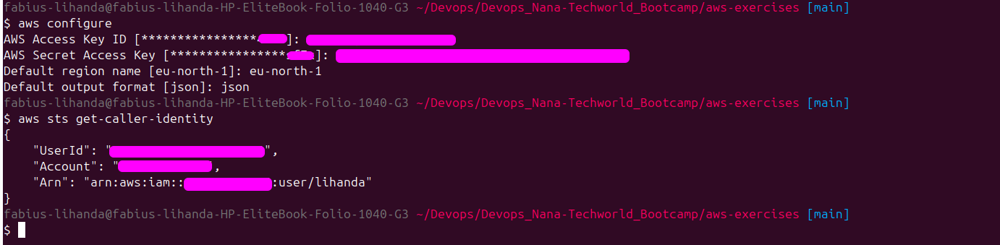

* Added:
  * Access Key ID
  * Secret Access Key
  * Default region
  * Output format
    
* Verified configuration as seen above using and also from the console:

```bash
aws sts get-caller-identity
```
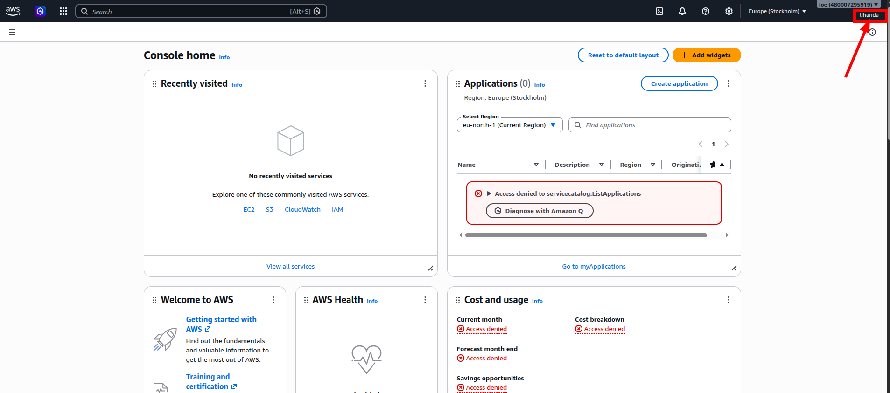

</details>

---

<details>
<summary>Exercise 3: Create VPC, Subnet & Security Group </summary>
<br />

Instead of deploying resources in the default AWS network, a dedicated Virtual Private Cloud (VPC) was created for the application infrastructure.

### Steps:

* Created a custom VPC using AWS CLI

```bash
aws ec2 create-vpc --cidr-block 10.0.0.0/16
```

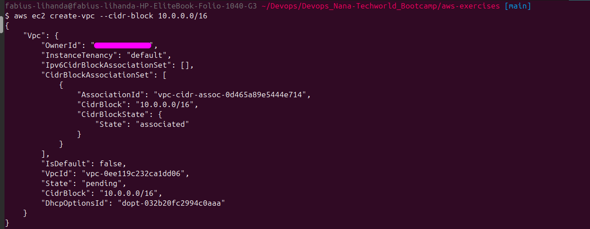

* Enabled DNS support and DNS hostnames

```bash
aws ec2 modify-vpc-attribute \
--vpc-id <vpc-id> \
--enable-dns-support "{\"Value\":true}"

aws ec2 modify-vpc-attribute \
--vpc-id <vpc-id> \
--enable-dns-hostnames "{\"Value\":true}"
```

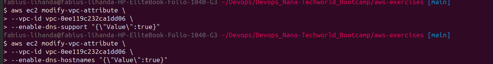

These settings were required to allow resources inside the VPC to resolve domain names and to automatically assign public DNS names to EC2 instances.

* **DNS support** → Enables DNS resolution within the VPC so instances can resolve domain names to IP addresses
* **DNS hostnames** → Automatically assigns public DNS hostnames to EC2 instances with public IP addresses, making them easier to access remotely

---

* Created a subnet inside the VPC

```bash
aws ec2 create-subnet \
--vpc-id <vpc-id> \
--cidr-block 10.0.1.0/24
```

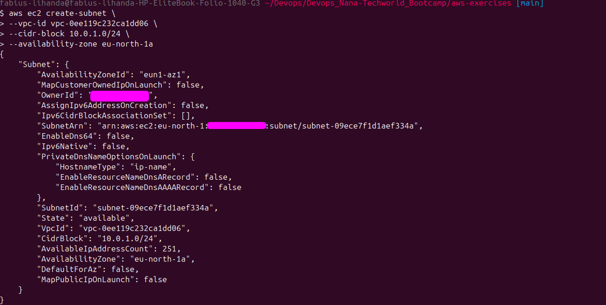

A subnet divides the VPC network into smaller network segments where resources such as EC2 instances can be deployed.

---

* Enabled automatic public IP assignment for instances launched in the subnet

```bash
aws ec2 modify-subnet-attribute \
--subnet-id <subnet-id> \
--map-public-ip-on-launch
```

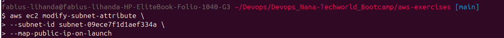

This ensures that EC2 instances launched inside the subnet automatically receive a public IP address, allowing direct internet access and remote SSH connectivity without manually assigning Elastic IPs.

---

* Created an Internet Gateway

```bash
aws ec2 create-internet-gateway
```

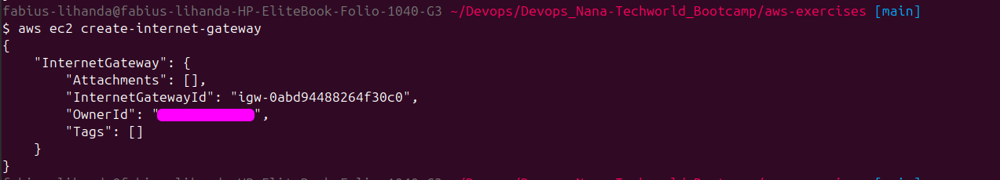

An Internet Gateway allows resources inside the VPC to communicate with the internet.

---

* Attached the Internet Gateway to the VPC

```bash
aws ec2 attach-internet-gateway \
--internet-gateway-id <igw-id> \
--vpc-id <vpc-id>
```

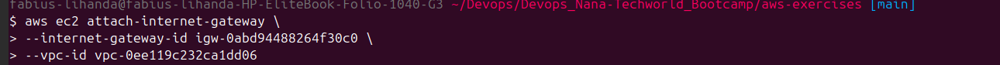

This connects the VPC to the public internet.

---

* Created a route table

```bash
aws ec2 create-route-table \
--vpc-id <vpc-id>
```

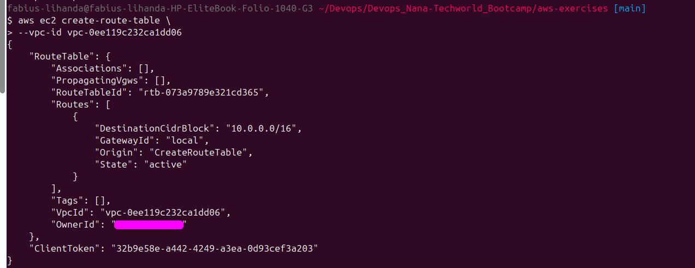

A route table controls how network traffic is routed within the VPC and to external networks.

---

* Added a public internet route

```bash
aws ec2 create-route \
--route-table-id <route-table-id> \
--destination-cidr-block 0.0.0.0/0 \
--gateway-id <igw-id>
```

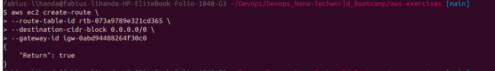

The route `0.0.0.0/0` directs all outbound internet traffic through the Internet Gateway.

---

* Associated the route table with the subnet

```bash
aws ec2 associate-route-table \
--route-table-id <route-table-id> \
--subnet-id <subnet-id>
```

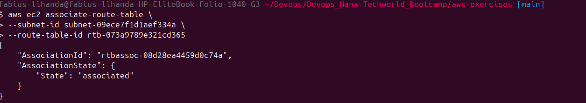

This made the subnet public by allowing instances inside it to access the internet.

---

* VPC Resource map

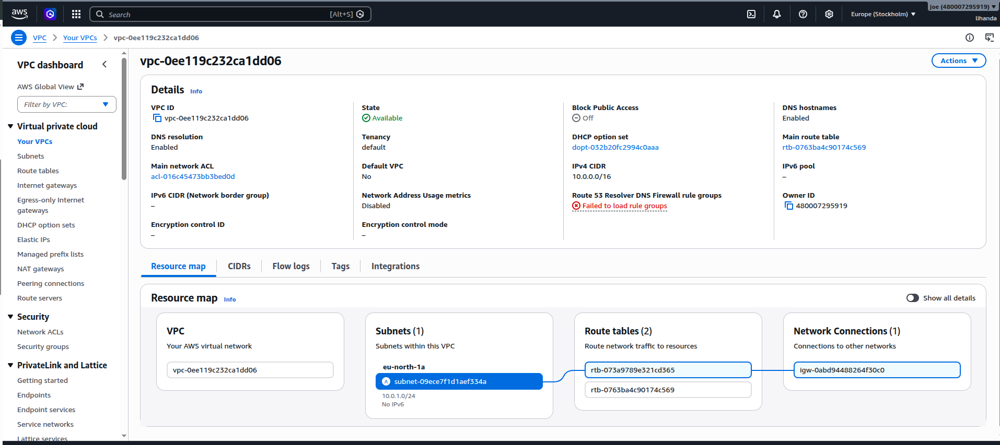

---

* Created a security group

```bash
aws ec2 create-security-group \
--group-name aws-exercises-sg \
--description "Security group for Node app" \
--vpc-id <vpc-id>
```

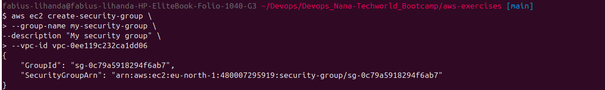

Security groups act as virtual firewalls controlling inbound and outbound traffic for EC2 instances.

---

* Added inbound rules:
  * Port `22` → SSH access
    
  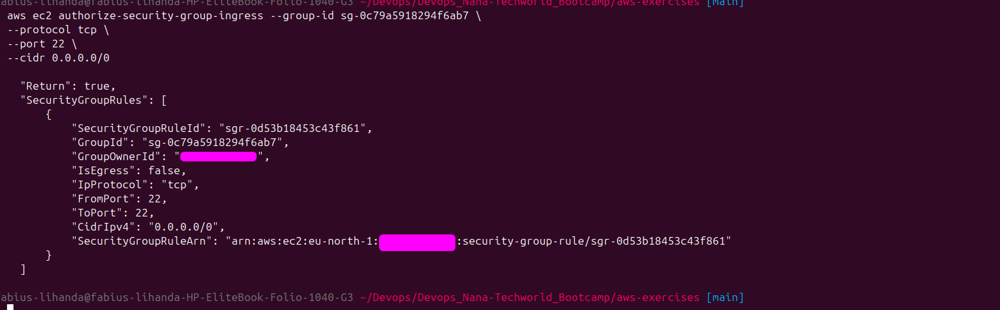
  
  * port `80` → HTTP access to allow  `apt update` etc
  
  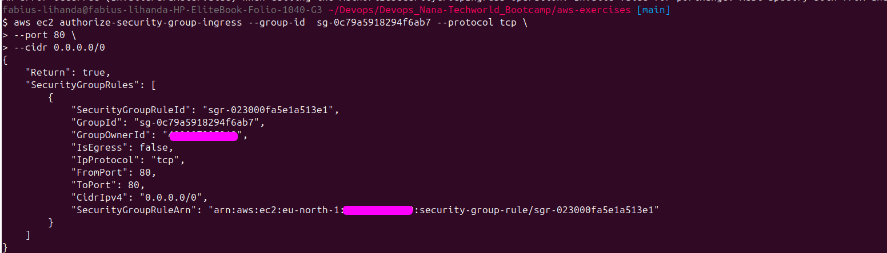

  * Application port (`3000`) → browser access

  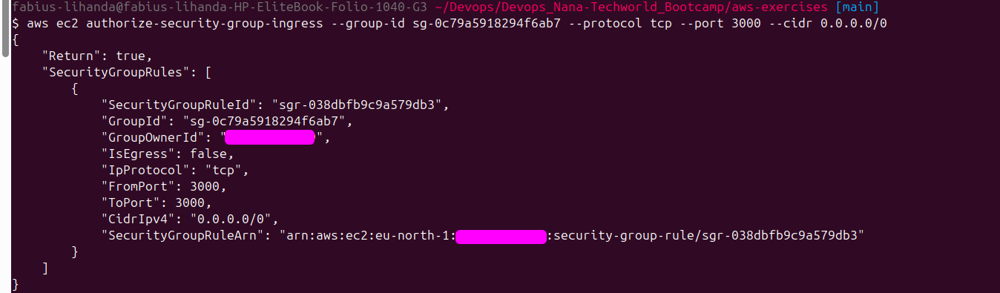


</details>

---

<details>
<summary>Exercise 4: Create EC2 Instance using AWS CLI </summary>
<br />

Once networking was configured, an EC2 instance was provisioned inside the custom VPC using AWS CLI.

### Steps:

* Created an SSH key pair

```bash
aws ec2 create-key-pair \
--key-name node_server_key \
--query 'keyMaterial' \
--output text > node_server_key.pem
```
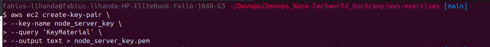

* The SSH key file was then given relevant permissions using `chmod` command

* Launched an EC2 instance

```bash
aws ec2 run-instances \
--image-id <ami-id> \
--instance-type t3.micro \
--key-name aws-server-key \
--security-group-ids <sg-id> \
--subnet-id <subnet-id>
```

* Retrieved the public IP address and displayed it in a nice view output table.

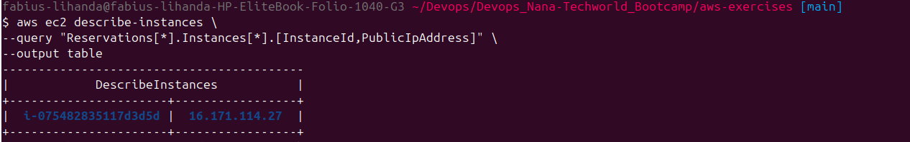


</details>

---

<details>
<summary>Exercise 5: SSH into EC2 & Install Docker </summary>
<br />

After provisioning the EC2 instance, a SSH connection was made to the server remotely and installed Docker to run the application containers.

### Steps:

* Connected to the instance using SSH

```bash
ssh -i node_server_key.pem ec2-user@<public-ip>
```

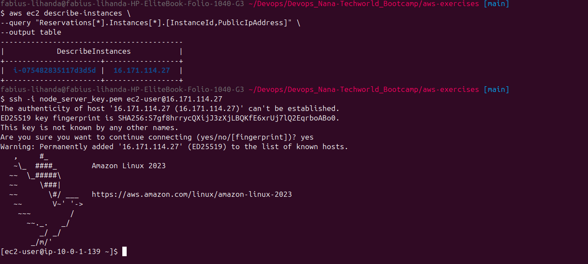

* Installed Docker

For Amazon Linux:

```bash
sudo yum update -y
sudo yum install docker -y
```

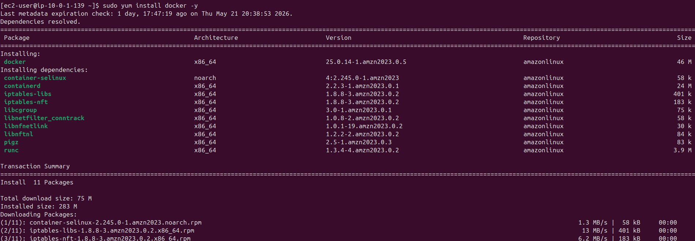


* Added current user to the Docker group

```bash
sudo usermod -aG docker $USER
```

* Restarted the session to apply group changes


</details>

---

# 🚀 Continuous Deployment Setup

The next goal was to automate the deployment process using Jenkins CI/CD pipelines.

The objective was:
- automatically build Docker images
- push images to Docker Hub
- deploy updated versions to EC2
- avoid manual deployment steps

---

<details>
<summary>Exercise 6: Add Docker Compose for Deployment </summary>
<br />

To simplify deployment configuration and improve maintainability, the Node.js application was containerized and configured using Docker Compose.

Before introducing Docker Compose, the application first needed to be dockerized using a custom `Dockerfile`. After building the image, the container was tested locally to verify that the application worked correctly inside a containerized environment.

A `.dockerignore` file was also added to exclude unnecessary files such as `node_modules`, logs, and Git metadata from the Docker build context, reducing image size and improving build performance.

### Dockerfile

```dockerfile
FROM node:18-alpine

WORKDIR /app

COPY package*.json ./
RUN npm install

COPY . .

# change ownership to node user
RUN chown -R node:node /app

# switch to non-root user
USER node

EXPOSE 3000

CMD ["node", "server.js"]
```

---
Then docker-compose was installed on the remote server

### Install Docker Compose

* Downloaded the latest Docker Compose binary

```bash
sudo curl -L https://github.com/docker/compose/releases/latest/download/docker-compose-$(uname -s)-$(uname -m) \
-o /usr/local/bin/docker-compose
```

* Added executable permissions

```bash
sudo chmod +x /usr/local/bin/docker-compose
```

* Verified the installation

```bash
docker-compose version
```
---

Instead of running long `docker run` commands with multiple parameters, Docker Compose centralizes container configuration inside a single YAML file. This also makes it easier to extend the setup later, for example by adding a database, caching service, or reverse proxy.

### docker-compose.yaml

```yaml
services:
  node-js-app:
    image: lihanda/demo-app:${IMAGE}
    ports:
      - 3000:3000

```


</details>

---

<details>
<summary>Exercise 7: Add "Deploy to EC2" Stage to Jenkins Pipeline </summary>
<br />

To automate deployments, the Jenkins pipeline was extended to deploy the application directly to the EC2 instance after building and pushing the Docker image.

Instead of manually SSH-ing into the server and running deployment commands, the entire deployment workflow was automated inside the Jenkins pipeline.

A shell deployment script (`server-cmds.sh`) was also introduced to group multiple deployment commands together. This simplified remote execution and made deployment logic easier to maintain and extend later.

### Deployment Script (`server-cmds.sh`)

```bash
#!/usr/bin/env bash

export IMAGE=$1

docker compose -f docker-compose.yaml up --detach
```

This approach avoids writing long inline SSH commands directly inside the Jenkinsfile and centralizes deployment logic in a reusable script.

---

### Steps:

* Added a deployment stage to the Jenkins pipeline
* Used Jenkins SSH Agent credentials for secure server authentication
* Transferred deployment files using `scp`
* Executed remote deployment commands using `ssh`
* Automated image deployment using environment variables

---

### Jenkins Deployment Stage

```groovy
stage('Deploy') {

    steps {
        script {
            echo 'Deploying the application to EC2 instance..'

            def shellCmd = "bash ./server-cmds.sh ${IMAGE_NAME}"

            def ec2Instance = "ec2-user@<ip>"

            sshagent(['ec2-server-key']) {

                sh """
                scp -o StrictHostKeyChecking=no \
                ${APP_PATH}/server-cmds.sh \
                ${ec2Instance}:/home/ec2-user
                """

                sh """
                scp -o StrictHostKeyChecking=no \
                ${APP_PATH}/docker-compose.yaml \
                ${ec2Instance}:/home/ec2-user
                """

                sh """
                ssh -o StrictHostKeyChecking=no \
                ${ec2Instance} \
                ${shellCmd}
                """
            }
        }
    }
}
```

---

```bash
-o StrictHostKeyChecking=no
```

This SSH option automatically accepts the remote server's SSH fingerprint without prompting for manual confirmation.

Normally, when connecting to a server for the first time, SSH asks:

```text
Are you sure you want to continue connecting (yes/no)?
```

In automated CI/CD pipelines there is no interactive terminal to manually type `yes`, so the deployment would fail.

Disabling strict host key checking allows Jenkins to:
* Connect non-interactively
* Avoid deployment interruptions
* Automatically trust the target server during automated deployments

---

Verified the files copied with SCP

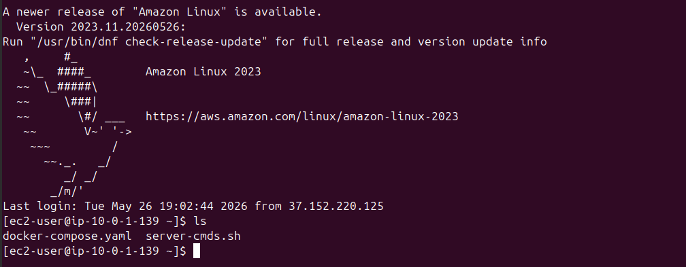

</details>

---

<details>
<summary>Exercise 8: Configure EC2 Security Group for Browser Access </summary>
<br />

This one I had already done before while creating the security group first time


* Accessed the application from the browser:

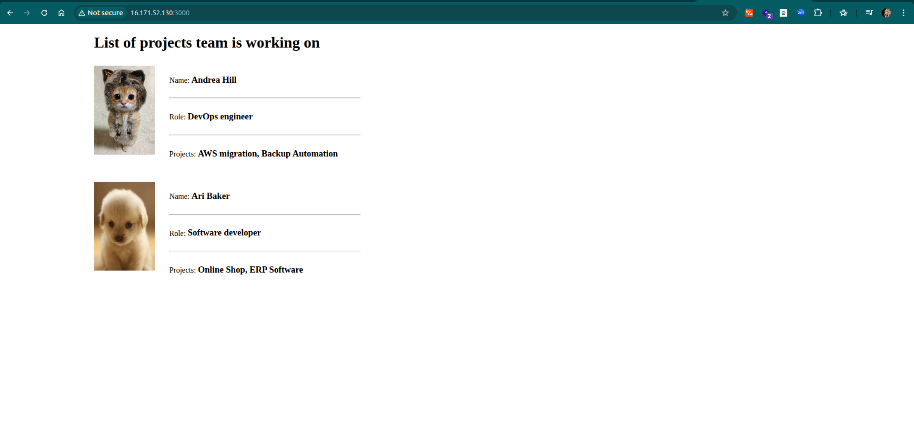

</details>

---

<details>
<summary>Exercise 9: Configure Multi-Branch Pipeline & Webhooks </summary>
<br />

To improve the CI/CD workflow, a Jenkins multibranch pipeline with automatic webhook triggering and branch-based deployment logic was configured.

The goal was to ensure that:
* all branches run automated tests
* only the `master` branch performs deployments
* pipelines are triggered automatically whenever changes are pushed to the repository

This setup prevents unfinished feature branches from being deployed to production while still validating code quality through automated testing.

---

### Jenkinsfile

```groovy
#!/usr/bin/env

@Library('Jenkins-shared-library')

def APP_PATH = "aws-exercises/app"

pipeline {
    agent any

    tools {
        nodejs 'node'
    }

    stages {

        stage('Increment app version') {
            steps {
                script {
                    incrementAppVersion(APP_PATH)
                }
            }
        }

        stage('Test code') {
            steps {
                script {
                    echo 'Running test'
                    sh "cd ${APP_PATH} && npm install && npm run test"

                    echo "Executing pipeline for branch $BRANCH_NAME"
                }
            }
        }

        stage('Build docker image') {

            when {
                expression {
                    BRANCH_NAME == "master"
                }
            }

            steps {
                script {
                    buildDockerImage(
                        "lihanda/demo-app:${IMAGE_NAME}",
                        APP_PATH
                    )
                }
            }
        }

        stage('Deploy') {

            when {
                expression {
                    BRANCH_NAME == "master"
                }
            }

            steps {
                script {

                    echo 'Deploying the application to EC2 instance..'

                    def shellCmd = "bash ./server-cmds.sh ${IMAGE_NAME}"

                    def ec2Instance = "ec2-user@16.171.52.130"

                    sshagent(['ec2-server-key']) {

                        sh """
                        scp -o StrictHostKeyChecking=no \
                        ${APP_PATH}/server-cmds.sh \
                        ${ec2Instance}:/home/ec2-user
                        """

                        sh """
                        scp -o StrictHostKeyChecking=no \
                        ${APP_PATH}/docker-compose.yaml \
                        ${ec2Instance}:/home/ec2-user
                        """

                        sh """
                        ssh -o StrictHostKeyChecking=no \
                        ${ec2Instance} \
                        ${shellCmd}
                        """
                    }
                }
            }
        }

        stage('Commit version update') {
            steps {
                script {
                    commitVersionUpdate()
                }
            }
        }
    }
}
```
Reusable code logic from other projects were called from  jenkins-shared library.
---

### Branch-Based Deployment Logic

Branch conditions were implemented using the Jenkins `when` directive:

```groovy
when {
    expression {
        BRANCH_NAME == "master"
    }
}
```

This ensures that:
* Docker image builds only occur on the `master` branch
* Deployments only occur on the `master` branch
* Feature branches execute tests without affecting production deployments

---

### Webhook Configuration

Repository webhooks were configured to automatically notify Jenkins whenever Git events occur.

This allows Jenkins to automatically:
* detect new branches
* trigger builds after pushes
* execute tests automatically
* deploy updates from the `master` branch


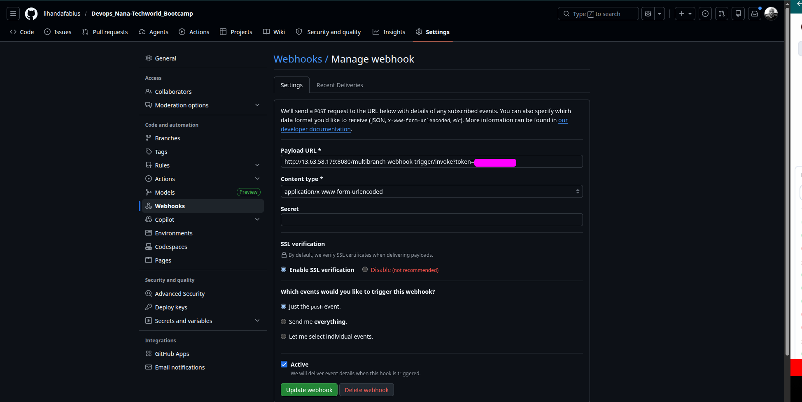

---

### Key Concepts:

* **Multibranch Pipeline** → Automatically creates pipelines for repository branches
* **Webhook automation** → Eliminates manual pipeline triggering
* **Branch-based deployment strategy** → Prevents incomplete features from reaching production
* **CI/CD separation** → Testing occurs on all branches while deployment is restricted
* **`when` directive** → Controls conditional stage execution in Jenkins
* **SSH-based deployment** → Enables remote deployment automation to EC2

</details>

---

## Challenges & Fixes

### 1. Docker Compose Command Issues

* **Issue:** Deployment script failed with:

```text
unknown shorthand flag: 'f' in -f
```

* **Cause:** Incorrect Docker Compose installation/version mismatch

* **Fix:** Installed Docker Compose correctly and used:

```bash
docker compose
```

instead of legacy:

```bash
docker-compose
```

---

### 2. Jenkins Shared Library Path Reusability

* **Issue:** Shared library functions contained hardcoded application paths

* **Fix:** Refactored shared library functions to accept reusable parameters:

---
