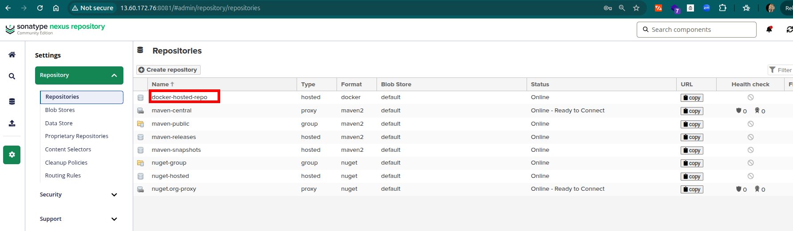
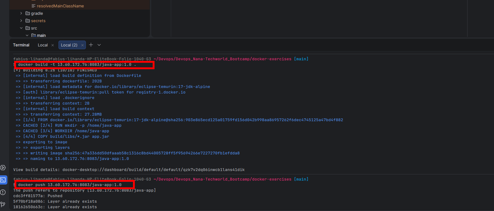
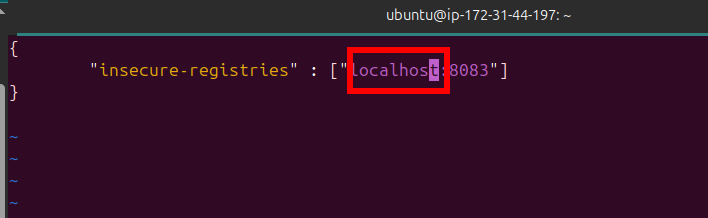
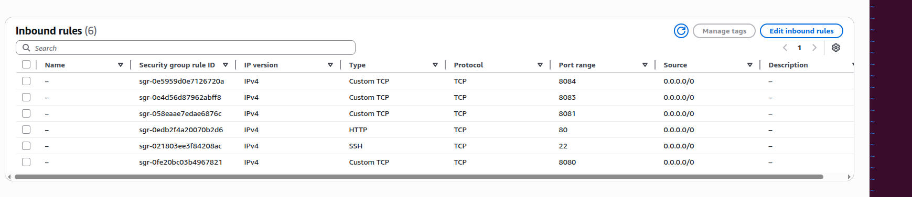
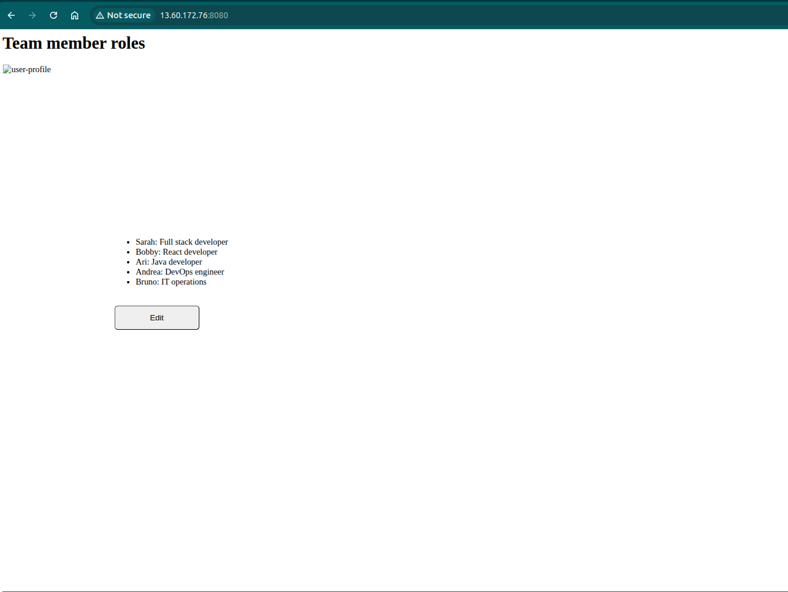
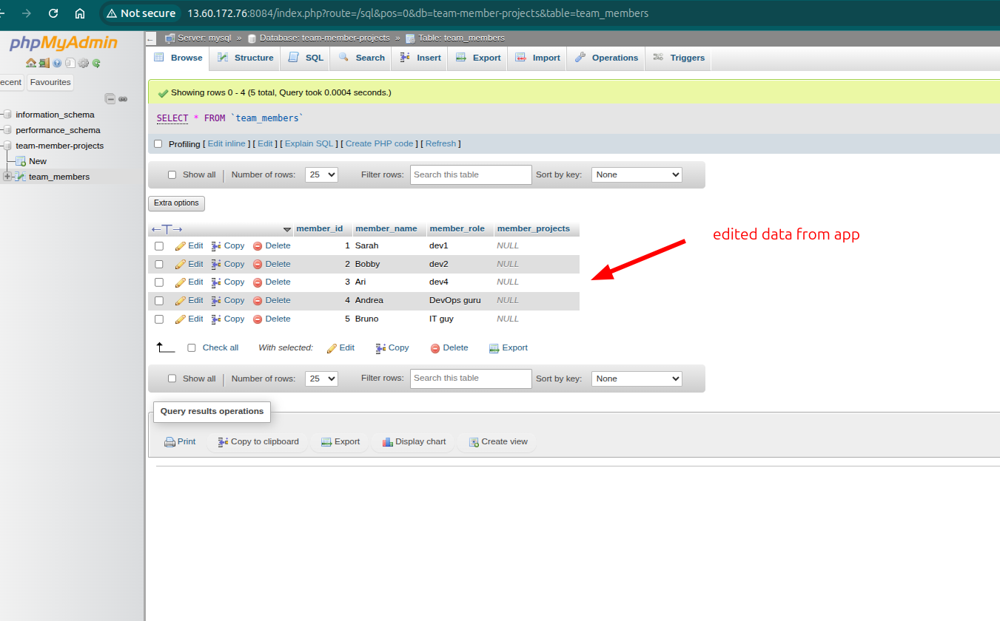

## 🐳 Docker & Containerized Application Deployment

This project demonstrates how to containerize and deploy a full-stack application using Docker and Docker Compose.
The setup includes a Java backend application, a MySQL database, and a phpMyAdmin UI, all orchestrated together and deployed on a remote server.

Additionally, the project integrates a private Docker registry using Sonatype Nexus Repository Manager to store and distribute application images, simulating real-world DevOps workflows.

The exercises cover:

* Running services using Docker containers
* Orchestrating multi-container applications with Docker Compose
* Building and pushing Docker images to a private registry
* Managing environment variables and secrets securely
* Deploying and accessing applications on a remote server

---

<details>
<summary>Exercise 0: Clone Repository & Environment Variables </summary>
<br />

For this exercise, I cloned the project repository and reviewed how environment variables are used within the application.
Also I reviewed some of the techniques I would use to handle sensitive env varaibles values like root passwords, user passwords etc.

These are some of the **techniques for handling senstive data** I considered to use:

* **Exporting variables (shell)** → quick for local testing
* **`.env` file** → simple to use (add to `.gitignore`)
* **Docker secrets** → more secure, not exposed as env variables
* **Cloud secret managers** (e.g. AWS Secrets Manager, HashiCorp Vault) → best for production

### Key Concepts:

* Sensitive values (e.g., DB credentials) should **not be hardcoded**
* Environment variables allow **flexible configuration across environments**
* Improves **security and portability**


</details>

---

<details>
<summary>Exercise 1: Start MySQL Container </summary>
<br />

I used Docker to quickly spin up a mysql database container in my local machine.

### Steps:

* Pulled the official MySQL image
* Started the container with required environment variables:

  * `MYSQL_ROOT_PASSWORD`
  * `MYSQL_DATABASE`
  * `MYSQL_USER`
  * `MYSQL_PASSWORD`

    ```bash
    docker run -p 3306:3306 \
     --name mysql \
     -e MYSQL_ROOT_PASSWORD= ... \
     -e MYSQL_DATABASE=... \
     -e MYSQL_USER=... \
     -e MYSQL_PASSWORD=... \
     -d mysql
    ```
    
* Exposed port `3306`. I had another mysql instance locally, so I had to kill the instance with the Instance's process ID
* Build the artifact

  ```bash
  ./gradlew clean
  ./gradlew build
  ```
  
* Run the artifact after setting the env variables
  
  ```bash
  java -jar build/libs/docker-exercises-project-1.0-SNAPSHOT.jar
  ```
* Verified database connectivity from the application by querying the database using mysql cli interface by use of `mysql -h 127.0.0.1 -p 3306 -u admin -p` after editing from the application

</details>

---

<details>
<summary>Exercise 2: Start phpMyAdmin Container </summary>
<br />

To visualize and manage MySQL database data, I deployed a UI tool as a Docker container locally.

### Steps:

* Started phpMyAdmin container using the official image  
* Configured connection to MySQL using `PMA_HOST`, set to the MySQL service/container name (Docker internal DNS) in the same network
  
  ```bash
  docker run --name phpmyadmin -d \
  -e PMA_HOST=mysql \
  -p 8080:80 phpmyadmin
  ```
   
* Accessed via browser and successfully logged in using the database credentials defined in the MySQL container ```localhost:8083```

</details>

---

<details>

<summary>Exercise 3: Use Docker Compose for MySQL and phpMyAdmin </summary>
<br />

Instead of starting containers manually, I used Docker Compose to manage both services together.

### Steps:

* Created a `docker-compose` file for MySQL and phpMyAdmin  
* Configured a named volume for persistent database storage  
* Used environment variables for dynamic configuration  
* Connected phpMyAdmin to MySQL using the service name (`mysql`) via `PMA_HOST`
  
### mysql-compose.yaml

```yaml
services:

  mysql:
    image: mysql
    container_name: mysql
    ports:
      - "3306:3306"
    environment:
      MYSQL_ROOT_PASSWORD: rootpass
      MYSQL_DATABASE: team-member-projects
      MYSQL_USER: ${DB_USER}
      MYSQL_PASSWORD: ${DB_PWD}
    volumes:
      - mysql-data:/var/lib/mysql

  phpmyadmin:
    image: phpmyadmin
    container_name: phpmyadmin
    ports:
      - "8084:80"
    restart: always
    environment:
      PMA_HOST: mysql
    depends_on:
      - mysql

volumes:
  mysql-data:
    driver: local
```
</details>

---

<details>
<summary>Exercise 4: Dockerizing the Java Application </summary>
<br />

The Java application was containerized to run alongside MySQL and phpMyAdmin using Docker.

### Dockerfile:

```dockerfile
FROM eclipse-temurin:17-jdk-alpine

RUN mkdir -p /home/java-app

WORKDIR /home/java-app 

COPY build/libs/*.jar app.jar   

ENTRYPOINT ["java", "-jar", "app.jar"]
```

### Steps:

* Created a lightweight Docker image using a minimal base image (`alpine`)
* Built the application JAR using Gradle
* Copied the JAR into the container
* Defined the entrypoint to run the application
* Built and tested the container locally

### Key Concepts:

* **Minimal base image:** Using `alpine` reduces image size and improves security by minimizing the attack surface
* **Containerization:** Ensures the app runs consistently across environments
* **Layer caching:** Separating steps improves build efficiency

</details>

---

<details>
<summary>Exercise 5: Build & Push Docker Image to Nexus </summary>
<br />

To enable remote deployment, the application image was stored in a private Docker registry hosted on Nexus.

### Steps:

* Deployed **Sonatype Nexus Repository Manager** as a Docker container on the AWS EC2 instance

* Opened required ports (**8081** for UI, **8083** for Docker registry) in the security group

* Created a **Docker (hosted)** repository in Nexus
  
  

* Configured an HTTP connector on port **8083** for Docker access

* Created a dedicated role with full access to the Docker repository
  
  

* Created a user and assigned the role

* Built the Docker image locally

* Tagged the image with the Nexus repository endpoint

* Logged in to the Nexus Docker registry

* Pushed the image to Nexus

  

* Verified the image in the Nexus UI

### Key Concepts:

* **Private registry:** Stores and manages Docker images securely
* **Access control:** Roles and users restrict who can push/pull images
* **Insecure registry (HTTP):** Required when SSL is not configured (common in dev setups)
* **Remote artifact storage:** Enables pulling images from any server

</details>

---

<details>
<summary>Exercise 6: Add Application to Docker Compose </summary>
<br />

The Java application was integrated into the multi-container setup and configured for remote deployment.

### Steps:

* Added the Java application service to `docker-compose.yaml` using the image from the private Nexus registry

  ### docker-compose.yaml

```yaml
services:
  java-app:
    image: localhost:8083/java-app:1.0
    ports:
      - "8080:8080"
    environment:
      DB_SERVER: mysql
      DB_USER: ${DB_USER}
      DB_PWD: ${DB_PWD}
      DB_NAME: team-member-projects
    depends_on:
      mysql:
        condition: service_healthy

  mysql:
    image: mysql
    container_name: mysql
    ports:
      - "3306:3306"
    environment:
      MYSQL_ROOT_PASSWORD: rootpass
      MYSQL_DATABASE: team-member-projects
      MYSQL_USER: ${DB_USER}
      MYSQL_PASSWORD: ${DB_PWD}
    volumes:
      - mysql-data:/var/lib/mysql
    healthcheck:
      test: ["CMD", "mysqladmin", "ping", "-h", "localhost"]
      interval: 10s
      timeout: 5s
      retries: 5


  phpmyadmin:
    image: phpmyadmin
    container_name: phpmyadmin
    ports:
      - "8084:80"
    restart: always
    environment:
      PMA_HOST: mysql
    depends_on:
      - mysql
volumes:
  mysql-data:
    driver: local
```

* Used `localhost:8083/java-app:1.0` as the image source since the registry is running on the **same server** as Docker
  → This avoids external network calls and allows faster, internal image pulls

* Updated `index.html` to use the **remote server’s IP address** instead of `localhost`
  → Ensures the frontend communicates correctly with the backend when accessed from a browser

* Rebuilt the Docker image and pushed the updated version to the Nexus repository

* Configured environment variables in Compose using variable substitution:

  ```yaml
  DB_USER: ${DB_USER}
  DB_PWD: ${DB_PWD}
  ```

* Implemented MySQL health check to ensure proper startup order:

```yaml
healthcheck:
  test: ["CMD", "mysqladmin", "ping", "-h", "localhost"]
  interval: 10s
  timeout: 5s
  retries: 5
```

* Used `depends_on` with `service_healthy` condition to delay app startup until MySQL is ready

* Transferred the `docker-compose.yaml` file securely to the remote server using `scp`

  ```bash
  scp -i ~/Downloads/server_publickey.pem docker-compose-file ubuntu@<server_ip>:/home/ubuntu
  ```

### Key Concepts:

* **Local registry access (`localhost`)**: Works because Nexus and Docker run on the same host remote server
* **Environment variable externalization**: Keeps sensitive data out of version control
* **.env security**: Restricting permissions prevents unauthorized access
* **Service dependency management**: Ensures correct startup order in multi-container apps
* **Frontend-backend separation**: Requires proper host configuration when deployed remotely

</details>

---

<details>
<summary>Exercise 7: Deploy Application on Remote Server </summary>
<br />

The complete application stack was deployed on a remote AWS server using Docker Compose.

### Steps:

* Configured Docker to allow pulling from the Nexus HTTP registry by updating `daemon.json`:

```json
{
  "insecure-registries": ["localhost:8083"]
}
```
  

* Restarted Docker to apply changes

  ```bash
  systemctl restart docker
  ```

* Logged in to the private Nexus Docker registry:

```bash
docker login localhost:8083
```

* Externalized sensitive configuration using a `.env` file:

  ```bash
  DB_USER=...
  DB_PWD=...
  ```

* Secured the `.env` file with restricted permissions:

  ```bash
  chmod 600 .env
  ```

* Started all services using Docker Compose:

```bash
docker compose up -d
```

* Verified running containers:

```bash
docker ps
```

### Key Concepts:

* **Insecure registry configuration:** Required when using HTTP instead of HTTPS
* **Authentication:** Needed to pull private images from Nexus
* **Compose orchestration:** Starts and manages multiple containers together

</details>

---

<details>
<summary>Exercise 8: Open Ports & Access Application </summary>
<br />

After deploying the application, firewall configuration was required to allow external access.

### Steps:

* Opened required ports in the AWS security group:

  * `8080` → Java application
  * `8084` → phpMyAdmin

* Ensured inbound rules allowed traffic from external sources



* Accessed the application via browser using the server’s public IP:

  * `<server-ip>:8080` → Application UI

  
    
  * `<server-ip>:8084` → phpMyAdmin
 
  

* Verified that:

  * Application loads successfully
  * Data is retrieved from MySQL
  * Updates made via UI persist in the database

### Key Concepts:

* **Port exposure:** Containers must map ports to the host to be accessible externally
* **Cloud firewall (Security Groups):** Controls inbound/outbound traffic to the instance
* **End-to-end connectivity:** Validates communication between frontend, backend, and database

</details>

---

## Challenges & Fixes

### 1. Docker disk space issues

* **Issue:** “no space left on device” when pulling images. The initial AWS instance had insufficient storage for large Docker images
* **Fix:** Increased EBS volume size and extended the filesystem to utilize the new space

---

### 2. Docker installation issues (Snap vs apt)

* **Issue:** Using Docker installed via **Snap** caused multiple problems, including permission issues, unexpected configuration paths, and compatibility issues with Docker Compose and daemon configuration

* **Fix:**

  * Removed Snap-based Docker installation
  * Installed Docker using the official `docker.io` package via `apt`
  * This provided a more stable setup with expected configuration paths (e.g., `/etc/docker/daemon.json`) and better compatibility with Docker Compose

---

### Key Learnings:

- **Use trusted images:** Always use official and verified base images to reduce security risks  

- **Versioning matters:** Avoid `latest` — use specific image tags for consistency and reliability  

- **Minimal images:** Prefer lightweight images (e.g., Alpine) to reduce size and attack surface  

---

- **Optimize image size:**
  - Use `.dockerignore` to exclude unnecessary files (e.g., `.git`, logs, dependencies not needed at runtime)  
  - **Leverage layer caching:**  
    Structure your Dockerfile so that rarely changing steps (like installing dependencies) come before frequently changing ones (like copying source code). This allows Docker to reuse cached layers and significantly speeds up builds  
  - **Use multi-stage builds:**  
    Separate the build stage (with build tools like Maven/Gradle) from the runtime stage. Only copy the final artifact into a minimal image → results in smaller, cleaner, and more secure images  

---

- **Security best practices:**
  - Run containers with a **non-root user** (least privilege principle)  
  - Avoid exposing sensitive data inside images (use environment variables or external configs)  
  - Regularly scan images for vulnerabilities  

---

- **Clean Dockerfiles:**
  - Keep them simple, readable, and maintainable  
  - Structure layers efficiently to improve build performance and caching  


