# ☸️ Container Orchestration with Kubernetes on AWS EKS

This project demonstrates how to migrate a traditional Docker Compose application to Kubernetes in order to achieve high availability, scalability, self-healing, and easier application management.

The original application consisted of:

* Java Spring Boot application
* MySQL database
* phpMyAdmin

Originally all services were running on a single server using Docker Compose. Any container failure required manual intervention, causing downtime for users.

To improve reliability and availability, the application was migrated to Amazon EKS (Elastic Kubernetes Service) and deployed using Kubernetes resources and Helm charts.

The project covers:

* Creating an AWS EKS cluster
* Deploying MySQL with replication using Helm
* Configuring persistent storage with EBS volumes
* Deploying a Java application with multiple replicas
* Managing configuration using ConfigMaps and Secrets
* Deploying phpMyAdmin
* Installing NGINX Ingress Controller
* Configuring Ingress routing
* Using port-forwarding for internal services
* Creating reusable Helm charts
* Packaging Kubernetes manifests for application deployment

---

## Architecture

```text
                           Internet
                               |
                               |
                    AWS Load Balancer (ELB)
                               |
                               |
                    NGINX Ingress Controller
                               |z
                               |
                          Ingress Rule
                               |
                               |
                    java-mysql-app-service
                               |
              --------------------------------
              |                              |
              |                              |
      Java Application Pod          Java Application Pod
            Replica 1                     Replica 2
              |                              |
              --------------------------------
                               |
                               |
                     mysql-primary Service
                               |
                               |
                         MySQL Primary
                               |
                    -------------------
                    |                 |
                    |                 |
             MySQL Replica 1   MySQL Replica 2

```

---

<details>
<summary>Exercise 1: Create Kubernetes Cluster</summary>

<br />

An Amazon EKS cluster was created using **EKS Auto Mode**.

Unlike a traditional Docker Compose deployment running on a single VM, Kubernetes provides automated scheduling, self-healing, scaling and workload distribution across multiple nodes.

Using EKS Auto Mode simplified cluster management because AWS automatically provisions and manages the worker nodes required to run workloads.

### Create IAM Roles

Before creating the cluster, IAM roles were configured for both the EKS control plane and worker nodes.

#### Cluster IAM Role

The cluster IAM role allows the EKS control plane to interact with AWS services on behalf

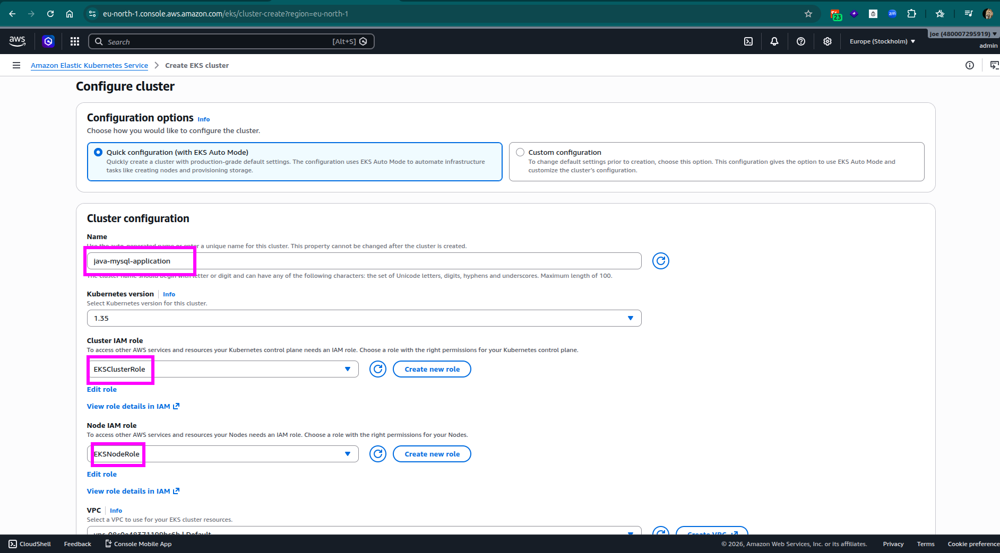

#### Verify cluster 

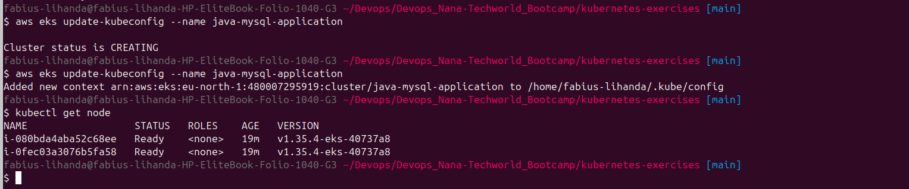

### Key Concepts

#### Control Plane

Managed by AWS EKS and responsible for:

* API Server
* Scheduler
* Controller Manager
* etcd

#### Worker Nodes

Responsible for running application workloads.

#### Self-Healing

If a pod crashes, Kubernetes automatically recreates it.

#### Scheduling

Pods are automatically distributed across available nodes.

</details>

---

<details>
<summary>Exercise 2: Deploy MySQL with Replication</summary>

<br />

The MySQL database is the most critical component of the application because it stores all application data. Running a single MySQL container would introduce a single point of failure, meaning that if the database became unavailable, the entire application would stop functioning.

To improve reliability and availability, MySQL was deployed using replication, ensuring that database replicas are available if the primary instance becomes unavailable.

### Create a Custom StorageClass

Before deploying MySQL, persistent storage needed to be configured.

Amazon EKS Auto Mode automatically provides a default StorageClass. However, the default class was configured to use **gp2** EBS volumes.


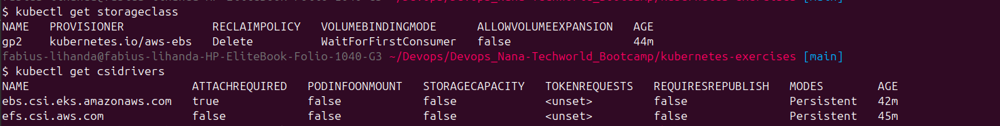


Although gp2 volumes work well, AWS recommends using **gp3** volumes for most new workloads because they provide:

* better performance
* independent scaling of storage and IOPS
* lower storage costs
* more predictable performance

To take advantage of these benefits, a custom StorageClass was created using the AWS EBS CSI Driver.

```yaml
apiVersion: storage.k8s.io/v1
kind: StorageClass

metadata:
  name: auto-ebs

provisioner: ebs.csi.eks.amazonaws.com

volumeBindingMode: WaitForFirstConsumer

parameters:
  type: gp3

allowVolumeExpansion: true
```

The StorageClass was then applied to the cluster:

```bash
kubectl apply -f storageclass.yaml
```

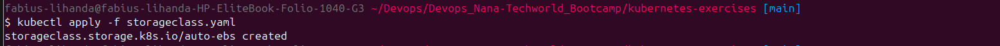


### Why Persistent Storage Is Important

Databases are stateful applications.

Without persistent storage:

* pod deletion would remove all database data
* node failures could cause permanent data loss
* application data would not survive restarts

Using Persistent Volumes ensures that data remains available even when database pods are recreated.

### Deploy MySQL Using Helm

Although MySQL could have been deployed manually using:

* StatefulSets
* Services
* PersistentVolumeClaims
* Secrets
* ConfigMaps

this would require creating and maintaining multiple Kubernetes resources.

To simplify deployment, the Bitnami MySQL Helm Chart was used.

The Helm chart automatically provisions:

* StatefulSets
* Services
* PersistentVolumeClaims
* replication configuration
* MySQL initialization logic

This significantly reduces the amount of YAML that must be maintained while following Kubernetes best practices.

### Configure MySQL Values

A custom values file was created to configure:

* replication architecture
* storage settings
* database credentials
* replication users
* storage classes

```yaml
architecture: replication

primary:
  persistence:
    storageClass: auto-ebs

secondary:
  replicaCount: 2

  persistence:
    storageClass: auto-ebs

auth:
  username: myuser
  password: mypassword
  rootPassword: rootpassword

  replicationUser: replicator
  replicationPassword: replica123

global:
  security:
    allowInsecureImages: true

image:
  registry: docker.io
  repository: bitnamilegacy/mysql
  tag: latest
```

### Install MySQL

The Bitnami repository was added and MySQL was installed using the custom values file.

```bash
helm repo add bitnami https://charts.bitnami.com/bitnami

helm install mysql --values helm-mysql-values.yaml bitnami/mysql 
```

### Verify Deployment

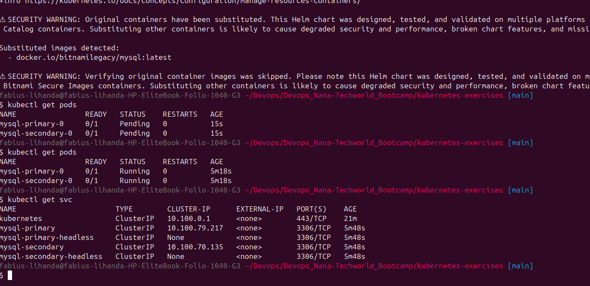

### Key Concepts

#### StatefulSets

MySQL is deployed as a StatefulSet because databases require:

* stable pod identities
* stable storage
* predictable startup ordering

#### Persistent Volumes

Persistent Volumes ensure database data survives:

* pod restarts
* node replacements
* rolling upgrades

#### Replication

Replication improves:

* availability
* fault tolerance
* read scalability

while reducing the risk of a single database instance becoming a bottleneck.

</details>

---

<details>
<summary>Exercise 3: Deploy the Java Application</summary>

<br />

The Java Spring Boot application was containerized, pushed to Docker Hub and deployed with multiple replicas.

Running multiple application replicas improves availability by ensuring that the application remains accessible even if a pod or node fails.

### Build the Application

The application was packaged using the Gradle Wrapper.

```bash
./gradlew build
```

### Build Docker Image

A Docker image was created from the application source code.

```bash
docker build \
-t lihanda/demo-app:java-app-1.0 .
```

### Push Docker Image

The image was then pushed to Docker Hub so that it could be pulled by the Kubernetes cluster.

```bash
docker push lihanda/demo-app:java-app-1.0
```

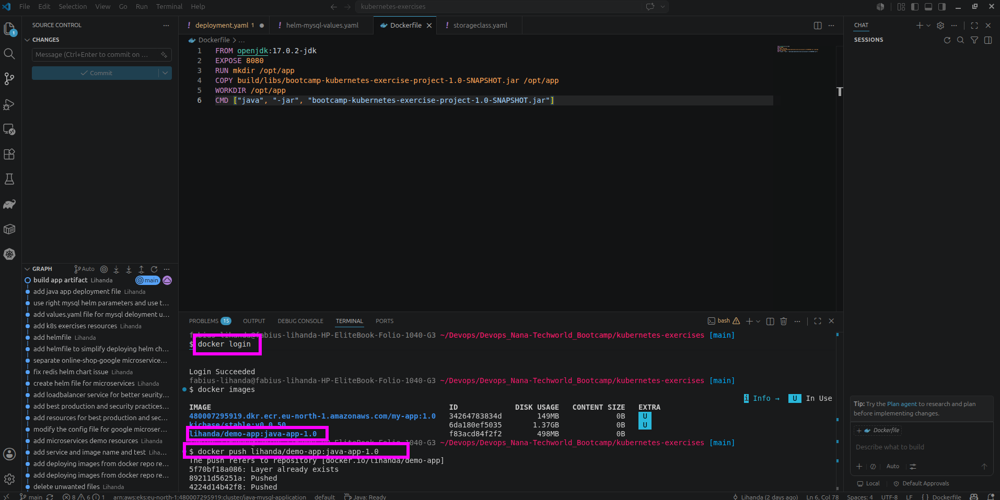

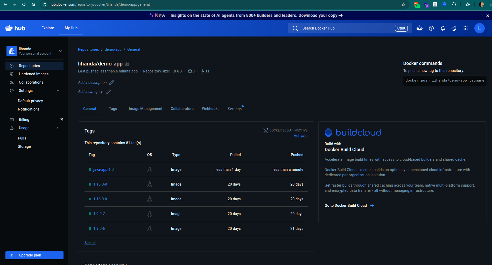


### Configure Access to the Private Docker Repository

The Docker image repository was configured as private.

To allow Kubernetes to pull images from Docker Hub, an image pull secret was required.

Instead of manually creating a Secret manifest containing a base64-encoded `.dockerconfigjson` file, the secret was generated directly using the Kubernetes CLI.

This approach:

* reduces manual configuration
* avoids base64 encoding mistakes
* automatically creates the required Docker authentication format

A Docker Hub Personal Access Token was used instead of the account password.


Using a token is considered a security best practice because:

* tokens can be revoked independently
* credentials can be rotated easily
* account passwords are never exposed to the cluster

```bash
kubectl create secret docker-registry my-registry-key \
--docker-server=https://index.docker.io/v1/ \
--docker-username=<dockerhub-user> \
--docker-password=<dockerhub-token>
```

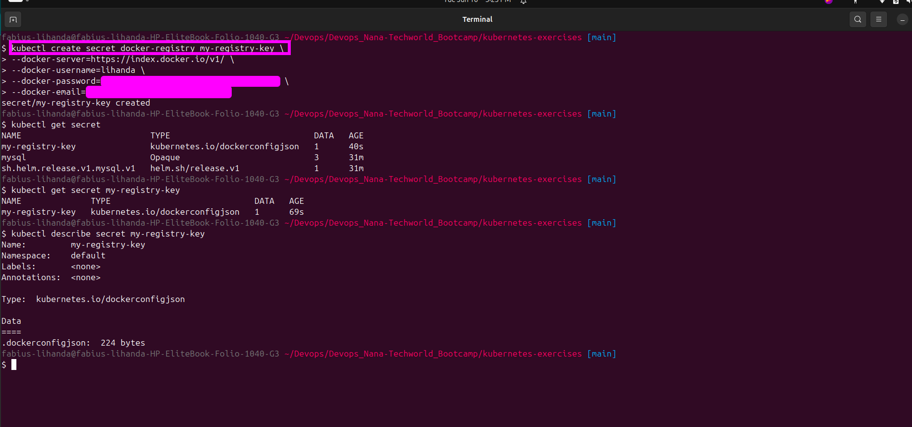


### Create ConfigMap

Application configuration values that are not sensitive were externalized using a ConfigMap.
The database name was gotten by:

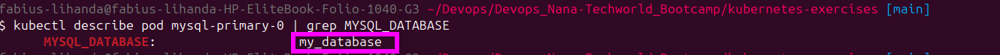

```yaml
apiVersion: v1
kind: ConfigMap

metadata:
  name: mysql-config

data:
  DB_SERVER: mysql-primary
  DB_NAME: my_database
```

The ConfigMap stores:

* database hostname
* database name
* application configuration values

without requiring application rebuilds.

### Create Secret

Database credentials were stored separately using a Kubernetes Secret.

```yaml
apiVersion: v1
kind: Secret

metadata:
  name: mysql-secret

type: Opaque

data: 
  DB_PWD: bXlwYXNzd29yZA==
  DB_USER: bXl1c2Vy
```

Unlike the Docker registry secret, this secret was created using a YAML manifest because the application requires specific environment variables that are consumed directly by the deployment.

Using a Secret instead of a ConfigMap helps separate sensitive and non-sensitive configuration.


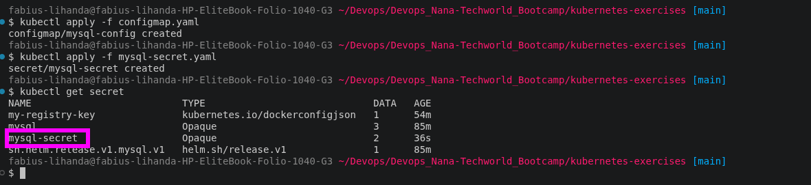


### Deploy the Application

The deployment was configured with:

* two replicas
* Docker Hub image authentication
* ConfigMap integration
* Secret integration

```yaml
apiVersion: apps/v1
kind: Deployment
metadata:
  name: java-mysql-app
  labels:
    app: java-mysql-app
spec:
  replicas: 2
  selector:
    matchLabels:
      app: java-mysql-app
  template:
    metadata:
      labels:
        app: java-mysql-app
    spec:
      imagePullSecrets:
      - name: my-registry-key
      containers:
      - name: java-mysql-app
        image: lihanda/demo-app:java-app-1.0
        imagePullPolicy: Always 

        ports:
        - containerPort: 8080

        env:
        - name: DB_SERVER
          valueFrom:
            configMapKeyRef:
              name: mysql-config
              key: DB_SERVER

        - name: DB_NAME
          valueFrom:
            configMapKeyRef:
              name: mysql-config
              key: DB_NAME

        - name: DB_USER
          valueFrom:
            secretKeyRef:
              name: mysql-secret
              key: DB_USER

        - name: DB_PWD
          valueFrom:
            secretKeyRef:
              name: mysql-secret
              key: DB_PWD
```

### Create Service

A ClusterIP service was created to expose the application internally within the cluster.

```yaml
apiVersion: v1
kind: Service

metadata:
  name: java-mysql-app-service

spec:
  type: ClusterIP

  selector:
    app: java-mysql-app

  ports:
  - port: 8080
    targetPort: 8080
```

The application is not exposed directly to the internet because external access will later be managed through an Ingress Controller.

### Key Concepts

#### Deployment

Responsible for:

* rolling updates
* rollbacks
* application lifecycle management

#### ReplicaSets

Ensures that the desired number of application pods are always running.

#### ConfigMaps

Store non-sensitive configuration separately from application code.

#### Secrets

Store sensitive values such as passwords and credentials.

#### Image Pull Secrets

Allow Kubernetes to authenticate against private container registries and pull protected images securely.

</details>


---

<details>
<summary>Exercise 4: Deploy phpMyAdmin</summary>

<br />

Although MySQL can be administered using command-line tools, managing databases through a graphical interface is often faster and more convenient.

To simplify database administration and verification during development, phpMyAdmin was deployed inside the Kubernetes cluster.

Because phpMyAdmin is only used by administrators and not by application end users, high availability was not a requirement. Therefore, a single replica was sufficient.

### Deployment

```yaml
apiVersion: apps/v1
kind: Deployment

metadata:
  name: phpmyadmin-deployment

spec:
  replicas: 1

  selector:
    matchLabels:
      app: phpmyadmin

  template:
    metadata:
      labels:
        app: phpmyadmin

    spec:
      containers:
      - name: phpmyadmin

        image: phpmyadmin:latest

        ports:
        - containerPort: 80

        env:
        - name: PMA_HOST
          value: mysql-primary

        - name: PMA_PORT
          value: "3306"
```

### Service

```yaml
apiVersion: v1
kind: Service

metadata:
  name: phpmyadmin-service

spec:
  type: ClusterIP

  selector:
    app: phpmyadmin

  ports:
  - port: 80
    targetPort: 80
```

### Verify Deployment

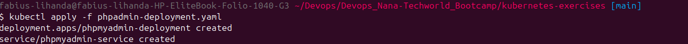


### Key Concepts

#### Service Discovery

phpMyAdmin connects to MySQL using the Kubernetes Service name:

```text
mysql-primary
```

Kubernetes DNS automatically resolves this name to the correct database endpoint.

#### Environment Variables

The `PMA_HOST` and `PMA_PORT` environment variables tell phpMyAdmin which MySQL instance it should connect to.

#### Internal Access

The service was configured as a `ClusterIP`, making it accessible only from within the cluster.

This prevents direct internet access to the database administration interface and reduces the attack surface of the environment.

</details>


---

<details>
<summary>Exercise 5: Deploy NGINX Ingress Controller</summary>

<br />

To expose the application externally, an NGINX Ingress Controller was installed using Helm.

### Why an Ingress Controller?

Without Ingress:

* every application requires its own LoadBalancer
* higher cloud costs
* difficult routing management

With Ingress:

* one LoadBalancer
* multiple applications
* centralized routing

### Install NGINX Ingress

```bash
helm install nginx-ingress \
oci://ghcr.io/nginx/charts/nginx-ingress \
--set controller.reportIngressStatus.enabled=true \
--set controller.service.type=LoadBalancer \
--set controller.service.annotations."service\.beta\.kubernetes\.io/aws-load-balancer-scheme"="internet-facing"
```

### AWS Subnet Tagging

The ingress service initially failed to create a load balancer because the VPC subnets were tagged for an old cluster.

Error:

```text
Failed build model due to unable to resolve at least one subnet
```

### Fix

Updated subnet tags:

```text
kubernetes.io/role/elb=1
kubernetes.io/cluster/java-mysql-application=shared
```

### Verify

```bash
kubectl get svc
```

Example:

```text
nginx-ingress-controller   LoadBalancer
```

### Key Concepts

#### Ingress Controller

Runs inside the cluster and processes ingress rules.

#### Load Balancer

Provides external access to the ingress controller.

#### Internet-Facing ELB

Allows public access to the application.

</details>

---

<details>
<summary>Exercise 6: Create Ingress Rule</summary>

<br />

An Ingress resource was created to route incoming traffic to the Java application.

### Ingress

```yaml
apiVersion: networking.k8s.io/v1
kind: Ingress

metadata:
  name: mysql-java-app-ingress

spec:
  ingressClassName: nginx

  rules:
  - host: k8s-default-nginxing-xxxx.elb.eu-north-1.amazonaws.com

    http:
      paths:
      - path: /
        pathType: Prefix

        backend:
          service:
            name: java-mysql-app-service

            port:
              number: 8080
```

### Frontend Configuration

The application frontend was updated to use the ELB DNS name:

```javascript
const HOST = "k8s-default-nginxing-xxxx.elb.eu-north-1.amazonaws.com";
```

### Key Concepts

#### Ingress Rule

Defines how requests are routed.

#### Host-Based Routing

Routes traffic based on DNS hostname.

#### Backend Service

Traffic is forwarded to:

```text
java-mysql-app-service
```

which distributes requests across both replicas.

</details>

---

<details>
<summary>Exercise 7: Configure Port Forwarding for phpMyAdmin</summary>

<br />

phpMyAdmin should not be publicly accessible.

Instead, Kubernetes port forwarding was configured.

### Port Forward

```bash
kubectl port-forward svc/phpmyadmin-service 8081:80
```

### Access

```text
http://localhost:8081
```

### Benefits

* No public exposure
* Temporary access
* Better security posture

### Common Use Cases

* Databases
* Monitoring dashboards
* Internal administration tools
* Debugging applications

</details>

---

<details>
<summary>Exercise 8: Create Helm Chart for the Java Application</summary>

<br />

To improve reusability and simplify deployments, the Java application resources were packaged into a Helm Chart.

### Chart Structure

```text
java-mysql-app/
│
├── Chart.yaml
├── values.yaml
│
└── templates/
    ├── deployment.yaml
    ├── service.yaml
    ├── ingress.yaml
    ├── configmap.yaml
    └── secret.yaml
```

### values.yaml

```yaml
appName: java-mysql-app

appReplicas: 2

appImage: lihanda/demo-app
appVersion: java-app-1.0

imagePullPolicy: Always

imagePullSecrets:
  - my-registry-key

containerPort: 8080

serviceType: ClusterIP
servicePort: 8080

containerEnvVars:
  - name: DB_SERVER
    configMapKeyRef:
      name: mysql-config
      key: DB_SERVER

  - name: DB_NAME
    configMapKeyRef:
      name: mysql-config
      key: DB_NAME

  - name: DB_USER
    secretKeyRef:
      name: mysql-secret
      key: DB_USER

  - name: DB_PWD
    secretKeyRef:
      name: mysql-secret
      key: DB_PWD
```

### Template Features

The chart templates support:

* configurable image tags
* configurable replicas
* configurable ingress
* configurable services
* configurable secrets
* configurable ConfigMaps

### Validate Chart

```bash
helm lint .
```

### Render Templates

```bash
helm template .
```

### Server-Side Validation

```bash
kubectl apply -f <(helm template .) --dry-run=server
```

### Install Chart

```bash
helm install java-app .
```

### Upgrade Chart

```bash
helm upgrade java-app .
```

### Restart Deployment

```bash
kubectl rollout restart deployment java-mysql-app
```

### Key Concepts

#### Helm

Package manager for Kubernetes.

#### Templates

Allow reusable Kubernetes manifests.

#### Values Files

Provide environment-specific configuration without modifying templates.

</details>

---

# Challenges & Fixes

## 1. Gradle Build Failure

### Issue

Spring Boot required a newer Gradle version than the system installation.

### Fix

Used the Gradle Wrapper:

```bash
gradle wrapper

./gradlew build
```

---

## 2. MySQL Connector Dependency Failure

### Issue

Gradle could not resolve:

```text
mysql:mysql-connector-j
```

### Fix

Updated dependency coordinates:

```groovy
implementation 'com.mysql:mysql-connector-j:9.2.0'
```

---

## 3. Docker Hub Private Repository Authentication

### Issue

Pods could not pull images from Docker Hub.

### Fix

Created image pull secret:

```bash
kubectl create secret docker-registry my-registry-key
```

and referenced it in the Deployment.

---

## 4. AWS Load Balancer Creation Failed

### Issue

Ingress service failed with:

```text
Failed build model due to unable to resolve at least one subnet
```

### Root Cause

Subnets were tagged for an old EKS cluster.

### Fix

Updated subnet tags:

```text
kubernetes.io/cluster/java-mysql-application=shared
```

---

## 5. Ingress Validation Error

### Issue

NGINX rejected ingress:

```text
spec.rules[0].host: Required value
```

### Fix

Added a valid host using the AWS ELB DNS name.

---

## 6. Application Could Read but Not Save Data

### Issue

Frontend displayed data but updates failed.

### Root Cause

Incorrect fetch URL:

```javascript
http://${HOST}update-roles
```

Missing:

```text
/
```

### Fix

```javascript
http://${HOST}/update-roles
```

---

## 7. New Docker Images Not Being Used

### Issue

After pushing a new image, the application still showed old behavior.

### Root Cause

The same image tag was reused.

### Fix

Restarted deployment:

```bash
kubectl rollout restart deployment java-mysql-app
```

or use versioned image tags.

---

## 8. Understanding Ingress vs LoadBalancer

### Initial Confusion

Both appeared to expose applications externally.

### Understanding

LoadBalancer:

```text
Internet
   |
Service
   |
Pods
```

Ingress:

```text
Internet
   |
LoadBalancer
   |
Ingress Controller
   |
Ingress Rules
   |
Services
   |
Pods
```

Ingress allows multiple applications to share a single external load balancer.

---

# Lessons Learned

* Kubernetes provides self-healing and workload orchestration.
* Stateful applications require Persistent Volumes and StatefulSets.
* Helm significantly simplifies application deployment.
* ConfigMaps and Secrets allow configuration to be externalized.
* AWS EKS networking depends heavily on correct subnet tagging.
* Ingress Controllers provide centralized routing and reduce infrastructure costs.
* Port-forwarding is useful for securely accessing internal services.
* Versioned Docker image tags are preferable to reusing the same tag.
* Helm charts make Kubernetes deployments reusable and maintainable.
* Understanding Kubernetes networking is critical when deploying production workloads.

---
