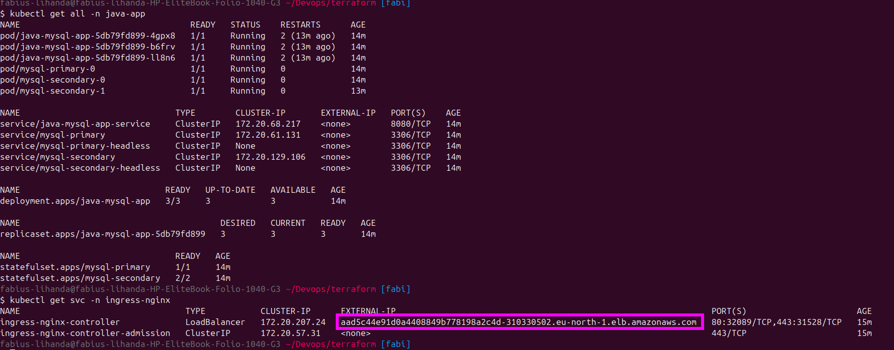
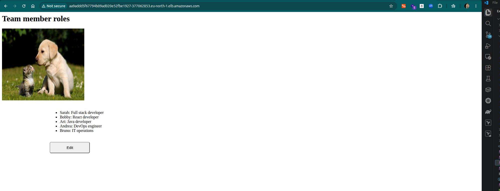
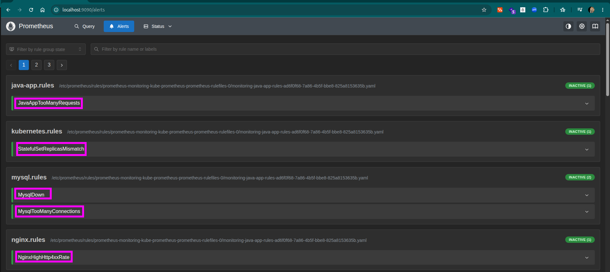

<table>
  <tr>
    <td width="70" align="center" valign="middle">
      
    </td>
    <td valign="middle">
      <h1 style="border-bottom: none; margin: 0; padding: 0; line-height: 1.2;">Monitoring and Observability with Prometheus</h1>
      <span style="font-size: 15px; color: #57606a;">Metrics, Alerting and Notifications for a Java + MySQL Application on Kubernetes</span>
    </td>
  </tr>
</table>

---

**Monitoring** is the continuous collection and watching of data (metrics) from your systems, so you know whether they are healthy. **Observability** goes one step further: it is being able to understand *why* something is happening inside a system, using the data it produces.

### Why monitoring and observability matter

- **Visibility in dynamic environments:** containers constantly start, stop and move, which makes them much harder to keep track of than fixed servers.
- **Visibility at every level:** with hundreds or thousands of containers, plus components across infrastructure, platform and application, you need one consistent view of all of them.
- **No more black box:** without visibility, when something breaks you have no idea what is happening, what caused it or what is not working.
- **Faster root cause analysis:** monitoring points directly at the cause of a problem, which saves a lot of time and effort, and with them a lot of money.
- **Problems caught before they happen:** the people responsible for the infrastructure are alerted early instead of after users are affected.
- **Early warning on resources:** notifications can fire when critical resources such as storage or memory cross a warning threshold (for example 50%). That gives the team time to plan capacity and request more, which often needs approval and justification, before anything actually runs out.

### How Prometheus helps

**Prometheus** is a widely used, open source monitoring tool with a large community, and it fits Kubernetes particularly well. It continuously **scrapes metrics** from the cluster and its applications, stores them as time series, evaluates **alert rules** against them, and hands firing alerts to **Alertmanager**, which notifies the right people through the right channel. **Grafana** sits on top to visualise the data.

### What this project builds

This project adds that visibility to an existing setup: a Java application backed by MySQL, exposed through an Nginx Ingress, running on Kubernetes. It is split into **five exercises that build on each other**: deploying the application, collecting metrics from every component, defining alerts, routing notifications to Slack and email, and finally simulating real failures to prove the whole chain works end to end. A Grafana dashboard sits on top to make the traffic visible.

## Project objectives

Across the exercises, these were my main objectives:

* Deploy the **Prometheus Operator** (`kube-prometheus-stack`) and understand how `ServiceMonitor`, `PrometheusRule` and `AlertmanagerConfig` custom resources drive it.
* Collect metrics from three different sources: the **Nginx Ingress Controller** (built-in metrics), **MySQL** (a separate exporter) and a **custom Java application** (client library with its own metrics port).
* Write **PromQL alert rules** for application and cluster problems, and understand the Pending → Firing alert lifecycle.
* Route alerts by **team**: Java and MySQL alerts to a Slack channel, Nginx and Kubernetes alerts to an administrator's email.
* **Test the alerting pipeline** by simulating real failures instead of assuming the configuration works.
* Visualise traffic and health with **Grafana**, and keep the whole setup reproducible through an Ansible playbook.
* Develop practical troubleshooting skills across Prometheus, Alertmanager, Helm and Kubernetes.

## Project Structure

```
.
├── project-vars                                         # Shared variables (kubeconfig, Docker Hub credentials, paths)
├── images/                                              # Screenshots referenced throughout this README
├── java-app/                                            # Gradle/Spring Boot source + Dockerfile for the Java app
│
├── deploy_java_mysql_app_with_new_alb_address.yaml      # Exercises 1-4 — one playbook that builds the whole stack
│
├── alert-rules.yaml                                     # Exercise 3 — PrometheusRule (5 alert rules)
├── alert-manager-configuration.yaml                     # Exercise 4 — AlertmanagerConfig (Slack + email routing)
├── slack-secret.yaml                                    # Exercise 4 — Slack webhook URL (not committed)
├── email-secret.yaml                                    # Exercise 4 — Gmail app password (not committed)
│
├── trigger_javaapp_alert.sh                             # Exercise 5 — load on /get-data (Java alert, Slack)
├── trigger_nginx_alert.sh                               # Exercise 5 — requests to a missing path (Nginx 4xx alert, email)
│
└── k8_manifests/                                        # Kubernetes manifests applied by the playbook
    ├── application-deployment.yaml                      # Java app Deployment + Service + ServiceMonitor
    ├── applicationconfig.yaml                           # ConfigMap (DB_SERVER, DB_NAME)
    ├── mysql_secret.yaml                                # MySQL credentials Secret
    ├── helm-mysql-values.yaml                           # Bitnami MySQL chart values (replication + metrics)
    └── ingress.yaml                                     # Ingress rule for the Java app
```

---

## Prerequisites

The playbook needs a few Python libraries and Ansible collections on the machine running it, plus the usual Kubernetes tooling.

```bash
python3 -m venv venv
source venv/bin/activate
pip install ansible docker kubernetes
ansible-galaxy collection install community.docker kubernetes.core
```

Other requirements:

- A running Kubernetes cluster (this project uses Amazon EKS) and its kubeconfig
- `kubectl` and `helm` installed locally
- A Docker Hub account to push the Java app image
- A **Slack** workspace with an incoming webhook (set up in Exercise 4)
- A **Gmail app password** for the email notifications (a normal password does not work with SMTP)

---

<details>
<summary> Exercise 1: Deploy the Application and Prepare the Setup</summary>
<br />
The starting point is a setup that is already running: a Java application with 3 replicas talking to MySQL, reachable from a browser through an Nginx Ingress. The Kubernetes cluster itself was provisioned separately via Terraform (see [Terraform EKS project](https://github.com/lihandafabius/terraform-eks-infrastructure)), and the application is deployed with the playbook from the earlier Ansible project, adjusted for this exercise.
 
| Component | Deployment | Detail |
|---|---|---|
| Java application | Deployment + Service | 3 replicas, image pushed to Docker Hub |
| MySQL | Bitnami Helm chart | `architecture: replication`, 1 primary and 2 secondary replicas |
| Ingress controller | `ingress-nginx` Helm chart | Exposed through an AWS load balancer |
| Ingress rule | `ingress.yaml` | Routes the load balancer hostname to the Java service |
 
### Implementation
 
The setup for this exercise is deployed by a single Ansible playbook, adapted from the earlier Ansible project. It creates the namespace, deploys the ingress controller, builds and pushes the Java application image, and then deploys MySQL, the application and the Ingress rule:
 
```yaml
---
- name: Deploy java mysql app to k8's cluster
  hosts: localhost
  vars_files:
    - project-vars
 
 
  tasks:
    - name: Create java app namespace
      kubernetes.core.k8s:
        name: java-app
        api_version: v1
        kind: Namespace
        state: present
        kubeconfig: "{{ kubeconfig }}"
 
    - name: Add NGINX Ingress Repository
      kubernetes.core.helm_repository:
        name: ingress-nginx
        repo_url: https://kubernetes.github.io/ingress-nginx
 
    - name: Deploy NGINX Ingress Controller via Helm
      kubernetes.core.helm:
        name: ingress-nginx
        chart_ref: ingress-nginx/ingress-nginx
        release_namespace: ingress-nginx
        create_namespace: true
        kubeconfig: "{{ kubeconfig }}"
 
    # ---- Optional: automatic ALB address update ----
    - name: Get NGINX Ingress LoadBalancer Hostname
      kubernetes.core.k8s_info:
        kubeconfig: "{{ kubeconfig }}"
        kind: Service
        name: ingress-nginx-controller
        namespace: ingress-nginx
      register: ingress_service
      until: ingress_service.resources[0].status.loadBalancer.ingress[0].hostname is defined
      retries: 20
      delay: 5
 
    - name: Set ALB Hostname Variable
      ansible.builtin.set_fact:
        alb_hostname: "{{ ingress_service.resources[0].status.loadBalancer.ingress[0].hostname }}"
 
    - name: Update host in ingress.yaml manifest
      ansible.builtin.replace:
        path: "{{ manifest_dir }}/ingress.yaml"
        regexp: '(host:\s*).*'
        replace: '\1"{{ alb_hostname }}"'
 
    - name: Update const HOST in index.html frontend file
      ansible.builtin.replace:
        path: "{{ docker_app_dir }}/src/main/resources/static/index.html"
        regexp: 'const HOST = ".*";'
        replace: 'const HOST = "{{ alb_hostname }}";'
    # ---- End of optional ALB address update ----
 
    - name: Build Gradle project to package updated frontend JAR
      ansible.builtin.command: ./gradlew clean build
      args:
        chdir: "{{ docker_app_dir }}"
 
    - name: Log in to Docker Hub
      community.docker.docker_login:
        username: "{{ docker_username }}"
        password: "{{ docker_password }}"
 
    - name: Build Docker image for Java App
      community.docker.docker_image:
        build:
          path: "{{ docker_app_dir }}"
        name: "{{ docker_image }}"
        source: build
        force_source: true
 
    - name: Push Java App image to Docker Hub
      community.docker.docker_image:
        name: "{{ docker_image }}"
        push: true
        source: local
 
    - name: Create Docker registry secret for image pull
      kubernetes.core.k8s:
        kubeconfig: "{{ kubeconfig }}"
        state: present
        definition:
          apiVersion: v1
          kind: Secret
          metadata:
            name: my-registry-key
            namespace: java-app
          type: kubernetes.io/dockerconfigjson
          stringData:
            .dockerconfigjson: "{{ {'auths': {'https://index.docker.io/v1/': {'username': docker_username, 'password': docker_password, 'auth': (docker_username + ':' + docker_password) | b64encode}}} | to_json }}"
 
    - name: Apply mysql secret
      kubernetes.core.k8s:
        src: "{{ manifest_dir }}/mysql_secret.yaml"
        state: present
        kubeconfig: "{{ kubeconfig }}"
 
    - name: Apply mysql configmap
      kubernetes.core.k8s:
        src: "{{ manifest_dir }}/applicationconfig.yaml"
        state: present
        kubeconfig: "{{ kubeconfig }}"
 
    - name: Deploy MySQL via Helm charts
      kubernetes.core.helm:
        name: mysql
        chart_ref: bitnami/mysql
        release_namespace: java-app
        kubeconfig: "{{ kubeconfig }}"
        values_files:
          - "{{ manifest_dir }}/helm-mysql-values.yaml"
 
    - name: Deploy Java Application and Service
      kubernetes.core.k8s:
        src: "{{ manifest_dir }}/application-deployment.yaml"
        state: present
        kubeconfig: "{{ kubeconfig }}"
 
    - name: Apply Ingress rule for Java App
      kubernetes.core.k8s:
        src: "{{ manifest_dir }}/ingress.yaml"
        state: present
        kubeconfig: "{{ kubeconfig }}"

```
 
The manifests and values applied by the playbook can be found in [`k8_manifests`](k8_manifests):
 
- [`application-deployment.yaml`](k8_manifests/application-deployment.yaml): Java application Deployment (3 replicas) and Service
- [`applicationconfig.yaml`](k8_manifests/applicationconfig.yaml): ConfigMap with the database connection details
- [`mysql_secret.yaml`](k8_manifests/mysql_secret.yaml): MySQL credentials Secret
- [`helm-mysql-values.yaml`](k8_manifests/helm-mysql-values.yaml): Bitnami MySQL chart values (replication with 1 primary and 2 secondary replicas)
- [`ingress.yaml`](k8_manifests/ingress.yaml): Ingress rule for the Java application

### Optional automation: the ALB address
 
The AWS load balancer only gets its hostname once the ingress controller exists, so that hostname cannot be written into any file beforehand. Four optional tasks, marked with comments in the playbook, remove this manual step. After the ingress controller is deployed, the playbook reads the hostname from the `ingress-nginx-controller` Service, waiting until AWS has assigned it, and then uses it in two places:
 
- **The Ingress rule:** the `host` field of `ingress.yaml` is replaced with the new hostname, so the rule always matches the current load balancer.
- **The Java application:** the `const HOST` value in the frontend's `index.html` is replaced as well. The application is then rebuilt with Gradle and packaged into a fresh Docker image, so the frontend calls the correct address.
This part is optional, since both values can also be edited by hand. Without these tasks, every rebuild of the cluster, which produces a new load balancer hostname, would need two manual edits before the application worked.
 

 

 
</details>

---

<details>
<summary> Exercise 2: Start Monitoring your Applications</summary>

<br />

The goal is to have Prometheus collect metrics from all three components. Everything revolves around one idea: the **Prometheus Operator** watches the cluster for `ServiceMonitor` objects, and each one tells Prometheus *which Service to scrape, on which port and path*.

```
App  →  metrics endpoint  →  Service  →  ServiceMonitor (label matches)  →  Prometheus
```

| Application | Who exposes the metrics | How the ServiceMonitor is created |
|---|---|---|
| Nginx Ingress Controller | The controller itself (port 10254) | Helm values |
| MySQL | A `mysqld-exporter` sidecar (port 9104) | Helm values (bundled in the Bitnami chart) |
| Java application | The app itself, on port **8081** | Written by hand |

### Deploy the Prometheus Operator

The `kube-prometheus-stack` chart installs Prometheus, Alertmanager, Grafana, node-exporter, kube-state-metrics and the Operator with its custom resource definitions. The release name matters, because it is used as a label later:

```yaml
    - name: Add Prometheus community Helm repository
      kubernetes.core.helm_repository:
        name: prometheus-community
        repo_url: https://prometheus-community.github.io/helm-charts

    - name: Deploy kube-prometheus-stack (Prometheus Operator)
      kubernetes.core.helm:
        name: monitoring
        chart_ref: prometheus-community/kube-prometheus-stack
        release_namespace: monitoring
        create_namespace: true
        kubeconfig: "{{ kubeconfig }}"
        wait: true
        wait_timeout: 10m
```

> **Note:** by default Prometheus only picks up ServiceMonitors that carry the label `release: <helm release name>`, here `release: monitoring`. A ServiceMonitor without it exists but is silently ignored, which is the most common reason for a missing target.

### Nginx Ingress Controller

The controller already exposes metrics, so only the flags are needed in the Helm values of the existing task:

```yaml
        values:
          controller:
            metrics:
              enabled: true
              serviceMonitor:
                enabled: true
                additionalLabels:
                  release: monitoring
```

### MySQL

MySQL cannot speak Prometheus on its own. The chart can add an exporter container next to each MySQL pod, which reads MySQL's internal statistics and republishes them in Prometheus format. The block below is added to `helm-mysql-values.yaml`:

```yaml
metrics:
  enabled: true
  image:
    registry: docker.io
    repository: bitnamilegacy/mysqld-exporter
  serviceMonitor:
    enabled: true
    labels:
      release: monitoring
```

Because of the extra exporter container, the MySQL pods change from `1/1` to `2/2` ready. The `metrics.image` lines point the exporter at the legacy repository for the same reason as the MySQL image (see Challenges).

### Java application

The application registers its own metrics with the Prometheus Java client and serves them from a separate HTTP server on port **8081**. `AppController.java` defines two metrics:

```java
static final Counter totalRequests = Counter.build()
        .name("java_app_http_requests_total").help("Total requests.").register();
static final Gauge inprogressRequests = Gauge.build()
        .name("java_app_inprogress_requests").help("Inprogress requests.").register();
```

Because the ServiceMonitor selects a Service *by labels* and a port *by name*, the Service of the Java application was extended with a label and a named metrics port. The ServiceMonitor is added to the same manifest:

```yaml
apiVersion: v1
kind: Service
metadata:
  name: java-mysql-app-service
  namespace: java-app
  labels:
    app: java-mysql-app
spec:
  selector:
    app: java-mysql-app
  ports:
  - name: http
    port: 8080
    targetPort: 8080
  - name: metrics
    port: 8081
    targetPort: 8081
  type: ClusterIP
---
apiVersion: monitoring.coreos.com/v1
kind: ServiceMonitor
metadata:
  name: java-mysql-app
  namespace: java-app
  labels:
    release: monitoring
    app: java-mysql-app
spec:
  endpoints:
  - port: metrics
    path: /metrics
  selector:
    matchLabels:
      app: java-mysql-app
```

> **Note:** the path is `/metrics` on port **8081**. The root path `/` serves an HTML landing page, which Prometheus rejects with `received unsupported Content-Type "text/html"`.

### Verify in the Prometheus UI

```bash
kubectl port-forward -n monitoring svc/monitoring-kube-prometheus-prometheus 9090:9090
```

Under **Status → Targets** all three applications must show as **UP**:

- `serviceMonitor/ingress-nginx/ingress-nginx-controller/0`
- `serviceMonitor/java-app/mysql/...`
- `serviceMonitor/java-app/java-mysql-app/0` (3 endpoints, one per replica)


> **Note:** a target showing **UP** only means the scrape succeeded, not that metrics were collected. The column `scrape_samples_scraped` shows how many samples each target really returned. This difference mattered for the Java application (see Challenges).

</details>

---

<details>
<summary> Exercise 3: Configure Alert Rules</summary>

<br />

With metrics flowing, the next step is to define what counts as a problem. Alert rules are `PrometheusRule` resources, which the Operator loads into Prometheus. Like ServiceMonitors they need the `release: monitoring` label.

| Application | Alert | Condition |
|---|---|---|
| Nginx Ingress | `NginxHighHttp4xxRate` | More than 5% of HTTP requests have status 4xx |
| MySQL | `MysqlDown` | All MySQL instances are down |
| MySQL | `MysqlTooManyConnections` | More than 80% of the maximum connections are in use |
| Java application | `JavaAppTooManyRequests` | More than 10 requests per second |
| Kubernetes | `StatefulSetReplicasMismatch` | A StatefulSet has fewer ready replicas than expected |

### Implementation

```yaml
apiVersion: monitoring.coreos.com/v1
kind: PrometheusRule
metadata:
  name: java-app-rules
  namespace: monitoring
  labels:
    app: kube-prometheus-stack
    release: monitoring
spec:
  groups:
  - name: nginx.rules
    rules:
    - alert: NginxHighHttp4xxRate
      expr: |
        sum(rate(nginx_ingress_controller_requests{status=~"4.."}[1m]))
        /
        sum(rate(nginx_ingress_controller_requests[1m])) * 100 > 5
      for: 1m
      labels:
        severity: warning
      annotations:
        summary: "Too many 4xx errors on nginx-ingress"
        description: "{{ $value | printf \"%.1f\" }}% of HTTP requests returned 4xx\n Value = {{ $value }}"
        # runbook_url: "https://wiki.yourdomain.com/runbooks/nginx-high-4xx-rate"

  - name: mysql.rules
    rules:
    - alert: MysqlDown
      expr: sum(mysql_up) == 0 or absent(mysql_up)
      for: 0m
      labels:
        severity: critical
      annotations:
        summary: "MySQL down (all instances)"
        description: "No MySQL instance is up\n Value = {{ $value }}"
        # runbook_url: "https://wiki.yourdomain.com/runbooks/mysql-down"

    - alert: MysqlTooManyConnections
      expr: mysql_global_status_threads_connected / mysql_global_variables_max_connections * 100 > 80
      for: 2m
      labels:
        severity: warning
      annotations:
        summary: "MySQL too many connections (instance {{ $labels.instance }})"
        description: "{{ $value | printf \"%.0f\" }}% of max connections used\n LABELS = {{ $labels }}"
        # runbook_url: "https://wiki.yourdomain.com/runbooks/mysql-too-many-connections"

  - name: java-app.rules
    rules:
    - alert: JavaAppTooManyRequests
      expr: sum(rate(java_app_http_requests_total[1m])) > 10
      for: 1m
      labels:
        severity: warning
      annotations:
        summary: "Java application receiving too many requests"
        description: "Request rate is {{ $value | printf \"%.1f\" }} per second\n Value = {{ $value }}"
        # runbook_url: "https://wiki.yourdomain.com/runbooks/java-app-too-many-requests"

  - name: kubernetes.rules
    rules:
    - alert: StatefulSetReplicasMismatch
      expr: kube_statefulset_status_replicas_ready != kube_statefulset_status_replicas
      for: 1m
      labels:
        severity: critical
      annotations:
        summary: "StatefulSet {{ $labels.statefulset }} has unready replicas"
        description: "Namespace {{ $labels.namespace }}\n Value = {{ $value }}"
        # runbook_url: "https://wiki.yourdomain.com/runbooks/statefulset-replicas-mismatch"
```

### How the rules work

Each rule has an `expr` (a PromQL query), a `for` duration, `labels` and `annotations`. An alert moves through three states:

```
condition false           → Inactive
condition true            → Pending  (waiting out `for`)
still true after `for`    → Firing   (sent to Alertmanager)
```

- **Nginx 4xx:** `nginx_ingress_controller_requests` is a counter with one series per status code. The regex `4..` matches every 4xx code, `rate()` turns the counters into requests per second, and dividing the two sums gives the share of 4xx responses.
- **MySQL down:** `mysql_up` is `1` per reachable MySQL instance. `sum(...) == 0` means every instance is down. `absent(mysql_up)` covers the case where the pods are gone completely: their series disappear, `sum()` then returns nothing instead of 0, and the alert would never fire without it.
- **MySQL connections:** current connections divided by the configured maximum, evaluated per instance.
- **Java requests:** `rate()` of the application's own counter, summed over all 3 replicas so the threshold applies to the whole application.
- **StatefulSet mismatch:** both metrics come from kube-state-metrics, which the stack installs. Since MySQL runs as a StatefulSet, a lost replica triggers it.

The `severity` label does not change how Prometheus behaves. It is a tag that Alertmanager can use for routing. The commented `runbook_url` lines are placeholders for links to runbook pages that describe the fix for each alert.

#### Verify

```bash
kubectl apply -f k8_manifests/alert-rules.yaml
kubectl get prometheusrule -n monitoring
```

All five alerts are listed on `http://localhost:9090/alerts` and stay green while everything is healthy.



</details>

---

<details>
<summary> Exercise 4: Send Alert Notifications</summary>

<br />

Alerts that only show up in the Prometheus UI help nobody who is not looking at it. **Alertmanager** receives the firing alerts and decides *who* is notified, *where*, and *how often*. The routing required here is split by team:

| Alerts | Destination |
|---|---|
| Java application and MySQL | Developers' **Slack** channel |
| Nginx Ingress Controller and Kubernetes components | Administrator's **email** |

### Slack webhook

1. Create a Slack workspace and a channel for the alerts.
2. On `api.slack.com/apps` choose **Create New App → Blank app** (the AI agent and starter app templates are not needed).
3. Open **Incoming Webhooks**, switch them on, click **Add New Webhook to Workspace**, pick the channel and copy the URL.
4. Test it before involving Kubernetes:

```bash
curl -X POST -H 'Content-type: application/json' \
  --data '{"text":"Test message from Prometheus setup"}' \
  '<webhook-url>'
```

### Secrets

Alertmanager reads the credentials from Kubernetes Secrets in the `monitoring` namespace instead of having them in the configuration:

```yaml
apiVersion: v1
kind: Secret
type: Opaque
metadata:
  name: slack-webhook
  namespace: monitoring
stringData:
  url: <slack-webhook-url>
---
apiVersion: v1
kind: Secret
type: Opaque
metadata:
  name: gmail-auth
  namespace: monitoring
stringData:
  password: <gmail-app-password>
```

### AlertmanagerConfig

```yaml
apiVersion: monitoring.coreos.com/v1alpha1
kind: AlertmanagerConfig
metadata:
  name: java-app-alert-config
  namespace: monitoring
spec:
  route:
    receiver: 'null'            # anything not matched below is discarded
    repeatInterval: 30m
    routes:
    - receiver: 'slack'
      matchers:
      - name: alertname
        value: 'JavaAppTooManyRequests|MysqlDown|MysqlTooManyConnections'
        matchType: '=~'
      repeatInterval: 30m
    - receiver: 'email'
      matchers:
      - name: alertname
        value: 'NginxHighHttp4xxRate|StatefulSetReplicasMismatch'
        matchType: '=~'
      repeatInterval: 30m

  receivers:
  - name: 'null'
  - name: 'slack'
    slackConfigs:
    - apiURL:
        name: slack-webhook
        key: url
      channel: '#dev-alerts'
      sendResolved: true
      title: '[{{ .Status | toUpper }}] {{ .CommonLabels.alertname }}'
      text: '{{ range .Alerts }}{{ .Annotations.summary }}{{ "\n" }}{{ .Annotations.description }}{{ "\n" }}{{ end }}'

  - name: 'email'
    emailConfigs:
    - to: '<recipient-address>'
      from: '<sender-address>'
      smarthost: 'smtp.gmail.com:587'
      authUsername: '<sender-address>'
      authIdentity: '<sender-address>'
      authPassword:
        name: gmail-auth
        key: password
      sendResolved: true
```

- **Routes** are checked from top to bottom and the first match wins. `matchType: '=~'` is a regex match, so one route covers several alert names.
- **`repeatInterval`** is how long Alertmanager waits before notifying again while an alert is still firing.
- **`sendResolved: true`** sends a second message when the problem clears.
- The default receiver `null` has no configuration, so alerts that match no route are dropped instead of being sent to someone's inbox.

### Required stack setting

The Operator automatically adds a `namespace="monitoring"` matcher to every route of an `AlertmanagerConfig`. Alerts built from Kubernetes metrics carry the namespace of the object they describe, and the others carry no namespace at all, so none of them match and no notification is ever sent. The matching is switched off in the values of the `kube-prometheus-stack` task:

```yaml
        values:
          alertmanager:
            alertmanagerSpec:
              alertmanagerConfigMatcherStrategy:
                type: None
```

### Playbook tasks

The resources are applied at the end of the playbook, after the Operator's custom resource definitions exist and the secrets are in place:

```yaml
    - name: Apply Slack webhook secret
      kubernetes.core.k8s:
        src: "{{ manifest_dir }}/slack-secret.yaml"
        state: present
        kubeconfig: "{{ kubeconfig }}"

    - name: Apply Gmail auth secret
      kubernetes.core.k8s:
        src: "{{ manifest_dir }}/email-secret.yaml"
        state: present
        kubeconfig: "{{ kubeconfig }}"

    - name: Apply Prometheus alert rules
      kubernetes.core.k8s:
        src: "{{ manifest_dir }}/alert-rules.yaml"
        state: present
        kubeconfig: "{{ kubeconfig }}"

    - name: Apply Alertmanager config (Slack and email routing)
      kubernetes.core.k8s:
        src: "{{ manifest_dir }}/alertmanager-config.yaml"
        state: present
        kubeconfig: "{{ kubeconfig }}"
```

#### Verify

```bash
kubectl port-forward -n monitoring svc/monitoring-kube-prometheus-alertmanager 9093:9093
```

On `http://localhost:9093` the **Status** page lists both receivers and the route tree, and firing alerts show the receiver they were routed to.


</details>

---

<details>
<summary> Exercise 5: Test the Alerts</summary>

<br />

A configuration that has never fired is only a guess. This exercise simulates real failures to trigger at least one alert for each notification channel. Each test follows the same timeline: the metric changes, the alert goes **Pending**, then **Firing** after its `for` duration, Alertmanager routes it, and the notification arrives about 30 seconds later (the default group wait). When the problem stops, a **RESOLVED** message follows.

| Test | How | Alert | Channel |
|---|---|---|---|
| Java load | Parallel requests to `/get-data` | `JavaAppTooManyRequests` | Slack |
| Unknown path | Requests to a path that does not exist | `NginxHighHttp4xxRate` | Email |
| MySQL down | Scale the StatefulSets to 0 | `MysqlDown` | Slack |
| Lost replica | Delete one MySQL secondary pod | `StatefulSetReplicasMismatch` | Email |

### Java application: too many requests

```bash
#!/usr/bin/env bash
# Usage: ./trigger_javaapp_alert.sh <ingress-hostname> [total-requests] [parallel]

HOST=$1
TOTAL=${2:-6000}
PARALLEL=${3:-20}

if [ -z "$HOST" ]; then
  echo "Usage: $0 <ingress-hostname> [total-requests] [parallel]"
  exit 1
fi

echo "Sending $TOTAL requests to http://$HOST/get-data ($PARALLEL in parallel)..."
seq 1 "$TOTAL" | xargs -P "$PARALLEL" -I{} curl -s -o /dev/null "http://$HOST/get-data"
echo "Done."
```

Only calls to `/get-data` and `/update-roles` increment the application's counter, so a request to any other path does not move this alert. The request rate reached about 58 requests per second, far above the threshold of 10.


### Nginx: too many 4xx responses

```bash
#!/usr/bin/env bash
HOST=$1
COUNT=${2:-600}
for i in $(seq 1 $COUNT); do
  curl -s -o /dev/null http://$HOST/path-that-doesnt-exist
  sleep 0.2
done
```

Every request returns a 404, so the 4xx share jumps toward 100% while the script runs and the alert follows after its one minute.


### MySQL

Deleting a single secondary pod triggers the StatefulSet alert, not `MysqlDown`, because that alert is defined as *all* instances down:

```bash
kubectl delete pod mysql-secondary-1 -n java-app
```

To test `MysqlDown`, all MySQL pods are stopped (the data stays on the persistent volumes) and brought back afterwards:

```bash
kubectl scale sts mysql-primary mysql-secondary -n java-app --replicas=0

# recovery
kubectl scale sts mysql-primary -n java-app --replicas=1
kubectl scale sts mysql-secondary -n java-app --replicas=2
kubectl rollout restart deployment/java-mysql-app -n java-app
```

The restart of the Java application is needed because its single database connection does not reconnect by itself. In the alert message `Value = 1` is expected in this case, because it is the result of `absent(mysql_up)`, which returns 1 for "the metric is missing".


</details>

---

<details>
<summary> Grafana Dashboard</summary>

<br />

Grafana is installed by the same chart and already has Prometheus configured as its data source, so only the panels needed to be built.

| Panel | Query | Type |
|---|---|---|
| Nginx requests by status | `sum by (status) (rate(nginx_ingress_controller_requests[1m]))` | Time series |
| Nginx 4xx percentage | `sum(rate(nginx_ingress_controller_requests{status=~"4.."}[1m])) / sum(rate(nginx_ingress_controller_requests[1m])) * 100` | Time series, threshold line at 5 |
| Java request rate per pod | `sum by (pod) (rate(java_app_http_requests_total[1m]))` | Time series |
| Java in-progress requests | `sum(java_app_inprogress_requests)` | Stat |
| MySQL connections | `mysql_global_status_threads_connected` | Time series |
| MySQL instances up | `sum(mysql_up) or vector(0)` | Stat |
| StatefulSet ready replicas | `kube_statefulset_status_replicas_ready{namespace="java-app"}` | Time series |

`or vector(0)` on the MySQL panel makes it show **0** when all instances are gone, instead of "No data". The same `absent()` trick belongs in the alert rule, not in the panel, because `absent()` returns 1 when something is missing.

Dashboards built in the Grafana UI live inside the Grafana pod, and persistence is off by default, so a restart of the pod deletes them. The dashboard is therefore exported as JSON and stored in a ConfigMap. The Grafana sidecar loads every ConfigMap that carries the label `grafana_dashboard: "1"`:

```yaml
apiVersion: v1
kind: ConfigMap
metadata:
  name: java-app-dashboard
  namespace: monitoring
  labels:
    grafana_dashboard: "1"
data:
  java-app-dashboard.json: |
    <exported dashboard JSON>
```

```yaml
    - name: Apply Grafana dashboard
      kubernetes.core.k8s:
        src: "{{ manifest_dir }}/grafana-dashboard.yaml"
        state: present
        kubeconfig: "{{ kubeconfig }}"
```


</details>

---

<details>
<summary>Challenges</summary>

<br />

### 1. `no matches for kind "ServiceMonitor"` when deploying the ingress controller

Rerunning the playbook on a fresh cluster failed at the Nginx task:

```
no matches for kind "ServiceMonitor" in version "monitoring.coreos.com/v1"
ensure CRDs are installed first
```

The Nginx values ask the chart to create a ServiceMonitor, but that resource type is defined by the Prometheus Operator, which did not exist yet. The fix was ordering: `kube-prometheus-stack` is installed first with `wait: true`, so the Operator and its custom resource definitions are ready before anything that depends on them. The same reasoning applies to the MySQL metrics, the Java ServiceMonitor, the alert rules and the Alertmanager config.

---

### 2. `ImagePullBackOff` on the MySQL exporter

After enabling `metrics.enabled`, the MySQL pods showed `1/2` ready, with the exporter container stuck pulling its image. The default exporter image comes from the Bitnami repository affected by the 2025 catalogue change. Pointing it at the legacy repository, as already done for MySQL itself, fixed it:

```yaml
metrics:
  image:
    registry: docker.io
    repository: bitnamilegacy/mysqld-exporter
```

During the rollout only some pods were stuck. A StatefulSet updates one pod at a time and waits for each to become ready, so the remaining pod stayed on the old version and kept running. It is a safety feature: a bad update stops instead of breaking every replica.

---

### 3. Java target UP, but zero metrics

The Prometheus target for the Java application was **UP**, yet the metric did not exist, and Grafana panels were empty. Looking at the target's own series showed the cause:

```
scrape_samples_scraped = 0
```

Prometheus could reach port 8081 and got a valid but **empty** response. The project used two generations of the Prometheus Java client at once:

| Library | Dependencies | Used by |
|---|---|---|
| Old client (0.16.0) | `simpleclient` | `AppController` (the counter and gauge) |
| New client (1.3.3) | `prometheus-metrics-*` | The HTTP server on port 8081 |

Each client has its own registry, and the server on 8081 only serves the new one, so the controller's metrics were never exposed. The fix was the official bridge library, registered before the server starts:

```gradle
implementation 'io.prometheus:prometheus-metrics-simpleclient-bridge:1.3.3'
```

```java
SimpleclientCollector.builder().register();
JvmMetrics.builder().register();   // optional: memory, GC and thread metrics
HTTPServer server = HTTPServer.builder().port(8081).buildAndStart();
```

Because the image tag does not change, `kubectl rollout restart deployment/java-mysql-app -n java-app` is needed after pushing the new image.

---


### 5. Unwanted emails from default alerts

Once routing worked, emails started arriving for `KubeControllerManagerDown`, `KubeSchedulerDown` and `Watchdog`. They are default alerts of the stack that were always firing but had been filtered out by the namespace matcher. `Watchdog` fires on purpose to prove the pipeline works. The other two are false alarms on Amazon EKS, where AWS manages the control plane and does not expose those components to Prometheus. Two changes fixed it:

- The default receiver of the route became `null`, so only the explicit routes notify anyone.
- The rules that cannot work on EKS were disabled in the stack values:

```yaml
          defaultRules:
            rules:
              kubeControllerManager: false
              kubeSchedulerAlerting: false
              etcd: false
              kubeProxy: false
          kubeControllerManager:
            enabled: false
          kubeScheduler:
            enabled: false
          kubeEtcd:
            enabled: false
          kubeProxy:
            enabled: false
```

---
