</details>

******

<details>
<summary>Exercise 1: Installing Nexus on a server </summary>
 <br />

For this exercise, I provisioned a cloud server and installed Nexus.

### Steps:
- Launched an Amazon EC2 instance on AWS  
- Connected to the server via SSH  
- Installed Java 17 (required for Nexus compatibility)  
- Downloaded and installed [Sonatype Nexus Repository](https://help.sonatype.com/en/download.html) using *wget* command  
  *Nexus is installed in /opt (optional directory) because it is a third-party application, and /opt is the standard Linux directory for optional software, ensuring better organization, security, and maintainability.*  
- Created a dedicated *nexus* user to run the Nexus service (for better security and isolation instead of running as root)  
- Assigned proper permissions to Nexus directories  
- Started the Nexus service using *./nexus start*
  
  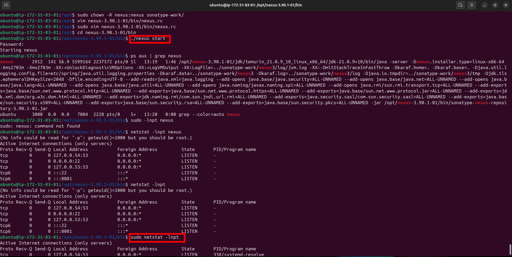
  
- Accessed nexus repository via browser through port 8081

  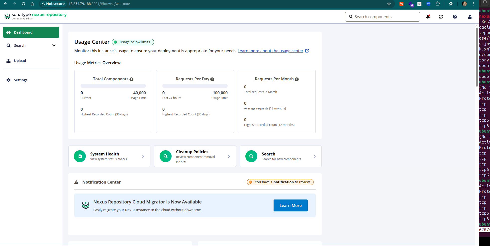

</details>

******

<details>
<summary>Exercise 2: Creating npm hosted repository </summary>
<br />

In Nexus, artifacts are stored in **blob stores**, which can be backed by different storage types such as:
- *File* (local filesystem)
- *S3* (Amazon S3)
- *Azure Blob Storage*
- *Google Cloud Storage*

For this setup, I used the *File* blob store for simplicity and local storage.

### Steps:
- Created a new Blob store (File type)

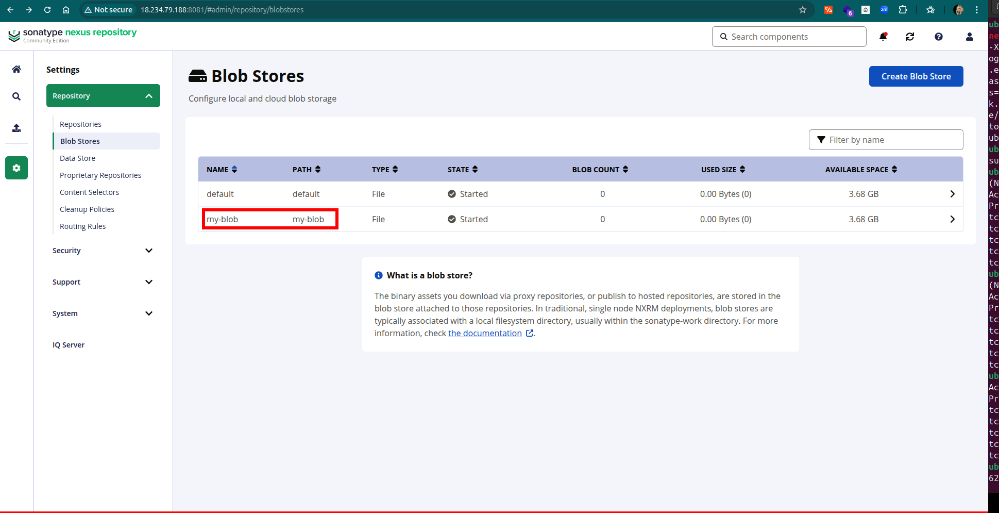

- Created a new **npm (hosted)** repository and configured it to use the newly created blob store

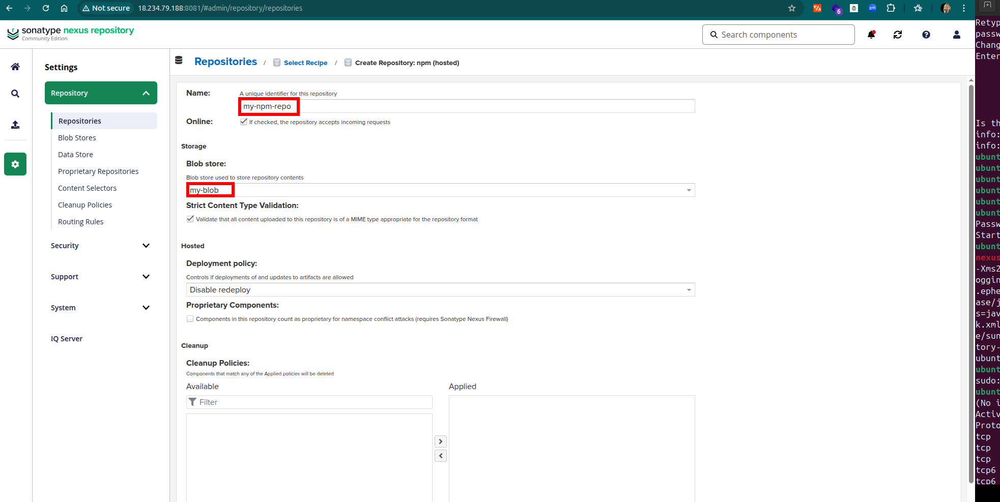

</details>

******

<details>
<summary>Exercise 3: Creating a user for team 1 </summary>
<br />

- Created a new role with the following privileges:
  - `nx-repository-admin-npm-repo1-*` → allows full access (publish, update, delete) to the specific npm repository (*repo1*)  
  - `nx-repository-view-npm-*-*` → allows read access (browse and install) to all npm repositories  

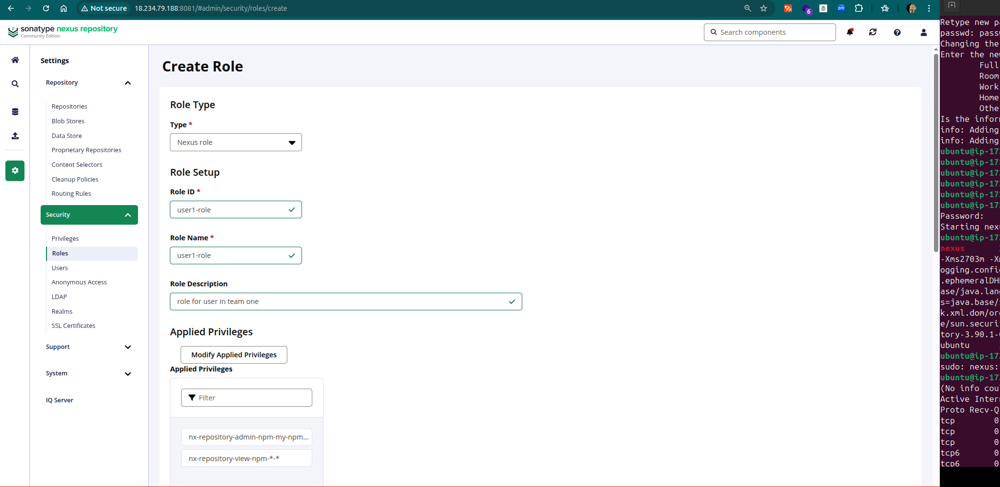

- Created a new user and assigned the newly created role to it

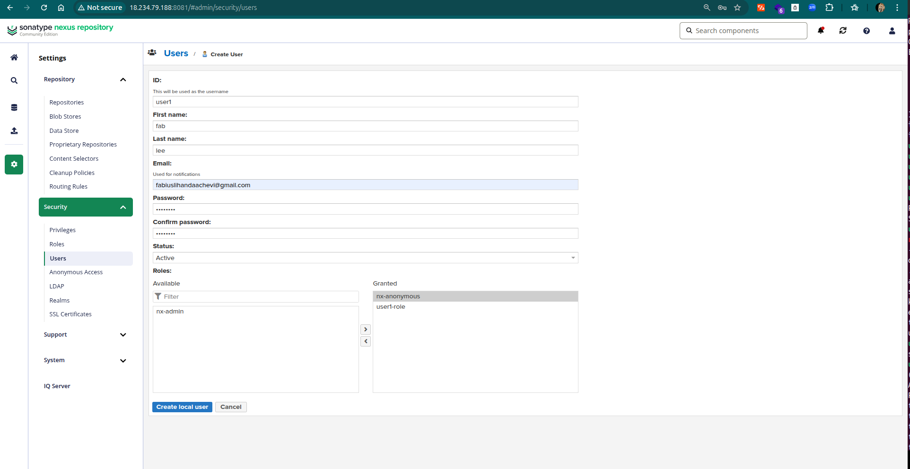

</details>

******

<details>
<summary>Exercise 4: Building and publishing npm artifact </summary>
<br />

For this exercise, I built the Node.js artifact and published it to the Nexus npm repository created in Exercise 2.

### Steps:
- Opened the project [found here](https://gitlab.com/twn-devops-bootcamp/latest/04-build-tools/node-app)  and ran *npm pack* to build the artifact
- Logged into the Nexus npm repository using the user created in Exercise 3:
- Initially, publishing failed with the error:
  
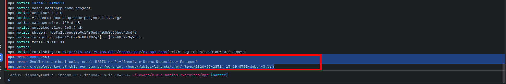

- After debugging, discovered that the user needed an npm Bearer Token from the Nexus Realm for authentication. After granting the user the token, the package published successfully
  
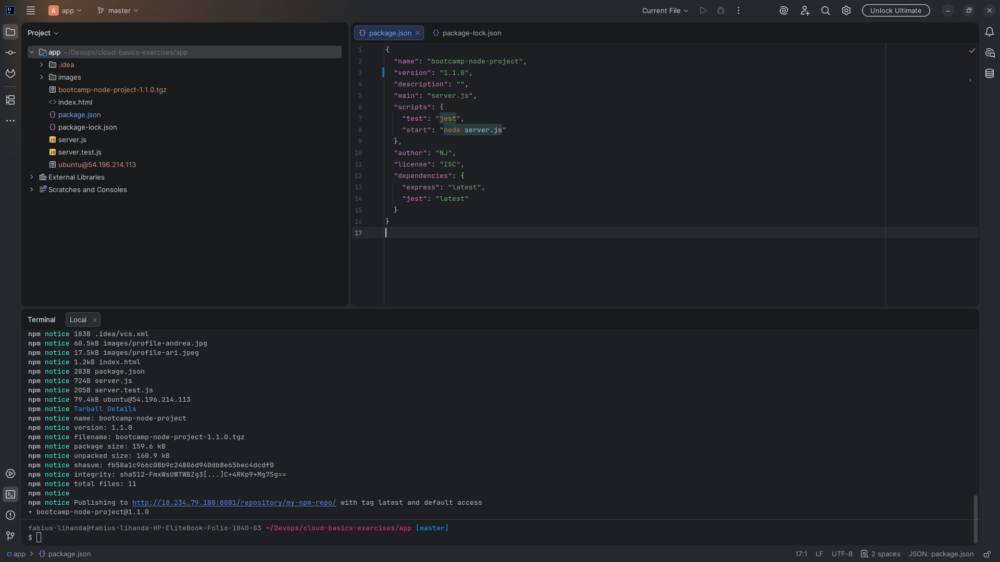

- Verified the package was published

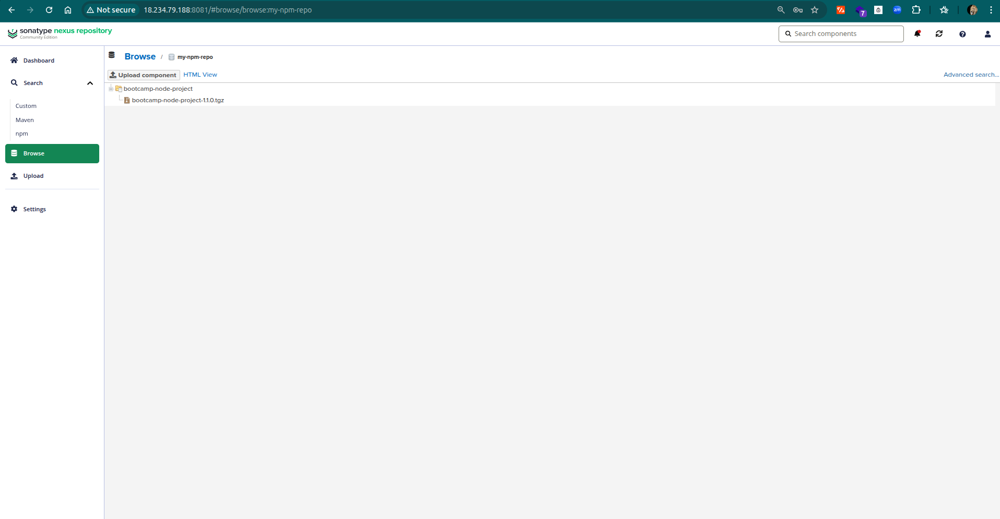  

</details>

******

<details>
<summary>Exercise 5: Creating a maven hosted repository </summary>
<br />

For this exercise, I created a Maven repository in Nexus to host Java artifacts.

In Nexus, **Maven repositories** can have different **Version Policies**:

- **Releases** → for stable, production-ready versions  
- **Snapshots** → for ongoing internal development versions, can be overwritten frequently  
- **Mixed** → allows both snapshots and releases in the same repository  

For this setup, I chose **Releases** to store only stable versions of Java artifacts.

### Steps:
- Created a new **maven2 (hosted)** repository and configured it to use the blob store created in the earlier step

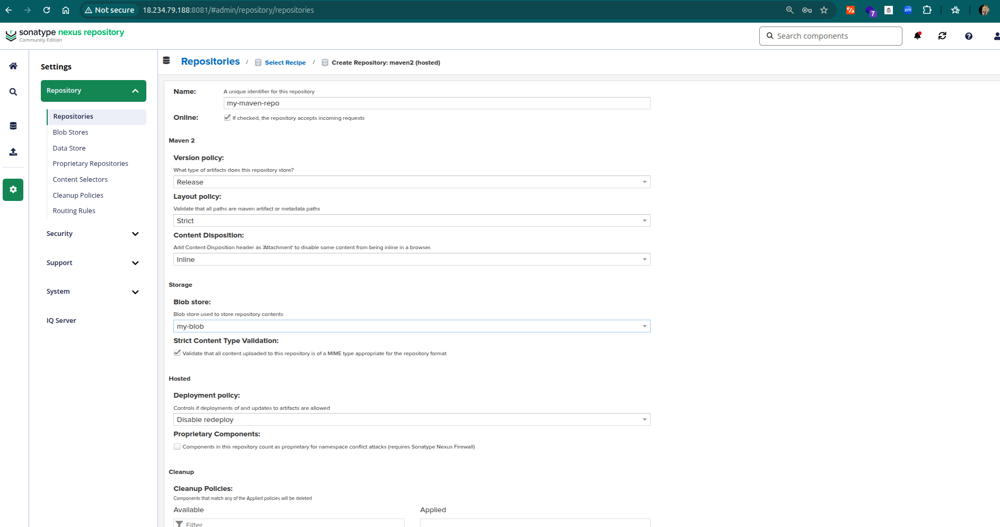

</details>

******

<details>
<summary>Exercise 6: Creating a user for team 2 </summary>
<br />

For this exercise, I created a Nexus user for Team 2 to manage the Maven repository created in Exercise 5.

### Steps:
- Created a new role with the following privileges:
  - `nx-repository-admin-maven2-maven-central-*` → allows full access (publish, update, delete) to the Maven repository (*maven-central*)  
  - `nx-repository-view-maven2-*-*` → allows read access (browse and download) to all Maven repositories  

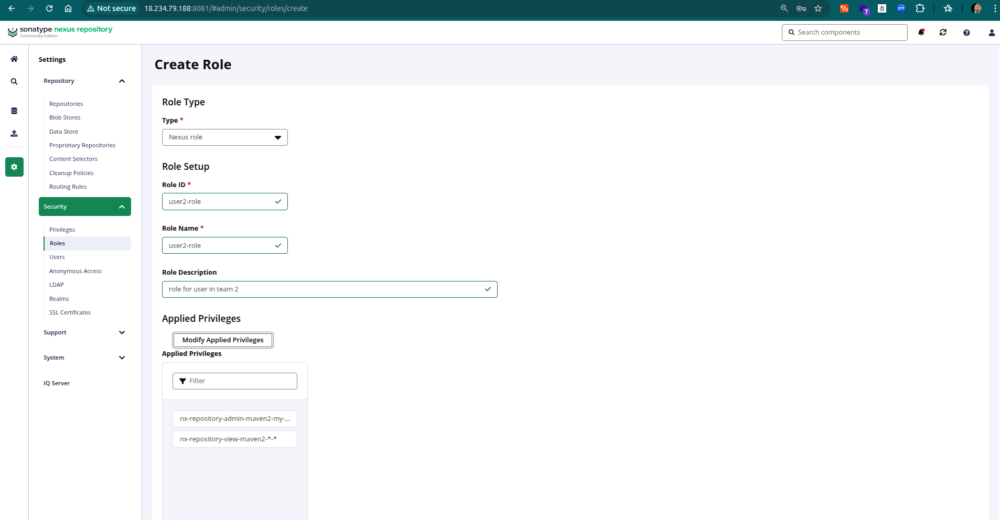

- Created a new user and assigned the newly created role to it

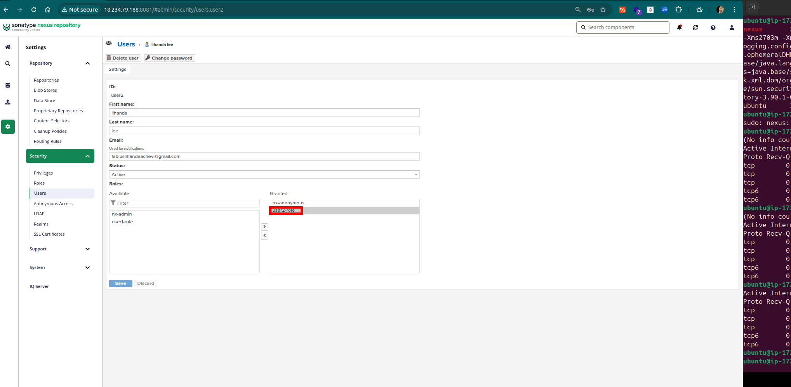

</details>

******

<details>
<summary>Exercise 7: Building and publishing jar file </summary>
<br />

For this exercise, I built a Java application with Maven and published the `.jar` artifact to the Maven repository created in Exercise 5 using the Team 2 user.

### Steps:
- Opened the Java application   
- Edited the Maven `settings.xml` file to configure the repository credentials:
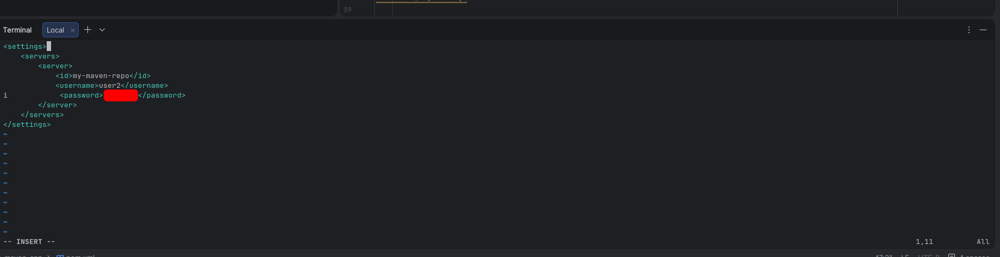

- Built the artifact using Maven:
  - *mvn clean package*
 
- Published the artifact to the Nexus Maven repository:
  - *mvn deploy*
    
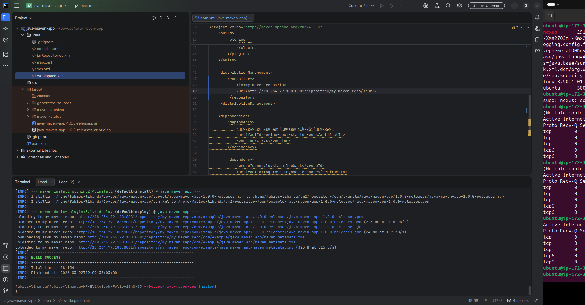

- Verified the artifact upload in the Nexus repository UI
  
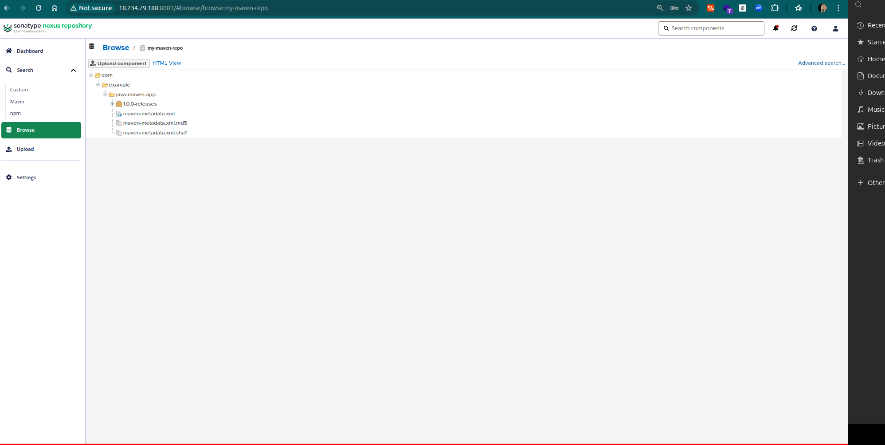  
</details>

******

<details>
<summary>Exercise 8: Download from Nexus and start application </summary>
 <br />

- Create a new user in the Nexus UI, and grant *both* of the roles previously created to it

- Execute `curl -u {user}:{password} -X GET 'http://{nexus-ip}:8081/service/rest/v1/components?repository={repo-name}&sort=version'` on the DigitalOcean droplet
- Execute `wget` followed by the result of the previous command

- Execute `java -jar java-app-1.0.jar`

</details>

******
<details>
<summary>Exercise 9: Automate </summary>
 <br />

- Create a **.sh** file on the DigitalOcean droplet and ensure it has execute permissions
- The **.sh** file should contain the following:
```sh
# save the artifact details in a json file
curl -u {user}:{password} -X GET 'http://{nexus-ip}:8081/service/rest/v1/components?repository={repo-name}&sort=version' | jq "." > artifact.json

# grab the download url from the saved artifact details using 'jq' json processor tool
artifactDownloadUrl=$(jq -r '.items[].assets[].downloadUrl | select(endswith(".jar"))' artifact.json)

# fetch the artifact with the extracted download url using 'wget' tool
wget --http-user={user} --http-password={password} "$artifactDownloadUrl" -O java-app.jar

# Run the Java application
java -jar java-app.jar
```
- Execute the shell script on the server

</details>

