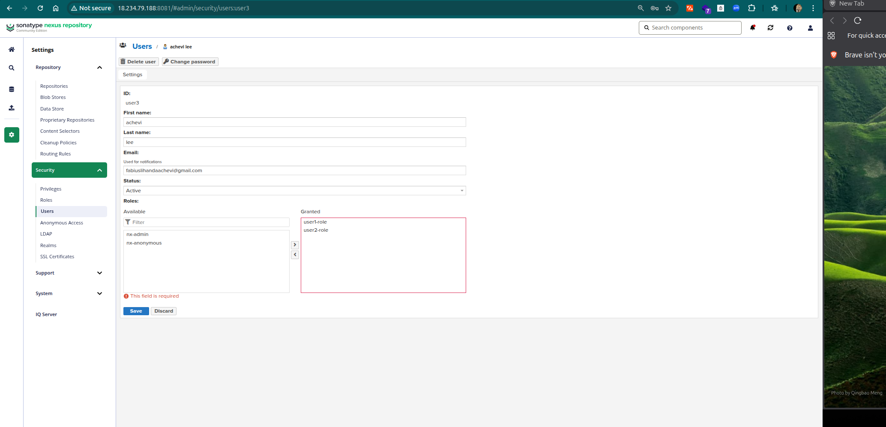
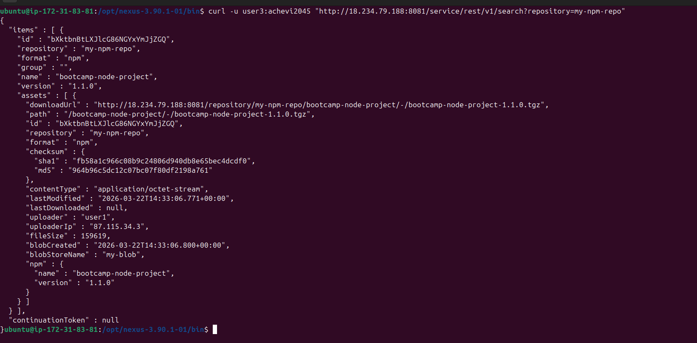
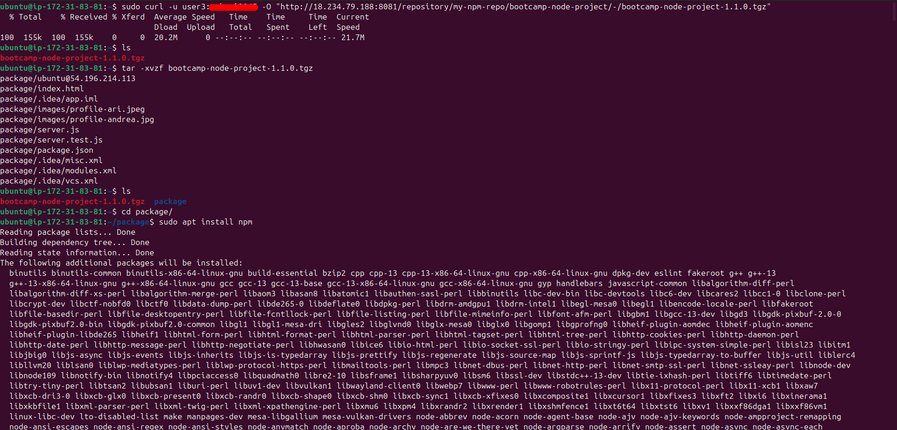
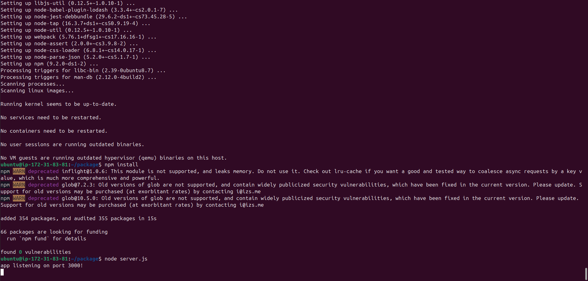
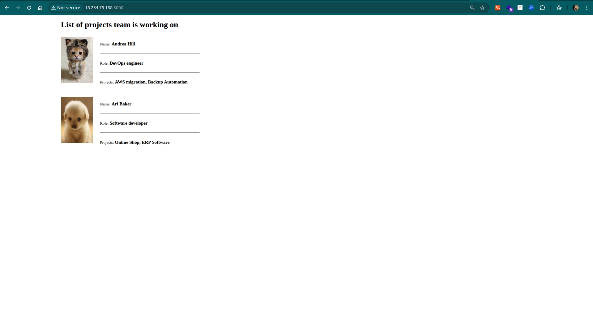

## 📦 Nexus Repository Manager 

This project demonstrates the setup and usage of a repository manager to handle application artifacts across different technologies.  
Using Nexus, I implemented workflows for storing, managing, and deploying both Node.js and Java artifacts, simulating real-world DevOps practices such as artifact versioning, access control, and automated deployment.

The exercises cover:
- Installing and configuring Nexus on a cloud server  
- Creating and managing npm and Maven repositories  
- Setting up users and roles for team-based access  
- Publishing and retrieving artifacts  
- Deploying applications from a remote server using the Nexus REST API  


******

<details>
<summary>Exercise 1: Installing Nexus on a server </summary>
 <br />

For this exercise, I provisioned a cloud server and installed Nexus.

### Steps:
- Launched an Amazon EC2 instance on AWS  
- Connected to the server via SSH  
- Installed Java 17 (required for Nexus compatibility)  
- Downloaded and installed [Sonatype Nexus Repository](https://help.sonatype.com/en/download.html) using *wget* command  
  *Nexus is installed in /opt (optional directory) because it is a third-party application, and /opt is the standard Linux directory for optional software, ensuring better organization, security, and maintainability.*  
- Created a dedicated *nexus* user to run the Nexus service (for better security and isolation instead of running as root)  
- Assigned proper permissions to Nexus directories  
- Started the Nexus service using *./nexus start*
  
  
  
- Accessed nexus repository via browser through port 8081

  

</details>

******

<details>
<summary>Exercise 2: Creating npm hosted repository </summary>
<br />

In Nexus, artifacts are stored in **blob stores**, which can be backed by different storage types such as:
- *File* (local filesystem)
- *S3* (Amazon S3)
- *Azure Blob Storage*
- *Google Cloud Storage*

For this setup, I used the *File* blob store for simplicity and local storage.

### Steps:
- Created a new Blob store (File type)


- Created a new **npm (hosted)** repository and configured it to use the newly created blob store


</details>

******

<details>
<summary>Exercise 3: Creating a user for team 1 </summary>
<br />

- Created a new role with the following privileges:
  - `nx-repository-admin-npm-repo1-*` → allows full access (publish, update, delete) to the specific npm repository (*repo1*)  
  - `nx-repository-view-npm-*-*` → allows read access (browse and install) to all npm repositories  


- Created a new user and assigned the newly created role to it


</details>

******

<details>
<summary>Exercise 4: Building and publishing npm artifact </summary>
<br />

For this exercise, I built the Node.js artifact and published it to the Nexus npm repository created in Exercise 2.

### Steps:
- Opened the project [found here](https://gitlab.com/twn-devops-bootcamp/latest/04-build-tools/node-app)  and ran *npm pack* to build the artifact
- Logged into the Nexus npm repository using the user created in Exercise 3:
- Initially, publishing failed with the error:
  


- After debugging, discovered that the user needed an npm Bearer Token from the Nexus Realm for authentication. After granting the user the token, the package published successfully
  


- Verified the package was published

  

</details>

******

<details>
<summary>Exercise 5: Creating a maven hosted repository </summary>
<br />

For this exercise, I created a Maven repository in Nexus to host Java artifacts.

In Nexus, **Maven repositories** can have different **Version Policies**:

- **Releases** → for stable, production-ready versions  
- **Snapshots** → for ongoing internal development versions, can be overwritten frequently  
- **Mixed** → allows both snapshots and releases in the same repository  

For this setup, I chose **Releases** to store only stable versions of Java artifacts.

### Steps:
- Created a new **maven2 (hosted)** repository and configured it to use the blob store created in the earlier step


</details>

******

<details>
<summary>Exercise 6: Creating a user for team 2 </summary>
<br />

For this exercise, I created a Nexus user for Team 2 to manage the Maven repository created in Exercise 5.

### Steps:
- Created a new role with the following privileges:
  - `nx-repository-admin-maven2-maven-central-*` → allows full access (publish, update, delete) to the Maven repository (*maven-central*)  
  - `nx-repository-view-maven2-*-*` → allows read access (browse and download) to all Maven repositories  


- Created a new user and assigned the newly created role to it


</details>

******

<details>
<summary>Exercise 7: Building and publishing jar file </summary>
<br />

For this exercise, I built a Java application with Maven and published the `.jar` artifact to the Maven repository created in Exercise 5 using the Team 2 user.

### Steps:
- Opened the Java application   
- Edited the Maven `settings.xml` file to configure the repository credentials:


- Built the artifact using Maven:
  - *mvn clean package*
 
- Published the artifact to the Nexus Maven repository:
  - *mvn deploy*
    


- Verified the artifact upload in the Nexus repository UI
  
  
</details>

******

<details>
<summary>Exercise 8: Download from Nexus and start application </summary>
<br />

For this exercise, I retrieved the latest Node.js artifact from Nexus using the REST API and deployed it on the AWS remote instance.

### Steps:

- Created a new Nexus user (user3) with access to both npm and Maven repositories

  
  


- Used the Nexus REST API to fetch metadata for the Node.js artifact:

 

- Extracted the download URL of the latest artifact from the response

```bash
curl -s -u mvnpm-user:PASSWORD \
"http://18.234.79.188:8081/service/rest/v1/search?repository=npm-repository" \
| jq -r '.items[0].assets[0].downloadUrl'
```
- Downloaded, extracted, and installed dependencies inside the remote server

 

- Started the Node.js application

 

-Verified that the application was running successfully. I had also to allow inbound traffic from port 3000 on the remote server security group

 


</details>

******
<details>
<summary>Exercise 9: Automation </summary>

- Finally I decided to automate the whole process using a  file I created on my local machine, used scp to transfer it to the remote server after thorough testing.
- Gave the script necessary permissions then executed it and the application started succesfuly

</details>

******

### Key Learnings:

- **What Nexus is:**  
  Nexus is a repository manager that acts as a central storage for build artifacts (e.g., npm packages, JAR files, Docker images). It allows teams to manage, version, and distribute artifacts efficiently across projects.

- **Why it is important:**  
  It provides a single source of truth for artifacts, making it essential for **CI/CD pipelines**, where applications are built once and deployed consistently across environments.

- **Multi-repository management:**  
  Nexus supports multiple repository formats (npm, Maven, Docker, etc.), enabling teams to manage different types of artifacts in one place.

- **Integration capabilities:**  
  It integrates with tools via a **REST API** and supports **LDAP integration** for centralized user authentication and access control.

- **Automation & CI/CD:**  
  Nexus can be easily integrated into CI/CD pipelines to automate artifact publishing and retrieval during build and deployment processes.

- **Cleanup policies:**  
  Automated cleanup policies help manage storage by deleting old or unused artifacts based on defined rules (e.g., age, version, or usage), preventing storage bloat.

- **Scheduled tasks:**  
  Tasks such as cleanup, repository maintenance, and backups can be scheduled to run automatically, improving system reliability and reducing manual effort.

- **Backup and restore:**  
  Nexus supports backup strategies to ensure artifact data can be recovered in case of failure.

- **Search and metadata:**  
  Powerful search functionality and metadata tagging make it easy to locate and organize artifacts across repositories.

- **Security and authentication:**  
  Supports user roles, permissions, and token-based authentication for secure access, including system users for automated processes.

